## Basic initializing

Import packages


```python
import numpy as np, matplotlib.pyplot as plt, cmocean, seawater as sw, datetime as dt, colorcet as cc
from mpl_toolkits.basemap import Basemap
from netCDF4 import Dataset
from scipy.ndimage.filters import gaussian_filter1d
from matplotlib.gridspec import GridSpec
from scipy.interpolate import interp1d
from matplotlib.colors import LinearSegmentedColormap

%matplotlib inline
plt.style.use('seaborn-paper')
np.set_printoptions(precision=2)
```

Define some basic variables


```python
OSMOSIS_LAT_RANGE = np.array([48.6,48.78])
OSMOSIS_LON_RANGE = np.array([-16.33,-16.05])
OSMOSIS_LAT_DEG = 111.12 # degrees to km conversion
OSMOSIS_LON_DEG = 73.38 # degrees to km conversion
OSMOSIS_LON = np.mean(OSMOSIS_LON_RANGE)
OSMOSIS_LAT = np.mean(OSMOSIS_LAT_RANGE)
g = 9.81
f = sw.f(OSMOSIS_LAT)
rho0 = 1025 # reference density, kg/m^3
Omega = 7.29e-5 # rotation rate, 1/s
```


```python
time_XLIM = [-118,249]
months_time = [-31-30-31-30,-31-30-31,-31-30,-31,0,31,31+28,31+28+31,31+28+31+30,31+28+31+30+31,31+28+31+30+31+30,31+28+31+30+31+30+31,31+28+31+30+31+30+31+31,31+28+31+30+31+30+31+31+30]
months_labels = ['S','O','N','D','J','F','M','A','M','J','J','A','S']
months_labels_long = ['Sep','Oct','Nov','Dec','Jan','Feb','Mar','Apr','May','Jun','Jul','Aug','Sep']
fontsize = 16;
```


```python
# where data are stored on my computer - netCDF files can be generated by other scripts posted here
folder = '../../../../../Research/Data/OSMOSIS/'
SG = ('sg502_JanApr','sg510_AprSep','sg533_AprSep','sg533_SepJan','sg566_AprSep','sg566_SepJan','sg579_JanApr',)
nc_SG_L1 = [Dataset(folder+SG[i]+'_L1.nc','r') for i in range(len(SG))]
nc_SG_L2 = [Dataset(folder+SG[i]+'_L2_5m.nc','r') for i in range(len(SG))]
nc_SG_L2_phys = [Dataset(folder+SG[i]+'_L2_2m.nc','r') for i in range(len(SG))]
nc_SG_L3 = [Dataset(folder+SG[i]+'_L3_2m.nc','r') for i in range(len(SG))]

```


```python
# deployment times:
rd = dt.datetime(2013,1,1)
for nc in nc_SG_L2:
    sd = rd+dt.timedelta(days=nc.variables['time'][0,0])
    ed = rd+dt.timedelta(days=nc.variables['time'][-1,0])
    print(nc.glider,sd.month,sd.day,ed.month,ed.day,nc.variables['backscatter'].wavelength)
```

    SG502 1 8 4 23 470
    SG510 4 19 6 9 650
    SG533 6 3 8 5 650
    SG533 9 6 11 4 650
    SG566 4 19 9 7 650
    SG566 9 4 1 8 650
    SG579 1 8 4 23 532


```python
Gl1 = [0,4,5] # SG502 and SG566 (with oxygen)
Gl2 = [1,2,3,6] # SG510, SG533, and SG579
```

## Calculate variables that will be used in figures

Define times and mixed layer depths


```python
t_l3 = [nc.variables['time'][:] for nc in nc_SG_L3]; # average time of each dive
t_diff_l3 = [tt[0:-1]+np.diff(tt)/2 for tt in t_l3] # used if plotting derivatives
t = [np.nanmean(nc.variables['time'][:],axis=1) for nc in nc_SG_L2]; # average time of each dive
z_phys = sw.dpth(nc_SG_L3[0].variables['pressure'][:],OSMOSIS_LAT) # depths for physical variables
z_diff_phys = z_phys[0:-1]+np.diff(z_phys)/2 # used if plotting derivatives
z_bio = sw.dpth(nc_SG_L2[0].variables['pressure'][:],OSMOSIS_LAT) # depths of biological variables
z_diff_bio = z_bio[0:-1]+np.diff(z_bio)/2 # used if plotting derivatives
```

    /Library/Frameworks/Python.framework/Versions/3.6/lib/python3.6/site-packages/ipykernel_launcher.py:3: RuntimeWarning: invalid value encountered in less
      This is separate from the ipykernel package so we can avoid doing imports until


```python
MLD = [np.empty(shape=t_l3[i].shape) for i in range(len(SG))] # density threshold
for i in range(len(SG)):
    pdens = nc_SG_L3[i].variables['pot_density'][:]
    for j in range(MLD[i].size):
        pdens_10 = interp1d(z_phys,pdens[:,j])(10)
        MLD[i][j] = interp1d(pdens[:,j],z_phys)(pdens_10+0.03)
```

    /Library/Frameworks/Python.framework/Versions/3.6/lib/python3.6/site-packages/ipykernel_launcher.py:3: RuntimeWarning: invalid value encountered in less
      This is separate from the ipykernel package so we can avoid doing imports until


```python
MLD2 = [np.empty(shape=t_l3[i].shape) for i in range(len(SG))] # density gradient threshold method
for i in range(len(SG)):
    pdens_z = gaussian_filter1d(np.diff(nc_SG_L3[i].variables['pot_density'][1::,:],axis=0)/np.tile(np.diff(z_phys[1::]),[t_l3[i].size,1]).T,5,axis=0)
    for j in range(MLD2[i].size):
        MLD2[i][j] = z_diff_phys[1::][np.where(pdens_z[:,j]>5e-4)[0][0]] if np.any(~np.isnan(pdens_z[:,j])) else np.nan
```

    /Library/Frameworks/Python.framework/Versions/3.6/lib/python3.6/site-packages/ipykernel_launcher.py:3: RuntimeWarning: invalid value encountered in less
      This is separate from the ipykernel package so we can avoid doing imports until


```python
for i in range(len(SG)):
    l1, = plt.plot(t_l3[i],gaussian_filter1d(MLD[i],3),color='C0',zorder=50)
    l2, = plt.plot(t_l3[i],gaussian_filter1d(MLD2[i],3),color='C1')
plt.ylim([400,0])
plt.legend([l1,l2],['Density threshold','Density derivative\nthreshold'],loc='lower right')
plt.xlim(time_XLIM)
plt.xlabel('Days since 01 January 2013');
plt.ylabel('Depth (m)');
plt.tight_layout()
plt.savefig('MLDs',dpi=300)
```


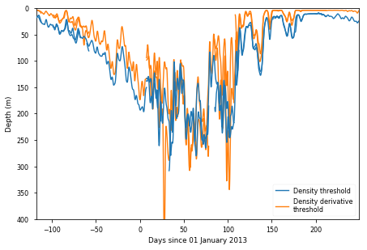


Chlorophyll calibration


```python
# Compare nighttime fluorescence with OceanColor data
OC = Dataset(folder+'OceanColor/Oceancolor_ocx.nc','r') # where this dataset is stored on my computer -- can be generated from other files in this folder
OC_lon = OC.variables['longitude'][:]
OC_lat = OC.variables['latitude'][:]
OC_time= np.round((OC.variables['time'][:]-2013)*366).astype('int')
latindices = np.where(np.logical_and(OC_lat>OSMOSIS_LAT_RANGE[0],OC_lat<OSMOSIS_LAT_RANGE[1]))[0]
lonindices = np.where(np.logical_and(OC_lon>OSMOSIS_LON_RANGE[0],OC_lon<OSMOSIS_LON_RANGE[1]))[0]
OC_chl = np.nanmean(OC.variables['chl'][latindices,lonindices,:].reshape(len(latindices)*len(lonindices),len(OC_time),order='F'),axis=0)
num = np.sum(~OC.variables['chl'][latindices,lonindices,:].reshape(len(latindices)*len(lonindices),len(OC_time),order='F').mask,axis=0)
OC_chl[num<3] = np.nan
```


```python
fl = [nc_SG_L2[gl].variables['fluorescence'][:] for gl in range(len(SG))]
for gl in range(len(SG)):
    for i in range(len(t[gl])):
        naned = np.isnan(fl[gl][i])
        if np.any(naned) & np.any(~naned):
            fl[gl][i,naned] = np.interp(z_bio[naned],z_bio[~naned],fl[gl][i,~naned])
    # get rid of daytime values
    fl[gl][nc_SG_L2[gl].variables['daytime'][:]==1] = np.nan 

```

    /Library/Frameworks/Python.framework/Versions/3.6/lib/python3.6/site-packages/ipykernel_launcher.py:1: RuntimeWarning: invalid value encountered in less
      """Entry point for launching an IPython kernel.


```python
fl_surf = [np.nanmean(fl[gl][:,0:5],axis=1) for gl in range(len(SG))] # over top 25 m (0:5 depth indices)
t_int = [np.floor(t[gl]).astype('int') for gl in range(len(SG))]
```

    /Library/Frameworks/Python.framework/Versions/3.6/lib/python3.6/site-packages/ipykernel_launcher.py:1: RuntimeWarning: Mean of empty slice
      """Entry point for launching an IPython kernel.


```python
fl_surf_day = [np.nan*np.empty(shape=OC_time.shape) for i in range(len(SG))] # get average each day (only use nighttime values here)
for i in range(len(SG)):
    for j in range(fl_surf_day[0].size):
        fl_surf_day[i][j] = np.nanmean(fl_surf[i][t_int[i]==OC_time[j]])
```

    /Library/Frameworks/Python.framework/Versions/3.6/lib/python3.6/site-packages/ipykernel_launcher.py:4: RuntimeWarning: Mean of empty slice
      after removing the cwd from sys.path.


```python
good_vals = [np.where(np.logical_and(~np.isnan(OC_chl),~np.isnan(fl_surf_day[i])))[0] for i in range(len(SG))]
scale_factor = [np.linalg.lstsq(OC_chl[good_vals[i]].reshape(-1,1),fl_surf_day[i][good_vals[i]])[0] for i in range(len(SG))]
print('Scalefactors:',np.concatenate(scale_factor))
good_n = [good_vals[i].size for i in range(len(SG))]
print('Number of observations:',good_n)
```

    Scalefactors: [1.9  4.06 2.76 3.17 3.03 3.1  2.29]
    Number of observations: [17, 9, 10, 6, 26, 11, 13]


    /Library/Frameworks/Python.framework/Versions/3.6/lib/python3.6/site-packages/ipykernel_launcher.py:2: FutureWarning: `rcond` parameter will change to the default of machine precision times ``max(M, N)`` where M and N are the input matrix dimensions.
    To use the future default and silence this warning we advise to pass `rcond=None`, to keep using the old, explicitly pass `rcond=-1`.
      


```python
for gl in range(len(SG)):
    fl[gl] /= scale_factor[gl]
    fl_surf[gl] /= scale_factor[gl]
    fl_surf_day[gl] /= scale_factor[gl]
```

Backscatter calibration


```python
# the first glider (SG502) had two backscatter sensors
bbp1 = nc_SG_L2[0].variables['backscatter'][:]
bbp2 = nc_SG_L2[0].variables['backscatter2'][:]
print(nc_SG_L2[0].variables['backscatter'].wavelength)
print(nc_SG_L2[0].variables['backscatter2'].wavelength)
```

    470
    700


    /Library/Frameworks/Python.framework/Versions/3.6/lib/python3.6/site-packages/ipykernel_launcher.py:2: RuntimeWarning: invalid value encountered in less
      
    /Library/Frameworks/Python.framework/Versions/3.6/lib/python3.6/site-packages/ipykernel_launcher.py:3: RuntimeWarning: invalid value encountered in less
      This is separate from the ipykernel package so we can avoid doing imports until


```python
# find average spectral slope between the two
k = np.log(bbp1/bbp2).ravel()/np.log(nc_SG_L2[0].variables['backscatter'].wavelength/nc_SG_L2[0].variables['backscatter2'].wavelength)
plt.hist(k[np.logical_and(~np.isnan(k),~np.isinf(np.abs(k)))],100);
k = np.nanmedian(k)
print('Average spectral slope:',k)
```

    /Library/Frameworks/Python.framework/Versions/3.6/lib/python3.6/site-packages/ipykernel_launcher.py:2: RuntimeWarning: divide by zero encountered in true_divide
      
    /Library/Frameworks/Python.framework/Versions/3.6/lib/python3.6/site-packages/ipykernel_launcher.py:2: RuntimeWarning: invalid value encountered in true_divide
      
    /Library/Frameworks/Python.framework/Versions/3.6/lib/python3.6/site-packages/ipykernel_launcher.py:2: RuntimeWarning: divide by zero encountered in log
      
    /Library/Frameworks/Python.framework/Versions/3.6/lib/python3.6/site-packages/ipykernel_launcher.py:2: RuntimeWarning: invalid value encountered in log
      


    Average spectral slope: -0.9170734215813469


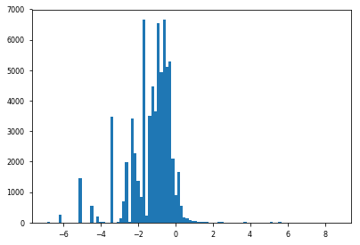


```python
# Convert all backscatter measurements to 650 nm (assume spectral slope of -1)
bbp = ()
for gl in range(len(SG)):
    b = nc_SG_L2[gl].variables['backscatter'][:]*(650/nc_SG_L2[gl].variables['backscatter'].wavelength)**(-1)
    b[b<0] = np.nan
    bbp += (b,)
```

    /Library/Frameworks/Python.framework/Versions/3.6/lib/python3.6/site-packages/ipykernel_launcher.py:4: RuntimeWarning: invalid value encountered in less
      after removing the cwd from sys.path.
    /Library/Frameworks/Python.framework/Versions/3.6/lib/python3.6/site-packages/ipykernel_launcher.py:5: RuntimeWarning: invalid value encountered in less
      """


Define buoyancy, buoyancy gradients, and PV


```python
pdens = [nc_SG_L3[i].variables['pot_density'][:] for i in range(len(SG))]
pdens_diff = [0.25*(pdens[i][0:-1,0:-1]+pdens[i][1::,0:-1]+pdens[i][0:-1,1::]+pdens[i][1::,1::]) for i in range(len(SG))]
b = [9.81*(1-pdens[i]/1025) for i in range(len(SG))]
lat = [nc_SG_L3[i].variables['latitude'][0,:] for i in range(len(SG))]
lon = [nc_SG_L3[i].variables['longitude'][0,:] for i in range(len(SG))]
distance = [np.zeros(shape=(1,lat[i].size)) for i in range(len(SG))]
for i in range(len(SG)):
    distance[i][0,1::] = np.cumsum(np.sqrt((np.diff(lat[i])*OSMOSIS_LAT_DEG)**2 + (np.diff(lon[i])*OSMOSIS_LON_DEG)**2))*1000
distance_interp = [np.interp(t_diff_l3[i],t_l3[i],distance[i].reshape(-1,)) for i in range(len(SG))]
b_x = [np.diff(b[i],axis=1)/np.tile(np.diff(distance[i]),[z_phys.size,1]) for i in range(len(SG))]
b_z = [-1.*np.diff(b[i],axis=0)/np.tile(np.diff(z_phys).reshape(-1,1),[1,lat[i].size]) for i in range(len(SG))]

# filter slightly
b_x = [gaussian_filter1d(gaussian_filter1d(b_x[i],1,axis=0),1,axis=1) for i in range(len(SG))]
b_z = [gaussian_filter1d(gaussian_filter1d(b_z[i],1,axis=0),1,axis=1) for i in range(len(SG))]
b_x_interp = [np.empty(shape=(b_z[i].shape[0],b_x[i].shape[1])) for i in range(len(SG))]
b_z_interp = [np.empty(shape=(b_z[i].shape[0],b_x[i].shape[1])) for i in range(len(SG))]
for i in range(len(SG)):
    for j in range(b_x_interp[i].shape[1]):
        b_x_interp[i][:,j] = np.interp(z_diff_phys,z_phys,b_x[i][:,j])
    for j in range(b_z_interp[i].shape[0]):
        b_z_interp[i][j,:] = np.interp(t_diff_l3[i],t_l3[i],b_z[i][j,:])

# calcualte Depth Averaged Current (DAC)
glider_orientation = [np.arctan((np.diff(nc_SG_L3[i].variables['latitude'][0,:])*OSMOSIS_LAT_DEG)/(np.diff(nc_SG_L3[i].variables['longitude'][0,:])*OSMOSIS_LON_DEG)) for i in range(len(SG))]
go = [glider_orientation[i].copy() for i in range(len(SG))]
for gl in range(len(SG)):
    current_offset = 0
    offset = np.zeros(shape=go[gl].shape)
    for i in range(1,go[gl].size):
        if go[gl][i]-go[gl][i-1]>np.pi/2:
            current_offset -= np.pi
        elif go[gl][i-1]-go[gl][i]>np.pi/2:
            current_offset += np.pi
        offset[i] = current_offset
    go[gl] += offset
go = [gaussian_filter1d(go[i],3) for i in range(len(SG))]
go_interp = [np.interp(t_l3[i],t_diff_l3[i],go[i]) for i in range(len(SG))]
DAC = [nc_SG_L3[i].variables['DAC_U'][:]*np.sin(go_interp[i]) + nc_SG_L3[i].variables['DAC_V'][:]*np.cos(go_interp[i]) for i in range(len(SG))]
DAC_x = [np.diff(DAC[i])/np.diff(distance[i]) for i in range(len(SG))]

v_z = [b_x[i]/f for i in range(len(SG))]
vort = [v_z[i][1::,:]+np.tile(-np.nanmean(v_z[i][1::,:],axis=0)+DAC_x[i],[v_z[i][1::,:].shape[0],1]) for i in range(len(SG))]

PV = [(f+vort[i])*b_z_interp[i] - b_x_interp[i]**2/f for i in range(len(SG))]
```

    /Library/Frameworks/Python.framework/Versions/3.6/lib/python3.6/site-packages/ipykernel_launcher.py:1: RuntimeWarning: invalid value encountered in less
      """Entry point for launching an IPython kernel.
    /Library/Frameworks/Python.framework/Versions/3.6/lib/python3.6/site-packages/ipykernel_launcher.py:43: RuntimeWarning: Mean of empty slice


```python
plt.figure(figsize=(15,5));
plt.subplot(211); plt.title('PV for glider 1 (s$^{-3}$)')
for gl in Gl1:
    plt.contourf(t_diff_l3[gl],z_diff_phys,PV[gl],levels=np.arange(-1.25e-9,5.01e-9,2.5e-10),cmap=cmocean.cm.oxy_r)
plt.colorbar();
plt.ylim([1000,0]);
plt.subplot(212); plt.title('PV for glider 2 (s$^{-3}$)')
for gl in Gl2:
    plt.contourf(t_diff_l3[gl],z_diff_phys,PV[gl],levels=np.arange(-1.25e-9,5.01e-9,2.5e-10),cmap=cmocean.cm.oxy_r)
plt.colorbar();
plt.ylim([1000,0]);

```


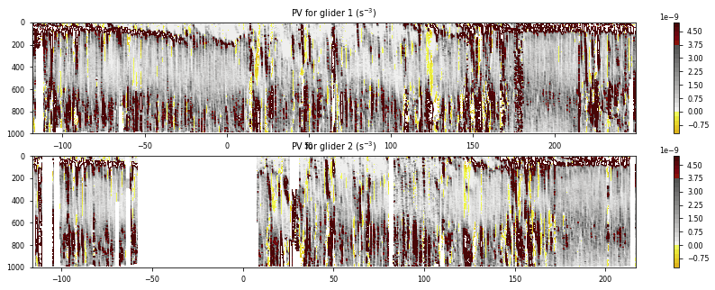


AOU


```python
AOU = ();
for i in range(len(SG)):
    if 'oxygen' not in nc_SG_L3[i].variables:
        AOU += ([],)
        continue;
    oxy = nc_SG_L3[i].variables['oxygen'][:].T
    sal = nc_SG_L3[i].variables['salinity'][:].T
    temp = nc_SG_L3[i].variables['temperature'][:].T
    density = nc_SG_L3[i].variables['density'][:].T
    oxy_sat = sw.satO2(sal,temp)*44.661*1e3/density
    AOU += (oxy_sat-oxy,)
```

    /Library/Frameworks/Python.framework/Versions/3.6/lib/python3.6/site-packages/ipykernel_launcher.py:6: RuntimeWarning: invalid value encountered in less
      
    /Library/Frameworks/Python.framework/Versions/3.6/lib/python3.6/site-packages/ipykernel_launcher.py:7: RuntimeWarning: invalid value encountered in less
      import sys
    /Library/Frameworks/Python.framework/Versions/3.6/lib/python3.6/site-packages/ipykernel_launcher.py:8: RuntimeWarning: invalid value encountered in less
      
    /Library/Frameworks/Python.framework/Versions/3.6/lib/python3.6/site-packages/ipykernel_launcher.py:9: RuntimeWarning: invalid value encountered in less
      if __name__ == '__main__':


## Make Figures

### Overview Figure


```python
SG_lat = np.concatenate([nc_SG_L1[i].variables['GPS_lat'][:,0] for i in range(len(nc_SG_L1))])
SG_lon = np.concatenate([nc_SG_L1[i].variables['GPS_lon'][:,0] for i in range(len(nc_SG_L1))])
SG_good = np.concatenate([nc_SG_L1[i].variables['GPS_flag'][:,0]<3 for i in range(len(nc_SG_L1))])

x = (SG_lon-OSMOSIS_LON_RANGE[0])*OSMOSIS_LON_DEG
y = (SG_lat-OSMOSIS_LAT_RANGE[0])*OSMOSIS_LAT_DEG
X_RANGE = [0,(OSMOSIS_LON_RANGE[1]-OSMOSIS_LON_RANGE[0])*OSMOSIS_LON_DEG]
Y_RANGE = [0,(OSMOSIS_LAT_RANGE[1]-OSMOSIS_LAT_RANGE[0])*OSMOSIS_LAT_DEG]
```


```python
nc_OC = Dataset('https://oceandata.sci.gsfc.nasa.gov:443/opendap/MODISA/L3SMI/2013/193/A20131932013200.L3m_8D_CHL_chl_ocx_4km.nc','r')
lonindices = np.where(np.logical_and(nc_OC.variables['lon'][:]>-40,nc_OC.variables['lon'][:]<10))[0]
latindices = np.where(np.logical_and(nc_OC.variables['lat'][:]>30,nc_OC.variables['lat'][:]<70))[0]
OC_lon = nc_OC.variables['lon'][lonindices]
OC_lat = nc_OC.variables['lat'][latindices]
chl_ocx = nc_OC.variables['chl_ocx'][latindices,:][:,lonindices]
```


```python
MODIS_nc = Dataset(folder+'OceanColor/Oceancolor_ocx_longterm.nc','r')
MODIS_lat = MODIS_nc.variables['latitude'][[0,-1]]
MODIS_lon = MODIS_nc.variables['longitude'][[0,-1]]
MODIS_nc.close()
MODIS_lon_range = np.linspace(MODIS_lon[0],MODIS_lon[1],5)
```


```python
# make figure and axes
fig = plt.figure(figsize=(8,5),facecolor='0.5',frameon=True)
ax2 = fig.add_axes([0.61,0.16,0.29,0.4]); 
ax3 = fig.add_axes([0.61,0.7,0.29,0.2]); 
cb1_ax = fig.add_axes([0.49,0.55,0.02,0.35])
cb2_ax = fig.add_axes([0.49,0.16,0.02,0.35])
ax1 = fig.add_axes([0.07,0.16,0.4,0.74],facecolor='0.75')# note: this needs to be the last axis to be made

# make map
m = Basemap(llcrnrlon=-22,llcrnrlat=42,urcrnrlon=-6,urcrnrlat=54,resolution='i',projection='tmerc',lon_0=-14,lat_0=48)
lon, lat = m(*np.meshgrid(OC_lon,OC_lat))
m.drawcoastlines()
m.fillcontinents(color='0.5')
ax_oc = m.contourf(lon,lat,np.log10(chl_ocx),levels=np.linspace(-1,np.log10(5),50),cmap=cmocean.cm.algae,extend='max')
OSMOSIS_x, OSMOSIS_y = m(np.array(OSMOSIS_LON_RANGE)[[0,1,1,0,0]],np.array(OSMOSIS_LAT_RANGE)[[0,0,1,1,0]])
m.plot(OSMOSIS_x,OSMOSIS_y,color='k')
MODIS_x, MODIS_y = m(np.array(MODIS_lon_range)[[0,1,2,3,4,4,3,2,1,0,0]],np.array(MODIS_lat)[[0,0,0,0,0,1,1,1,1,1,0]])
m.plot(MODIS_x,MODIS_y,color='k',ls='--',lw=1.5)
m.drawparallels(np.arange(40,60,5),labels=[True,False,False,False])
m.drawmeridians(np.arange(-25,-5,5),labels=[False,False,False,True]);
m.drawmapscale(-12.5, 44, OSMOSIS_LON, OSMOSIS_LAT, 200, barstyle='fancy')

# make heatmap
_,_,_,ax_heatmap = ax2.hist2d(x[SG_good],y[SG_good],[np.arange(X_RANGE[0],X_RANGE[1],1),np.arange(Y_RANGE[0],Y_RANGE[1],1)],cmap=plt.cm.Reds);
glidernum = [1,2,3,3,4,4,5]
for i in Gl1:
    ax3.plot(t[i][[0,-1]],np.array([1,1])*glidernum[i],color='b',linewidth=2)
for i in Gl2:
    ax3.plot(t[i][[0,-1]],np.array([1,1])*glidernum[i],color='g',linewidth=2)

# make axis labels
ax2.yaxis.tick_right();
ax2.set_xlabel('Zonal distance (km)')
ax2.set_ylabel('Meridional distance (km)'); ax2.yaxis.set_label_position("right")
ax3.yaxis.tick_right()
ax3.set_yticks([1,2,3,4,5]); ax3.set_ylim([0.5,5.5])
ax3.set_yticklabels(['SG502','SG510','SG533','SG566','SG579'])
ax3.set_xlim(time_XLIM)
[tt.set_color(i) for (i,tt) in zip(['b','g','g','b','g'],ax3.yaxis.get_ticklabels())]
ax3.set_xticks([-100,0,100,200])
ax3.set_xlabel(nc_SG_L1[0].variables['time'].units)

# make colorbars
labels = np.array([0.1,0.3,1,3])
fig.colorbar(ax_oc, cax=cb1_ax, orientation='vertical',ticks=np.log10(labels))
fig.colorbar(ax_heatmap, cax=cb2_ax, orientation='vertical',ticks=np.arange(0,50,10))
cb1_ax.set_ylabel(r'Chlorophyll (mg/m$^3$)')
cb1_ax.set_yticklabels(labels)
cb2_ax.set_ylabel('Counts')
ax2.set_yticks([0,10,20]);

# make time axis
timeax = ax3.twiny(); 
timeax.set_xticks(months_time)
timeax.set_xticklabels(months_labels)
timeax.set_xlim(time_XLIM);

# add panel labels
ax1.annotate('a', xy=(0,1),xycoords=ax1.transAxes,color='k',weight='bold',size=fontsize,xytext=(-5,5), textcoords="offset points")
ax2.annotate('c', xy=(0,1),xycoords=ax2.transAxes,color='k',weight='bold',size=fontsize,xytext=(-5,5), textcoords="offset points")
ax3.annotate('b', xy=(0,1),xycoords=ax3.transAxes,color='k',weight='bold',size=fontsize,xytext=(-5,5), textcoords="offset points")

plt.savefig('Overview',dpi=300);
```

    /Library/Frameworks/Python.framework/Versions/3.6/lib/python3.6/site-packages/mpl_toolkits/basemap/__init__.py:1767: MatplotlibDeprecationWarning: The get_axis_bgcolor function was deprecated in version 2.0. Use get_facecolor instead.
      axisbgc = ax.get_axis_bgcolor()
    /Library/Frameworks/Python.framework/Versions/3.6/lib/python3.6/site-packages/ipykernel_launcher.py:14: RuntimeWarning: invalid value encountered in log10
      
    /Library/Frameworks/Python.framework/Versions/3.6/lib/python3.6/site-packages/mpl_toolkits/basemap/__init__.py:3608: MatplotlibDeprecationWarning: The ishold function was deprecated in version 2.0.
      b = ax.ishold()
    /Library/Frameworks/Python.framework/Versions/3.6/lib/python3.6/site-packages/mpl_toolkits/basemap/__init__.py:3677: MatplotlibDeprecationWarning: axes.hold is deprecated.
        See the API Changes document (http://matplotlib.org/api/api_changes.html)
        for more details.
      ax.hold(b)
    /Library/Frameworks/Python.framework/Versions/3.6/lib/python3.6/site-packages/mpl_toolkits/basemap/__init__.py:3260: MatplotlibDeprecationWarning: The ishold function was deprecated in version 2.0.
      b = ax.ishold()
    /Library/Frameworks/Python.framework/Versions/3.6/lib/python3.6/site-packages/mpl_toolkits/basemap/__init__.py:3269: MatplotlibDeprecationWarning: axes.hold is deprecated.
        See the API Changes document (http://matplotlib.org/api/api_changes.html)
        for more details.
      ax.hold(b)


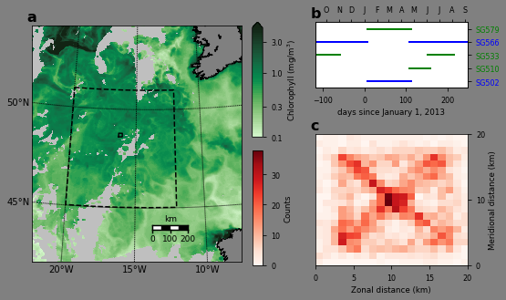


### Surface chlorophyll figure


```python
MODIS_nc = Dataset(folder+'OceanColor/Oceancolor_ocx_longterm.nc','r')
year = np.arange(2002,2012)
num_files = MODIS_nc.variables['chl'].shape[2]
rd = dt.datetime(2002,10,1)
start_index = np.empty(shape=year.shape,dtype='int')
for i in range(len(year)):
    start_index[i] = int((dt.datetime(year[i],10,1)-rd).days)
print(start_index)
```

    [   0  365  731 1096 1461 1826 2192 2557 2922 3287]


```python
chl_year = np.empty(shape=(len(year),365))
for i in range(len(year)):
    chl_year[i] = np.nanmean(MODIS_nc.variables['chl'][...,start_index[i]:start_index[i]+365],axis=(0,1))
    naned = np.isnan(chl_year[i])
    chl_year[i][naned] = np.interp(np.arange(365)[naned],np.arange(365)[~naned],chl_year[i][~naned],left=np.nan,right=np.nan)
    chl_year[i] = gaussian_filter1d(chl_year[i],1)
    chl_year[i][naned] = np.nan
```


```python
# make figure
fig = plt.figure(figsize=(8,4))
ax = plt.subplot(111);

# make plot
days = np.arange((dt.datetime(2002,10,1)-dt.datetime(2003,1,1)).days,(dt.datetime(2003,10,1)-dt.datetime(2003,1,1)).days)
for i in range(len(year)-1):
    plt.plot(days,chl_year[i],color=str(0.9-0.03*i))
l1, = plt.plot(days,chl_year[-1],color='k',lw=1.5)
for gl in Gl1:
    l2, = plt.plot(OC_time,fl_surf_day[gl],color='b',lw=2)
for gl in Gl2:
    l3, = plt.plot(OC_time,fl_surf_day[gl],color='g',lw=2)
    
# make labels
plt.xlim(time_XLIM)
plt.legend([l1,l2,l3],['Satellite','Glider 1','Glider 2'],loc='upper left')
plt.ylabel(r'Surface chlorophyll (mg/m$^3$)')
plt.xlabel('Days since 01 January');
plt.ylim([0,3]);

# make time axis
timeax = ax.twiny();
timeax.set_xticks(months_time)
timeax.set_xticklabels(months_labels)
timeax.set_xlim(time_XLIM);

plt.tight_layout()
plt.savefig('Climatology',dpi=300)
```


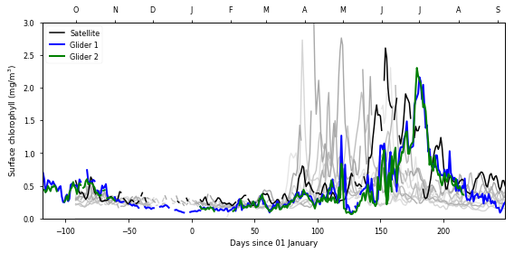


### Chlorophyll calibration figure


```python
colors = ['C0','C1','C2','C2','C4','C4','C5']
labels = ['SG502','SG510','SG533','SG566','SG579']

#make figure
fig = plt.figure(figsize=(8,4))
ax1 = plt.subplot(111);
ax2 = plt.axes([0.2, 0.45, .2, .4])

# make plots
l = ()
for i in [0,1,2,4,6,3,5]:#range(len(SG)): # matplotlib legends are stupid and very nonintuitive, so this is a hack
    print('%s: %s' % (nc_SG_L2[i].glider,colors[i]))
    l += (ax1.plot(OC_time,fl_surf_day[i],color=colors[i],zorder=-i-5),); 
ax1.scatter(OC_time,OC_chl,color='k',marker='x',zorder=-1)
ax1.legend(l[0:5],labels=labels,loc=(0.4,0.55))

for i in range(len(SG)):
    ax2.scatter(OC_chl,fl_surf_day[i],color=colors[i],s=5,marker='o')
ax2.plot([.1,2],[.1,2],'--',color='k')

# make labels
ax1.set_xlabel('Days since 01 January 2013'); ax1.set_ylabel('Surface chlorophyll (mg/m$^3$)');
ax1.set_xlim(time_XLIM); ax1.set_ylim([0,2.5]);
ax2.set_xlabel(r'MODIS Aqua (mg/m$^3$)'); ax2.set_ylabel(r'Gliders (mg/m$^3$)');
ax2.set_xlim([.1,2]); ax2.set_ylim([.1,2]); ax2.set_xscale('log'); ax2.set_yscale('log')

# make time axis
timeax = ax1.twiny();
timeax.set_xticks(months_time)
timeax.set_xticklabels(months_labels)
timeax.set_xlim(time_XLIM);
plt.tight_layout()

plt.savefig('Calibration',dpi=300)
```

    SG502: C0
    SG510: C1
    SG533: C2
    SG566: C4
    SG579: C5
    SG533: C2
    SG566: C4


    /Library/Frameworks/Python.framework/Versions/3.6/lib/python3.6/site-packages/matplotlib/axes/_axes.py:518: UserWarning: You have mixed positional and keyword arguments, some input will be discarded.
      warnings.warn("You have mixed positional and keyword "
    /Library/Frameworks/Python.framework/Versions/3.6/lib/python3.6/site-packages/matplotlib/figure.py:1743: UserWarning: This figure includes Axes that are not compatible with tight_layout, so its results might be incorrect.
      warnings.warn("This figure includes Axes that are not "


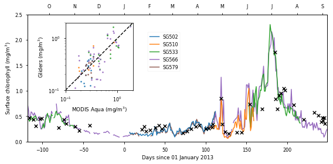


### Backscatter calibration figure


```python
bbp1b = bbp1*(650/nc_SG_L2[0].variables['backscatter'].wavelength)**(-1)
bbp2b = bbp2*(650/nc_SG_L2[0].variables['backscatter2'].wavelength)**(-1)
```


```python
# make figure
plt.figure(figsize=(7,6))

# make plot
plt.scatter(bbp1b*1e4,bbp2b*1e4,s=5,color='k',marker='.')
plt.plot([0,2],[0,2],lw=2,color='k')

# make labels
plt.xlabel(r'Backscatter (sensor at %d nm; 10$^4$/m)' % (nc_SG_L2[0].variables['backscatter'].wavelength))
plt.ylabel(r'Backscatter (sensor at %d nm; 10$^4$/m)' % (nc_SG_L2[0].variables['backscatter2'].wavelength))
plt.xlim([0,2]); plt.ylim([0,2]); plt.xticks(np.arange(0,2.1,.5)); plt.yticks(np.arange(0,2.1,.5))

plt.tight_layout()
plt.savefig('Backscatter_calib',dpi=300)
```


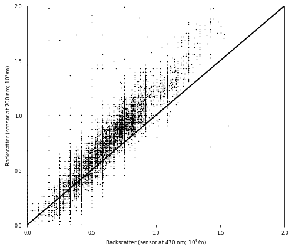


### Seaglider biological data time series figure


```python
MLD_day = [np.empty(shape=(OC_time.size,)) for gl in range(len(SG))]
for gl in range(len(SG)):
    for j in range(OC_time.size):
        MLD_day[gl][j] = np.nanmean(MLD[gl][np.floor(t_l3[gl]).astype('int')==OC_time[j]])

```

    /Library/Frameworks/Python.framework/Versions/3.6/lib/python3.6/site-packages/ipykernel_launcher.py:4: RuntimeWarning: Mean of empty slice
      after removing the cwd from sys.path.


```python
fl_day = [np.empty(shape=(OC_time.size,fl[0].shape[1])) for gl in range(len(SG))]
bbp_day = [np.empty(shape=(OC_time.size,fl[0].shape[1])) for gl in range(len(SG))]
for gl in range(len(SG)):
    for j in range(OC_time.size):
        fl_day[gl][j] = np.nanmedian(fl[gl][np.floor(t[gl]).astype('int')==OC_time[j]],axis=0)
        bbp_day[gl][j] = np.nanmedian(bbp[gl][np.floor(t[gl]).astype('int')==OC_time[j]],axis=0)
        naned = np.isnan(fl_day[gl][j])
        if np.any(naned) & np.any(~naned):
            fl_day[gl][j][naned] = np.interp(np.arange(len(z_bio))[naned],np.arange(len(z_bio))[~naned],fl_day[gl][j][~naned],right=np.nan)
        naned = np.isnan(bbp_day[gl][j])
        if np.any(naned) & np.any(~naned):
            bbp_day[gl][j][naned] = np.interp(np.arange(len(z_bio))[naned],np.arange(len(z_bio))[~naned],bbp_day[gl][j][~naned],right=np.nan)
    
    naned = np.logical_or(np.isnan(bbp_day[gl]),np.isnan(fl_day[gl]))
    fl_day[gl][naned] = np.nan; bbp_day[gl][naned] = np.nan
            
surf_chl = [np.nanmean(fl_day[gl][:,0:5],axis=1) for gl in range(len(SG))]
total_chl = [np.nansum(fl_day[gl][:,0:100],axis=1)*np.mean(np.diff(z_bio)) for gl in range(len(SG))]
surf_bbp = [np.nanmean(bbp_day[gl][:,0:5],axis=1) for gl in range(len(SG))]
total_bbp = [np.nansum(bbp_day[gl][:,0:100],axis=1)*np.mean(np.diff(z_bio)) for gl in range(len(SG))]
for gl in range(len(SG)):
    total_chl[gl][total_chl[gl]==0] = np.nan
    total_chl[gl][total_chl[gl]>100] = np.nan
    total_bbp[gl][total_bbp[gl]==0] = np.nan
    total_bbp[gl][total_bbp[gl]>0.025] = np.nan

```

    /Library/Frameworks/Python.framework/Versions/3.6/lib/python3.6/site-packages/numpy/lib/nanfunctions.py:1018: RuntimeWarning: Mean of empty slice
      return np.nanmean(a, axis, out=out, keepdims=keepdims)
    /Library/Frameworks/Python.framework/Versions/3.6/lib/python3.6/site-packages/numpy/lib/function_base.py:4033: RuntimeWarning: All-NaN slice encountered
      r = func(a, **kwargs)
    /Library/Frameworks/Python.framework/Versions/3.6/lib/python3.6/site-packages/ipykernel_launcher.py:17: RuntimeWarning: Mean of empty slice
    /Library/Frameworks/Python.framework/Versions/3.6/lib/python3.6/site-packages/ipykernel_launcher.py:19: RuntimeWarning: Mean of empty slice
    /Library/Frameworks/Python.framework/Versions/3.6/lib/python3.6/site-packages/ipykernel_launcher.py:23: RuntimeWarning: invalid value encountered in greater
    /Library/Frameworks/Python.framework/Versions/3.6/lib/python3.6/site-packages/ipykernel_launcher.py:25: RuntimeWarning: invalid value encountered in greater


```python
# make pseudo-depth for these figures
z2 = z_bio.copy()
z2[z2>200] = (z2[z2>200]-200)/3 + 200
old_depths = np.array([0,50,100,150,200,300,400,500])
new_depths = old_depths.copy()
new_depths[new_depths>200] = (new_depths[new_depths>200]-200)/4+200
print(new_depths)
MLD_day2 = ()
for gl in range(len(SG)):
    temp_MLD = MLD_day[gl].copy()
    temp_MLD[temp_MLD>200] = (temp_MLD[temp_MLD>200]-200)/4+200
    MLD_day2 += (temp_MLD,)

    maxdepth = (500-200)/4+200
print(maxdepth)

```

    [  0  50 100 150 200 225 250 275]
    275.0


    /Library/Frameworks/Python.framework/Versions/3.6/lib/python3.6/site-packages/ipykernel_launcher.py:11: RuntimeWarning: invalid value encountered in greater
      # This is added back by InteractiveShellApp.init_path()


```python
# make figure
fig = plt.figure(figsize=(8,10))
ax1 = plt.subplot(411); 
ax2 = plt.subplot(412); 
ax2b = ax2.twinx(); 
ax3 = plt.subplot(413); 
ax4 = plt.subplot(414);
ax4b = ax4.twinx();

# make plots
for gl in Gl1:
    im1 = ax1.contourf(OC_time,z2,np.log10(fl_day[gl]).T,levels=np.linspace(-1,np.log10(5),50),extend='both',cmap=cmocean.cm.algae);
    ax1.plot(OC_time,MLD_day2[gl],color='k')

for gl in Gl1:
    l1, = ax2.plot(OC_time,surf_chl[gl],color='dodgerblue')
for gl in Gl2:
    l2, = ax2.plot(OC_time,surf_chl[gl],color='limegreen')
for gl in Gl1:
    l3, = ax2b.plot(OC_time,total_chl[gl],color='mediumblue')
for gl in Gl2:
    l4, = ax2b.plot(OC_time,total_chl[gl],color='green')
ax2b.legend([l3,l1,l4,l2],[r'Glider 1, integrated',r'Glider 1, surface',r'Glider 2, integrated',r'Glider 2, surface'],ncol=1,fontsize=11,loc='upper left',labelspacing=0,columnspacing=0)

for gl in Gl1:
    im2 = ax3.contourf(OC_time,z2,np.log10(bbp_day[gl].T*1e4),levels=np.linspace(-1,np.log10(5),50),extend='both',cmap=cmocean.cm.matter);
    ax3.plot(OC_time,MLD_day2[gl],color='k')

for gl in Gl1:
    l1, = ax4.plot(OC_time,surf_bbp[gl]*1e4,color='dodgerblue')
for gl in Gl2:
    l2, = ax4.plot(OC_time,surf_bbp[gl]*1e4,color='limegreen')
for gl in Gl1:
    l3, = ax4b.plot(OC_time,total_bbp[gl]*1e4,color='mediumblue')
for gl in Gl2:
    l4, = ax4b.plot(OC_time,total_bbp[gl]*1e4,color='green')
ax4b.legend([l3,l1,l4,l2],[r'Glider 1, integrated',r'Glider 1, surface',r'Glider 2, integrated',r'Glider 2, surface'],ncol=1,fontsize=11,loc='upper left',labelspacing=0,columnspacing=0)

# make labels
ax1.set_ylabel('Depth (m)'); ax1.set_xlim(time_XLIM)
#ax1.xaxis.set_ticks_position('bottom')
ax1.set_ylim([maxdepth,0]); ax1.set_yticks(new_depths); ax1.set_yticklabels(old_depths)
ax2.set_ylabel(r'Surface Chl (mg/m$^3$)'); ax2b.set_ylabel(r'Integrated Chl (mg/m$^2$)');
ax2.set_xlim(time_XLIM); ax2.set_ylim([0,2.5]); ax2b.set_xlim(time_XLIM);  ax2b.set_ylim([0,100])
#plt.gca().xaxis.set_ticks_position('bottom')
ax3.set_ylabel('Depth (m)'); ax3.set_xlim(time_XLIM)
#ax1.xaxis.set_ticks_position('bottom')
ax3.set_ylim([maxdepth,0]); ax3.set_yticks(new_depths); ax3.set_yticklabels(old_depths)
ax4.set_ylabel(r'Surface Backscatter (10$^4$/m)'); ax4b.set_ylabel(r'Integrated Backscatter x 10$^4$');
ax4.set_xlim(time_XLIM); ax4.set_ylim([0,5]); ax4b.set_xlim(time_XLIM);  ax4b.set_ylim([0,250])
ax4.set_xlabel('Days since 01 January 2013')

# make time axes
for ax in [ax1,ax2,ax3,ax4]:
    timeax = ax.twiny();
    timeax.set_xticks(months_time)
    timeax.set_xticklabels(months_labels)
    timeax.set_xlim(time_XLIM);

# tighten up and make colorbar axes
plt.tight_layout()
plt.subplots_adjust(right=0.85)
cb1_ax = fig.add_axes([0.88,0.8,0.01,0.15])
cb2_ax = fig.add_axes([0.88,0.3,0.01,0.15])

# make colorbars
labels1 = [0.2,0.5,1,2,4]
labels1_ticks = ['0.2','0.5','1.0','2.0','4.0']
labels2 = [0,1,2]
fig.colorbar(im1, cax=cb1_ax, orientation='vertical',ticks=np.log10(labels1),label='Chlorophyll (mg/m$^3$)')
fig.colorbar(im2, cax=cb2_ax, orientation='vertical',ticks=np.log10(labels1),label='Backscatter ($10^4$/m)')
cb1_ax.set_yticklabels(labels1_ticks);
cb2_ax.set_yticklabels(labels1_ticks);

ax1.annotate('a', xy=(0,1),xycoords=ax1.transAxes,color='k',weight='bold',size=fontsize,xytext=(-5,5), textcoords="offset points")
ax2.annotate('b', xy=(0,1),xycoords=ax2.transAxes,color='k',weight='bold',size=fontsize,xytext=(-5,5), textcoords="offset points")
ax3.annotate('c', xy=(0,1),xycoords=ax3.transAxes,color='k',weight='bold',size=fontsize,xytext=(-5,5), textcoords="offset points")
ax4.annotate('d', xy=(0,1),xycoords=ax4.transAxes,color='k',weight='bold',size=fontsize,xytext=(-5,5), textcoords="offset points")

plt.savefig('Timeseries_SG',dpi=300)
```

    /Library/Frameworks/Python.framework/Versions/3.6/lib/python3.6/site-packages/ipykernel_launcher.py:12: RuntimeWarning: divide by zero encountered in log10
      if sys.path[0] == '':
    /Library/Frameworks/Python.framework/Versions/3.6/lib/python3.6/site-packages/ipykernel_launcher.py:12: RuntimeWarning: invalid value encountered in log10
      if sys.path[0] == '':
    /Library/Frameworks/Python.framework/Versions/3.6/lib/python3.6/site-packages/ipykernel_launcher.py:26: RuntimeWarning: divide by zero encountered in log10


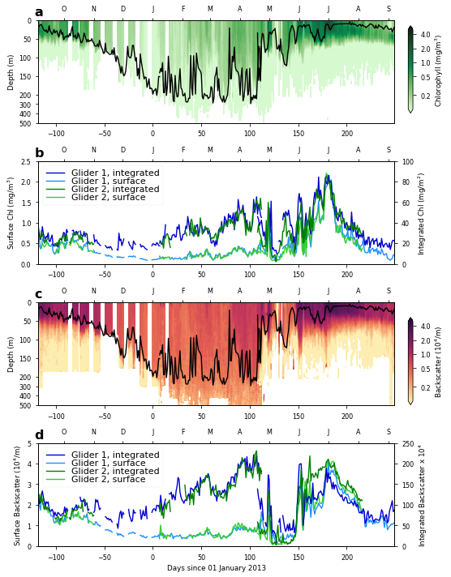


### Community index figure


```python
in_ML = [np.empty(shape=(OC_time.size,fl[0].shape[1])) for gl in range(len(SG))]
for gl in range(len(SG)):
    for j in range(OC_time.size):
        in_ML[gl][j] = z_bio<=MLD_day[gl][j]
    in_ML[gl][in_ML[gl]==0] = np.nan
```

    /Library/Frameworks/Python.framework/Versions/3.6/lib/python3.6/site-packages/ipykernel_launcher.py:4: RuntimeWarning: invalid value encountered in less_equal
      after removing the cwd from sys.path.


```python
# make figure
fig = plt.figure(figsize=(8,5))
ax1 = plt.subplot(211); 
ax2 = plt.subplot(212); 
ax2b = ax2.twinx();

# make plots
for gl in Gl1:
    im = ax1.contourf(OC_time,z2,np.log10(fl_day[gl]/bbp_day[gl]).T,levels=np.linspace(np.log10(800),np.log10(10000),50),extend='both',cmap=plt.cm.brg);
    ax1.plot(OC_time,MLD_day2[gl],color='k')

for gl in Gl1:
    l7, = ax2.plot(OC_time,MLD_day2[gl],color='0.7')
for gl in Gl1:
    l5, = ax2b.plot(OC_time,np.nanmean((fl_day[gl]/bbp_day[gl])*in_ML[gl],axis=1),color='b')
for gl in Gl2:
    l6, = ax2b.plot(OC_time,np.nanmean((fl_day[gl]/bbp_day[gl])*in_ML[gl],axis=1),color='g')

# make labels
ax1.set_ylabel('Depth (m)'); ax1.set_xlim(time_XLIM); 
ax1.set_ylim([maxdepth,0]); ax1.set_yticks(new_depths); ax1.set_yticklabels(old_depths)
ax2.set_ylabel('Depth (m)'); ax2.set_xlabel('Days since 01 January 2013'); ax2.set_xlim(time_XLIM); 
ax2.set_ylim([maxdepth,0]); ax2.set_yticks(new_depths); ax2.set_yticklabels(old_depths)
ax2b.set_yscale('log'); ax2b.set_ylim([800,3e4])
ax2b.set_ylabel(r'ML Community Index (CI)'); ax2b.set_xlim(time_XLIM);
ax2b.legend([l7,l5,l6],['Glider 1 MLD','Glider 1 CI','Glider 2 CI'],loc=(0.3,0.6),fontsize=11,labelspacing=0)

# time axis
for ax in [ax1,ax2]:
    timeax = ax.twiny();
    timeax.set_xticks(months_time)
    timeax.set_xticklabels(months_labels)
    timeax.set_xlim(time_XLIM);

# tighten up and make colorbar axis
plt.tight_layout()
plt.subplots_adjust(right=0.85)
cb1_ax = fig.add_axes([0.88,0.6,0.01,0.3])
labels = np.array([1000,2000,5000,10000])
fig.colorbar(im, cax=cb1_ax, orientation='vertical',label='Community Index (CI)',ticks=np.log10(labels))
cb1_ax.set_yticklabels(labels);

ax1.annotate('a', xy=(0,1),xycoords=ax1.transAxes,color='k',weight='bold',size=fontsize,xytext=(-5,5), textcoords="offset points")
ax2.annotate('b', xy=(0,1),xycoords=ax2.transAxes,color='k',weight='bold',size=fontsize,xytext=(-5,5), textcoords="offset points")

plt.savefig('CI',dpi=300)
```

    /Library/Frameworks/Python.framework/Versions/3.6/lib/python3.6/site-packages/ipykernel_launcher.py:9: RuntimeWarning: divide by zero encountered in true_divide
      if __name__ == '__main__':
    /Library/Frameworks/Python.framework/Versions/3.6/lib/python3.6/site-packages/ipykernel_launcher.py:9: RuntimeWarning: invalid value encountered in true_divide
      if __name__ == '__main__':
    /Library/Frameworks/Python.framework/Versions/3.6/lib/python3.6/site-packages/ipykernel_launcher.py:9: RuntimeWarning: divide by zero encountered in log10
      if __name__ == '__main__':
    /Library/Frameworks/Python.framework/Versions/3.6/lib/python3.6/site-packages/ipykernel_launcher.py:9: RuntimeWarning: invalid value encountered in log10
      if __name__ == '__main__':
    /Library/Frameworks/Python.framework/Versions/3.6/lib/python3.6/site-packages/ipykernel_launcher.py:15: RuntimeWarning: divide by zero encountered in true_divide
      from ipykernel import kernelapp as app
    /Library/Frameworks/Python.framework/Versions/3.6/lib/python3.6/site-packages/ipykernel_launcher.py:15: RuntimeWarning: invalid value encountered in true_divide
      from ipykernel import kernelapp as app
    /Library/Frameworks/Python.framework/Versions/3.6/lib/python3.6/site-packages/ipykernel_launcher.py:15: RuntimeWarning: Mean of empty slice
      from ipykernel import kernelapp as app
    /Library/Frameworks/Python.framework/Versions/3.6/lib/python3.6/site-packages/ipykernel_launcher.py:17: RuntimeWarning: divide by zero encountered in true_divide
    /Library/Frameworks/Python.framework/Versions/3.6/lib/python3.6/site-packages/ipykernel_launcher.py:17: RuntimeWarning: invalid value encountered in true_divide
    /Library/Frameworks/Python.framework/Versions/3.6/lib/python3.6/site-packages/ipykernel_launcher.py:17: RuntimeWarning: Mean of empty slice


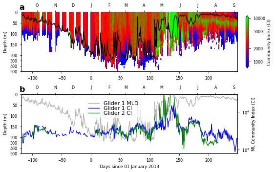


### PV and AOU figure


```python
PV_levels = np.arange(-10,-7.95,.1)
PV_ticks = [-10,-9,-8]
PV_labels = [r'10$^{-10}$',r'10$^{-9}$',r'10$^{-8}$']

# make figure
fig = plt.figure(figsize=(8,4))
ax1 = plt.subplot(211)
ax2 = plt.subplot(212)

# make plot
for i in [0,4,5]:
    pv = PV[i][5::].copy(); aou = AOU[i].copy().T[5::]; # eliminate first few rows because they are NaN in PV
    pv[pv<0] = 1e-20; # set negative values to very low so that it still plots
    aou = (aou[1::,1::]+aou[0:-1,1::]+aou[1::,0:-1]+aou[0:-1,0:-1])/4 # sample AOU like PV
    naned = np.logical_or(np.isnan(pv),np.isnan(aou)); # when either is nan, both are!
    pv[naned] = np.nan; aou[naned] = np.nan
    im1 = ax1.contourf(t_diff_l3[i],z_diff_phys[5::],np.log10(gaussian_filter1d(gaussian_filter1d(pv,2,axis=0),2,axis=1)),levels=PV_levels,extend='both',cmap=cmocean.cm.balance)
    ax1.plot(t_l3[i],gaussian_filter1d(MLD[i],2),color='k',lw=1.5)
    ax1.contour(t_l3[i],z_phys,gaussian_filter1d(pdens[i],2),levels=[1027.1],colors='k',linewidths=[0.5])
    im2 = ax2.contourf(t_diff_l3[i],z_diff_phys[5::],aou,levels=np.arange(0,81,5),extend='both',cmap=cmocean.cm.oxy_r)
    ax2.plot(t_l3[i],gaussian_filter1d(MLD[i],2),color='k',lw=1.5)
    ax2.contour(t_l3[i],z_phys,gaussian_filter1d(pdens[i],2),levels=[1027.1],colors='k',linewidths=[0.5])

# make labels
ax1.set_ylim([500,0]); ax1.set_ylabel('Depth (m)'); ax1.set_xlim(time_XLIM);
ax2.set_ylim([500,0]); ax2.set_ylabel('Depth (m)'); ax2.set_xlim(time_XLIM); ax2.set_xlabel('Days since 01 January 2013')

# make time axis
for ax in [ax1,ax2]:
    timeax = ax.twiny();
    timeax.set_xticks([-31-30-31-30,-31-30-31,-31-30,-31,0,31,31+28,31+28+31,31+28+31+30,31+28+31+30+31,31+28+31+30+31+30,31+28+31+30+31+30+31,31+28+31+30+31+30+31+31,31+28+31+30+31+30+31+31+30])
    timeax.set_xticklabels(['S','O','N','D','J','F','M','A','M','J','J','A','S'])
    timeax.set_xlim(time_XLIM);

# tighten up and make colorbar axis
plt.tight_layout()
plt.subplots_adjust(right=0.85)
cb1_ax = fig.add_axes([0.88,0.6,0.01,0.3])
cb2_ax = fig.add_axes([0.88,0.14,0.01,0.3])
cb1 = fig.colorbar(im1, cax=cb1_ax, orientation='vertical',label='PV (s$^{-3}$)',ticks=PV_ticks)
cb1.set_ticklabels(PV_labels)
cb2 = fig.colorbar(im2, cax=cb2_ax, orientation='vertical',label='AOU ($\mu$mol/kg)',ticks=np.arange(0,81,20));   
    
ax1.annotate('a', xy=(0,1),xycoords=ax1.transAxes,color='k',weight='bold',size=fontsize,xytext=(-5,5), textcoords="offset points")
ax2.annotate('b', xy=(0,1),xycoords=ax2.transAxes,color='k',weight='bold',size=fontsize,xytext=(-5,5), textcoords="offset points")

plt.savefig('PV_AOU_depth',dpi=300)
```

    /Library/Frameworks/Python.framework/Versions/3.6/lib/python3.6/site-packages/ipykernel_launcher.py:13: RuntimeWarning: invalid value encountered in less
      del sys.path[0]


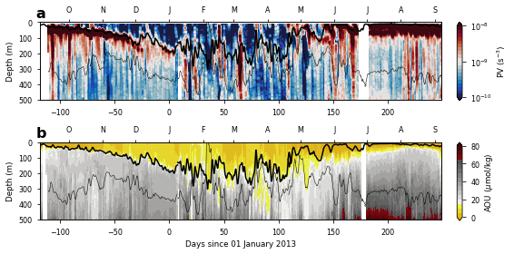


### PV and AOU figure 2


```python
isobar = 500
PV_levels = np.arange(-10,-7.95,.1)
PV_ticks = [-10,-9,-8]
PV_labels = [r'10$^{-10}$',r'10$^{-9}$',r'10$^{-8}$']

# make figure
fig = plt.figure(figsize=(8,4))
ax1 = plt.subplot(211)
ax2 = plt.subplot(212)

# make plot
for i in [0,4,5]:
    pv = PV[i][5::].copy(); aou = AOU[i].copy().T[5::]; # eliminate first few rows because they are NaN in PV
    pv[pv<0] = 1e-20; # set negative values to very low so that it still plots
    aou = (aou[1::,1::]+aou[0:-1,1::]+aou[1::,0:-1]+aou[0:-1,0:-1])/4 # sample AOU like PV
    naned = np.logical_or(np.isnan(pv),np.isnan(aou)); # when either is nan, both are!
    pv[naned] = np.nan; aou[naned] = np.nan
    
    x_grid = np.tile(t_diff_l3[i].reshape(1,-1),[pdens_diff[i][5::].shape[0],1])
    y_grid = pdens_diff[i][5::,:]-1000
    for j in range(y_grid.shape[0]):
        nanned = np.isnan(y_grid[j,:])
        if np.any(nanned):
            y_grid[j,nanned] = np.interp(np.arange(y_grid.shape[1])[nanned],np.arange(y_grid.shape[1])[~nanned],y_grid[j,~nanned])
    p_surface = np.array([np.interp(500,z_diff_phys[5::],y_grid[:,j]) for j in range(y_grid.shape[1])])
    
    im1 = ax1.contourf(x_grid,y_grid,np.log10(gaussian_filter1d(gaussian_filter1d(pv,2,axis=0),2,axis=1)),levels=PV_levels,extend='both',cmap=cmocean.cm.balance)
    ax1.plot(t_diff_l3[i],p_surface,color='k',lw=0.5)
    ax1.plot(x_grid[0,:],y_grid[3,:]+.03,color='k',lw=1.5)
    im2 = ax2.contourf(x_grid,y_grid,aou,levels=np.arange(0,81,5),extend='both',cmap=cmocean.cm.oxy_r)
    ax2.plot(x_grid[0,:],y_grid[3,:]+.03,color='k',lw=1.5)
    ax2.plot(t_diff_l3[i],p_surface,color='k',lw=0.5)

# make labels
ax1.set_ylim([27.3,26.5]); ax1.set_ylabel('Depth (m)'); ax1.set_xlim(time_XLIM);
ax2.set_ylim([27.3,26.5]); ax2.set_ylabel('Depth (m)'); ax2.set_xlim(time_XLIM); ax2.set_xlabel('Days since 01 January 2013')

# make time axis
for ax in [ax1,ax2]:
    timeax = ax.twiny();
    timeax.set_xticks([-31-30-31-30,-31-30-31,-31-30,-31,0,31,31+28,31+28+31,31+28+31+30,31+28+31+30+31,31+28+31+30+31+30,31+28+31+30+31+30+31,31+28+31+30+31+30+31+31,31+28+31+30+31+30+31+31+30])
    timeax.set_xticklabels(['S','O','N','D','J','F','M','A','M','J','J','A','S'])
    timeax.set_xlim(time_XLIM);

# tighten up and make colorbar axis
plt.tight_layout()
plt.subplots_adjust(right=0.85)
cb1_ax = fig.add_axes([0.88,0.6,0.01,0.3])
cb2_ax = fig.add_axes([0.88,0.14,0.01,0.3])
cb1 = fig.colorbar(im1, cax=cb1_ax, orientation='vertical',label='PV (s$^{-3}$)',ticks=PV_ticks)
cb1.set_ticklabels(PV_labels)
cb2 = fig.colorbar(im2, cax=cb2_ax, orientation='vertical',label='AOU ($\mu$mol/kg)',ticks=np.arange(0,81,20));   
    
ax1.annotate('a', xy=(0,1),xycoords=ax1.transAxes,color='k',weight='bold',size=fontsize,xytext=(-5,5), textcoords="offset points")
ax2.annotate('b', xy=(0,1),xycoords=ax2.transAxes,color='k',weight='bold',size=fontsize,xytext=(-5,5), textcoords="offset points")

plt.savefig('PV_AOU_pdens',dpi=300)
```

    /Library/Frameworks/Python.framework/Versions/3.6/lib/python3.6/site-packages/ipykernel_launcher.py:14: RuntimeWarning: invalid value encountered in less
      


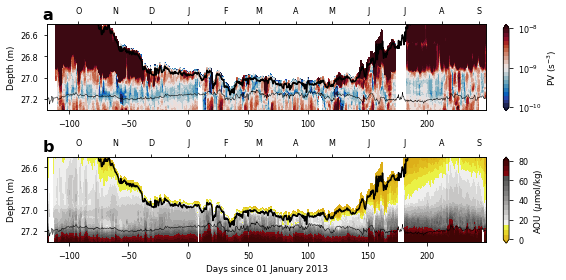


### Time series forcings figure


```python
# get SST
sp = Dataset(folder+'../../Osmosis/Datasets/Reanalysis/ECMWF.nc','r')
lonindex = np.abs(sp.variables['longitude'][:]-360-OSMOSIS_LON)<.5
latindex = np.abs(sp.variables['latitude'][:]-OSMOSIS_LAT)<.5
sp_indices = np.argsort(sp.variables['time'][:])
sst = np.nanmean(sp.variables['sst'][sp_indices,latindex,lonindex][0:-1],axis=(1,2))-273.15
sp_time = 1.*sp.variables['time'][:][sp_indices][0:-1]/24 - (dt.date(2013,1,1)-dt.date(1900,1,1)).days
sp.close()
```


```python
# get surface stress
sp = Dataset(folder+'../../Osmosis/Datasets/Reanalysis/ECMWF.nc','r')
lonindex = np.abs(sp.variables['longitude'][:]-360-OSMOSIS_LON)<.5
latindex = np.abs(sp.variables['latitude'][:]-OSMOSIS_LAT)<.5
zonal_stress = np.nanmean(sp.variables['iews'][sp_indices,latindex,lonindex][1::4],axis=(1,2))
merid_stress = np.nanmean(sp.variables['inss'][sp_indices,latindex,lonindex][1::4],axis=(1,2))
surf_stress = np.sqrt(zonal_stress**2 + merid_stress**2)
stress_time = (1.*sp.variables['time'][:][sp_indices][0:-1]/24 - (dt.date(2013,1,1)-dt.date(1900,1,1)).days)[1::4]
sp.close()
```


```python
# get total heat flux
hf = Dataset(folder+'../../Osmosis/Datasets/Reanalysis/ecmwf_total_heat_flux.nc');
lonindex = np.abs(hf.variables['longitude'][:]-360-OSMOSIS_LON)<.5
latindex = np.abs(hf.variables['latitude'][:]-OSMOSIS_LAT)<.5
swr = np.mean(hf.variables['ssr'][:,latindex,lonindex],axis=(1,2)) # short wave radiation
lwr = np.mean(hf.variables['str'][:,latindex,lonindex],axis=(1,2)) # long wave radiation
# sw and lw are in units of J/m^2. To convert to W/m^2, we must consider the length of time they are integrated over.
# This is non-intuitive.
# We have data integrated over a 3 hour period every 24 hours.
# Then the next data step is integrated over a 6 hour period, then 9, then 12.
swr[0::8] = swr[0::8]/3/3600
for i in range(1,8):
    swr[i::8] = swr[i::8]/3/3600 - swr[i-1::8]
lwr[0::8] = lwr[0::8]/3/3600
for i in range(1,8):
    lwr[i::8] = lwr[i::8]/3/3600 - lwr[i-1::8]
hf_time = hf.variables['time'][:]
glider_reference = dt.datetime(year=2013,month=1,day=1)
ecmwf_reference = dt.datetime(year=1900,month=1,day=1)
diff = glider_reference - ecmwf_reference
days, seconds = diff.days, diff.seconds
delta_hours = days * 24 + (seconds / 3600)
hf_time = (hf_time-delta_hours)/24
hf.close()

sp = Dataset(folder+'../../Osmosis/Datasets/Reanalysis/ECMWF.nc','r')
lonindex = np.abs(sp.variables['longitude'][:]-360-OSMOSIS_LON)<.5
latindex = np.abs(sp.variables['latitude'][:]-OSMOSIS_LAT)<.5
sp_indices = np.argsort(sp.variables['time'][:])
sp_time = 1.*sp.variables['time'][:][sp_indices][0:-1]/24 - (dt.date(2013,1,1)-dt.date(1900,1,1)).days
#time_step = (sp.variables['time'][:][sp_indices][1]-sp.variables['time'][:][sp_indices][0])*3600
shf = np.nanmean(sp.variables['ishf'][sp_indices,latindex,lonindex][0:-1],axis=(1,2))
lhf = np.nanmean(sp.variables['slhf'][sp_indices,latindex,lonindex][0:-1],axis=(1,2))
# see above; shf is fine but lhf is integrated over up to 2 days at half day increments.
lhf[0::4] = lhf[0::4]/12/3600
for i in range(1,4):
    lhf[i::4] = lhf[i::4]/12/3600 - lhf[i-1::4]
sp.close()
thf = np.interp(sp_time,hf_time,swr+lwr)+lhf+shf

```


```python
# get ADT
LAT_RANGE = np.array([45,55])
LON_RANGE = np.array([-20,-11])
# download ADT (AVISO)
date_processed = '20140106'
day = dt.datetime(year=2012,month=1,day=1)
filename = folder+'AVISO/dt_global_allsat_madt_h_%04d%02d%02d_%s.nc' % (day.year,day.month,day.day,date_processed)
nc_av = Dataset(filename,'r')
latindices = np.where(np.logical_and(nc_av.variables['lat'][:]>LAT_RANGE[0],nc_av.variables['lat'][:]<LAT_RANGE[1]))[0]
lonindices = np.where(np.logical_and(nc_av.variables['lon'][:]>LON_RANGE[0]+360,nc_av.variables['lon'][:]<LON_RANGE[1]+360))[0]
lon = nc_av.variables['lon'][lonindices]
lat = nc_av.variables['lat'][latindices]
print(nc_av.variables['adt']);
nc_av.close()
adt = np.nan*np.empty(shape=(365+366,len(latindices),len(lonindices)))
day = dt.datetime(year=2012,month=1,day=1)
for i in range(len(adt)):
    date_processed = '20140106' if day.year==2012 else '20140704'
    filename = folder+'AVISO/dt_global_allsat_madt_h_%04d%02d%02d_%s.nc' % (day.year,day.month,day.day,date_processed)
    nc_av = Dataset(filename,'r')
    adt[i,:,:] = nc_av.variables['adt'][0,latindices,:][:,lonindices]
    nc_av.close()
    day += dt.timedelta(days=1)
days = np.arange(-366,365,1)
```

    <class 'netCDF4._netCDF4.Variable'>
    int32 adt(time, lat, lon)
        _FillValue: -2147483647
        coordinates: lon lat
        long_name: Absolute Dynamic Topography
        scale_factor: 0.0001
        standard_name: sea_surface_height_above_geoid
        units: m
    unlimited dimensions: 
    current shape = (1, 720, 1440)
    filling off
    


```python
# get Okubo-Weiss parameter
u_g_grid = np.nan*np.empty(shape=adt.shape)
v_g_grid = np.nan*np.empty(shape=adt.shape)
S1 =   np.nan*np.empty(shape=adt.shape)
S2 =   np.nan*np.empty(shape=adt.shape)
vort = np.nan*np.empty(shape=adt.shape)
ow =   np.nan*np.empty(shape=adt.shape)
lat_diff = lat[0:-1]+np.diff(lat)/2
lon_diff = lon[0:-1]+np.diff(lon)/2
for i in range(adt.shape[0]):
    ADT = adt[i,:,:]
    u_g = -g/f*np.diff(ADT,axis=0)/np.tile(np.diff(lat).reshape(-1,1),[1,ADT.shape[1]])/OSMOSIS_LAT_DEG/1000
    v_g =  g/f*np.diff(ADT,axis=1)/np.tile(np.diff(lon).reshape(1,-1),[ADT.shape[0],1])/OSMOSIS_LON_DEG/1000
    u_g_grid[i,1:-1,:] = u_g[0:-1,:]+np.diff(u_g,axis=0)/2
    v_g_grid[i,:,1:-1] = v_g[:,0:-1]+np.diff(v_g,axis=1)/2
    u_g_x = np.diff(u_g,axis=1)/np.tile(np.diff(lon).reshape(1,-1),[u_g.shape[0],1])/OSMOSIS_LON_DEG/1000
    u_g_y = np.diff(u_g,axis=0)/np.tile(np.diff(lat_diff).reshape(-1,1),[1,u_g.shape[1]])/OSMOSIS_LAT_DEG/1000
    v_g_x = np.diff(v_g,axis=1)/np.tile(np.diff(lon_diff).reshape(1,-1),[v_g.shape[0],1])/OSMOSIS_LON_DEG/1000
    v_g_y = np.diff(v_g,axis=0)/np.tile(np.diff(lat).reshape(-1,1),[1,v_g.shape[1]])/OSMOSIS_LAT_DEG/1000
    u_g_x_grid = np.nan*np.empty(shape=(len(lat),len(lon)))
    u_g_x_grid[1:-1,1:-1] = (u_g_x[0:-1,0:-1]+u_g_x[1::,0:-1]+u_g_x[0:-1,1::]+u_g_x[1::,1::])/4
    u_g_y_grid = np.nan*np.empty(shape=(len(lat),len(lon)))
    u_g_y_grid[1:-1,:] = u_g_y
    v_g_x_grid = np.nan*np.empty(shape=(len(lat),len(lon)))
    v_g_x_grid[:,1:-1] = v_g_x
    v_g_y_grid = np.nan*np.empty(shape=(len(lat),len(lon)))
    v_g_y_grid[1:-1,1:-1] = (v_g_y[0:-1,0:-1]+v_g_y[1::,0:-1]+v_g_y[0:-1,1::]+v_g_y[1::,1::])/4
    S1[i,:,:]   = u_g_x_grid - v_g_y_grid
    S2[i,:,:]   = v_g_x_grid + u_g_y_grid
    vort[i,:,:] = v_g_x_grid - u_g_y_grid
    ow[i,:,:]   = (S1[i,:,:]**2+S2[i,:,:]**2-vort[i,:,:]**2)/2
```


```python
# find correct indices
lonind = np.argmin(np.abs(lon-360-OSMOSIS_LON))
latind = np.argmin(np.abs(lat-OSMOSIS_LAT))
print(lon[lonind]-360)
print(lat[latind])
```

    -16.125
    48.625


```python
# make figure
plt.figure(figsize=(8,9));
ax1 = plt.subplot(311); 
ax1b = ax1.twinx(); 
ax2 = plt.subplot(312); 
ax2b = ax2.twinx(); 
ax3 = plt.subplot(313); 
ax3b = ax3.twinx(); 

# make plots
ax1.plot(stress_time,surf_stress,color='0.8')
ax1.plot(stress_time,gaussian_filter1d(surf_stress,8),color='0.6')
for gl in Gl1:
    ax1b.plot(OC_time,sw.dpth(MLD_day[gl],OSMOSIS_LAT),color='0.3')
    ax1b.plot(OC_time,gaussian_filter1d(sw.dpth(MLD_day[gl],OSMOSIS_LAT),4),color='k',zorder=2)
ax2.plot(sp_time,sst,color='k')
ax2b.plot(sp_time,gaussian_filter1d(thf,8),color='0.6')
ax3.plot(days,(adt[:,latind,lonind]-np.mean(adt,axis=(1,2)))*100,color='k')
ax3b.plot(days,ow[:,latind,lonind]/f**2*1e3,color='0.6')

# make labels
for ax in [ax1,ax1b,ax2,ax2b,ax3,ax3b]:
    ax.set_xlim(time_XLIM)
ax1.set_ylim([0,1]); ax1.set_yticks(np.arange(0,1.1,.2)); ax1.set_ylabel('Wind streee (N/m$^2$)');
ax1b.set_ylim([500,0]); ax1b.set_yticks(np.arange(0,501,100)); ax1b.set_ylabel('MLD (m)');
ax2.set_ylim([10,20]); ax2.set_yticks(np.arange(10,21,2)); ax2.set_ylabel('SST ($^\circ$C)');
ax2b.set_ylim([-300,450]); ax2b.set_yticks(np.arange(-300,451,150)); ax2b.set_ylabel('Heat flux (W/m$^2$)');
ax3.set_ylim([-15,15]); ax3.set_yticks(np.arange(-15,16,5)); ax3.set_ylabel('SLA (cm)');
ax3b.set_ylim([-4.5,4.5]); ax3b.set_yticks(np.arange(-4.5,5,1.5)); ax3b.set_ylabel('OW/$f^2$ x 10$^3$');
ax3.set_xlabel('Days since 01 January 2013')

ax1b.yaxis.tick_left(); ax1b.yaxis.set_label_position("left")
ax1.yaxis.tick_right(); ax1.yaxis.set_label_position("right")

for ax in [ax1,ax2b,ax3b]:
    ax.spines['right'].set_color('0.6')
    ax.yaxis.label.set_color('0.6')
    ax.tick_params(axis='y', colors='0.6')
    
# plot zero lines
for ax in [ax2b,ax3b]:
    ax.plot(time_XLIM,[0,0],color='k',ls=':')

# make time axes
for ax in [ax1,ax2,ax3]:
    timeax = ax.twiny();
    timeax.set_xticks([-31-30-31-30,-31-30-31,-31-30,-31,0,31,31+28,31+28+31,31+28+31+30,31+28+31+30+31,31+28+31+30+31+30,31+28+31+30+31+30+31,31+28+31+30+31+30+31+31,31+28+31+30+31+30+31+31+30])
    timeax.set_xticklabels(['S','O','N','D','J','F','M','A','M','J','J','A','S'])
    timeax.set_xlim(time_XLIM);

ax1.annotate('a', xy=(0,1),xycoords=ax1.transAxes,color='k',weight='bold',size=fontsize,xytext=(-5,5), textcoords="offset points")
ax2.annotate('b', xy=(0,1),xycoords=ax2.transAxes,color='k',weight='bold',size=fontsize,xytext=(-5,5), textcoords="offset points")
ax3.annotate('c', xy=(0,1),xycoords=ax3.transAxes,color='k',weight='bold',size=fontsize,xytext=(-5,5), textcoords="offset points")

#bbox_props = dict(boxstyle="darrow,pad=0", fc="k", ec="k", lw=2)
#ax3.text(time_XLIM[0]-65,.5, "------------------------------------------------------------------------", ha="center", va="center", rotation=90, size=5, bbox=bbox_props)
ax3.annotate('Cyclone', xy=(-.2,.0),ha='center',xycoords=ax3.transAxes,xytext=(-.2,1.),color='k',arrowprops=dict(arrowstyle="<->",color='k',lw=2))
ax3.annotate('Anticyclone',xy=(-.2,-.08),ha='center',xycoords=ax3.transAxes,color='k')
ax3.annotate('Eddy\nperiphery', xy=(1.2,0),ha='center',xycoords=ax3.transAxes,xytext=(1.2,1.),color='0.6',arrowprops=dict(arrowstyle="<->",color='0.6',lw=2))
ax3.annotate('Eddy\ncore',xy=(1.2,-.12),ha='center',xycoords=ax3.transAxes,color='0.6')

plt.tight_layout()
plt.subplots_adjust(left=.2,right=.8)
plt.savefig('Timeseries_forcings',dpi=300);
```


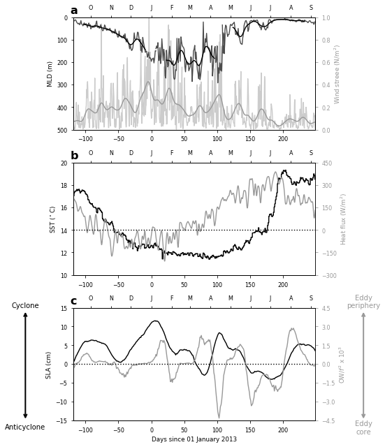


### Subduction event detail figure


```python
plt.pcolormesh(t_diff_l3[gl],z_diff_phys[5::],np.log10(gaussian_filter1d(gaussian_filter1d(pv,2,axis=0),2,axis=1)),vmin=-12,vmax=-8,cmap=cmocean.cm.balance); plt.colorbar()
plt.xlim([110,128]); plt.ylim([300,0])
```


    (300, 0)


    /Library/Frameworks/Python.framework/Versions/3.6/lib/python3.6/site-packages/matplotlib/colors.py:496: RuntimeWarning: invalid value encountered in less
      cbook._putmask(xa, xa < 0.0, -1)


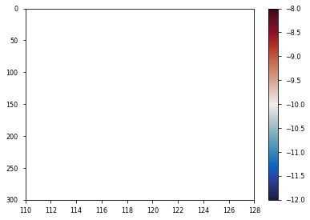


```python
# plot PV, AOU, Chl, and community index from day 110 to day 130, down to 300 m depth
gl = 4
time_range = [110,128]
depth_range = [300,15]
PV_ticks = [-12,-11,-10,-9,-8]
PV_labels = ['10$^{-12}$','10$^{-11}$', '10$^{-10}$', '10$^{-9}$','10$^{-8}$']

# set up PV, AOU, and chl
pv = PV[gl][5::].copy(); aou = AOU[gl].copy().T[5::]; # eliminate first few rows because they are NaN in PV
pv[pv<0] = 1e-20; # set negative values to very low so that it still plots
aou = (aou[1::,1::]+aou[0:-1,1::]+aou[1::,0:-1]+aou[0:-1,0:-1])/4 # sample AOU like PV
naned = np.logical_or(np.isnan(pv),np.isnan(aou)); # when either is nan, both are!
pv[naned] = np.nan; aou[naned] = np.nan
chl = fl_day[gl].T
chl[chl<1e-6] = 1e-6; chl[np.isnan(chl)] = 1e-6;

# make figure
fig = plt.figure(figsize=(8,4))
ax1 = plt.subplot(131) # PV
ax2 = plt.subplot(132) # AOU
ax3 = plt.subplot(133) # Chl

# make plots
im1 = ax1.contourf(t_diff_l3[gl],z_diff_phys[5::],np.log10(gaussian_filter1d(gaussian_filter1d(pv,2,axis=0),2,axis=1)),levels=np.arange(-12,-7.95,.1),extend='both',cmap=cmocean.cm.balance); 
im2 = ax2.contourf(t_diff_l3[gl],z_diff_phys[5::],aou,levels=np.arange(0,21,1),extend='both',cmap=cmocean.cm.oxy_r);
im3 = ax3.contourf(OC_time,z_bio,np.log10(chl),levels=np.linspace(np.log10(0.02),np.log10(2),50),extend='both',cmap=cmocean.cm.algae)

for ax in [ax1,ax2,ax3]:
    ax.plot(t_l3[gl],MLD[gl],color='k',lw=2)
    ax.contour(t_l3[gl],z_phys,gaussian_filter1d(pdens[gl],1,axis=0),levels=[1027.09,1027.1],colors='k')
    
# make labels
for ax in [ax1,ax2,ax3]:
    ax.set_xlabel('Days since 01 Jan 2013')
    ax.set_xlim(time_range); ax.set_ylim(depth_range)
    ax.set_xticks(np.arange(110,130,4));
ax1.set_ylabel('Depth (m)');

# tighten up and make colorbars
plt.tight_layout(w_pad=0)
plt.subplots_adjust(top=0.92,bottom=0.3)
cb1_ax = fig.add_axes([ax1.get_position().x0,0.15,ax1.get_position().x1-ax1.get_position().x0,0.02])
cb2_ax = fig.add_axes([ax2.get_position().x0,0.15,ax2.get_position().x1-ax2.get_position().x0,0.02])
cb3_ax = fig.add_axes([ax3.get_position().x0,0.15,ax3.get_position().x1-ax3.get_position().x0,0.02])
cb1 = plt.colorbar(im1, cax=cb1_ax, orientation='horizontal',label='PV (s$^{-3}$)',ticks=PV_ticks);
cb1.set_ticklabels(PV_labels)
cb2 = plt.colorbar(im2, cax=cb2_ax, orientation='horizontal',label='AOU ($\mu$mol/kg)',ticks=np.arange(0,21,5));  
cb3 = plt.colorbar(im3, cax=cb3_ax, orientation='horizontal',label=r'Chl (mg/m$^3$)',ticks=np.log10([0.03,0.1,0.3,1]))  
cb3.set_ticklabels(['0.03','0.1','0.3','1.0'])

# make labels        
ax1.annotate('a', xy=(0,1),xycoords=ax1.transAxes,color='k',weight='bold',size=fontsize,xytext=(-5,5), textcoords="offset points")
ax2.annotate('b', xy=(0,1),xycoords=ax2.transAxes,color='k',weight='bold',size=fontsize,xytext=(-5,5), textcoords="offset points")
ax3.annotate('c', xy=(0,1),xycoords=ax3.transAxes,color='k',weight='bold',size=fontsize,xytext=(-5,5), textcoords="offset points")

plt.savefig('Detail',dpi=300)

```

    /Library/Frameworks/Python.framework/Versions/3.6/lib/python3.6/site-packages/ipykernel_launcher.py:10: RuntimeWarning: invalid value encountered in less
      # Remove the CWD from sys.path while we load stuff.
    /Library/Frameworks/Python.framework/Versions/3.6/lib/python3.6/site-packages/ipykernel_launcher.py:15: RuntimeWarning: invalid value encountered in less
      from ipykernel import kernelapp as app


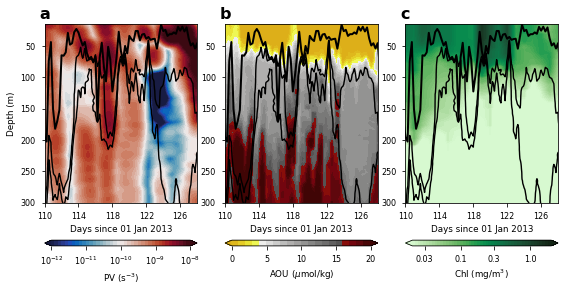


### MLI and SI figure


```python
# calculate H
H = ();
for i in range(len(SG)):
    pv = gaussian_filter1d(gaussian_filter1d(PV[i][5::],2,axis=0),2,axis=1)
    HH = np.empty(shape=t_diff_l3[i].shape)
    for j in range(len(HH)):
        # find first index where the cumulative PV is positive
        inds = np.where(np.nancumsum(pv[:,j])>0)[0]
        HH[j] = z_diff_phys[5::][inds[0]] if len(inds)>0 else np.nan
    H += (HH.copy(),);
    del HH
```


```python
plt.figure(figsize=(12,4))
for i in range(len(H)):
    plt.plot(t_diff_l3[i],gaussian_filter1d(H[i],0))

```


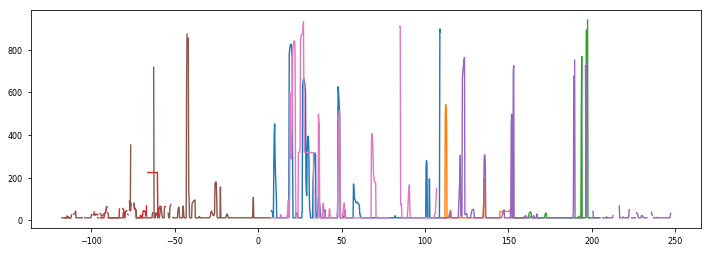


```python
# calculate h
alpha = [sw.eos80.alpha(np.nanmean(nc_SG_L3[i].variables['salinity'][0:10,:],axis=0),np.nanmean(nc_SG_L3[i].variables['pot_temperature'][0:10,:],axis=0),0) for i in range(len(SG))]
alpha_interp = [(alpha[i][0:-1]+alpha[i][1::])/2 for i in range(len(SG))]


```

    /Library/Frameworks/Python.framework/Versions/3.6/lib/python3.6/site-packages/ipykernel_launcher.py:2: RuntimeWarning: invalid value encountered in less
      
    /Library/Frameworks/Python.framework/Versions/3.6/lib/python3.6/site-packages/ipykernel_launcher.py:2: RuntimeWarning: Mean of empty slice
      


```python
nc_hf = Dataset(folder+'../../Osmosis/Datasets/Reanalysis/ecmwf_total_heat_flux.nc');
hf_time = nc_hf.variables['time'][:]
lat = nc_hf.variables['latitude'][:]
lon = nc_hf.variables['longitude'][:]-360
latindices = np.where(np.logical_and(lat>OSMOSIS_LAT_RANGE[0],lat<OSMOSIS_LAT_RANGE[1]))[0]
lonindices = np.where(np.logical_and(lon>OSMOSIS_LON_RANGE[0],lon<OSMOSIS_LON_RANGE[1]))[0]

ssr = np.mean(nc_hf.variables['ssr'][:,latindices,lonindices].reshape(-1,len(lonindices)+len(latindices)),axis=1)
str = np.mean(nc_hf.variables['str'][:,latindices,lonindices].reshape(-1,len(lonindices)+len(latindices)),axis=1)
hf_time = nc_hf.variables['time'][:]

# ssr and str are in units of J/m^2. To convert to W/m^2, we must consider the length of time they are integrated over.
# This is non-intuitive.
# For ssr, we have data integrated over a 3 hour period every 24 hours.
# Then the next data step is integrated over a 6 hour period, then 9, then 12, etc..
# For str, the same is true but the total integration period is only 12 hours, not 24.
for i in range(7,0,-1):
    ssr[i::8] = (ssr[i::8] - ssr[i-1::8])/3/3600
ssr[0::8] = ssr[0::8]/3/3600
for i in range(3,0,-1):
    str[i::4] = (str[i::4] - str[i-1::4])/3/3600
str[0::4] = str[0::4]/3/3600

glider_reference = dt.datetime(year=2013,month=1,day=1)
ecmwf_reference = dt.datetime(year=1900,month=1,day=1)
diff = glider_reference - ecmwf_reference
days, seconds = diff.days, diff.seconds
delta_hours = days * 24 + (seconds / 3600)
hf_time = (hf_time-delta_hours)/24
# filter over a day's length
ssr = gaussian_filter1d(ssr,8)
str = gaussian_filter1d(str,8)
```


```python
sp = Dataset(folder+'../../Osmosis/Datasets/Reanalysis/ECMWF.nc','r')
lonindex = np.argmin(np.abs(sp.variables['longitude'][:]-360-OSMOSIS_LON))
latindex = np.argmin(np.abs(sp.variables['latitude'][:]-OSMOSIS_LAT))
sp_indices = np.argsort(sp.variables['time'][:])
ecmwf_time = 1.*sp.variables['time'][sp_indices]/24 - (dt.date(2013,1,1)-dt.date(1900,1,1)).days
time_step = (sp.variables['time'][:][sp_indices][1]-sp.variables['time'][:][sp_indices][0])*3600
shf = sp.variables['ishf'][sp_indices,latindex,lonindex]
lhf = sp.variables['slhf'][sp_indices,latindex,lonindex]
ecmwf_time = ecmwf_time[1::]
shf = shf[1::]
lhf = lhf[1::]
# see above; shf is fine but lhf is integrated over up to 2 days at half day increments.
#lhf[0::4] = lhf[0::4]/12/3600
#for i in range(1,4):
#    lhf[i::4] = lhf[i::4]/12/3600 - lhf[i-1::4]
for i in range(3,0,-1):
    lhf[i::4] = (lhf[i::4] - lhf[i-1::4])/3/3600
lhf[0::4] = lhf[0::4]/3/3600
shf = gaussian_filter1d(shf,8)
lhf = gaussian_filter1d(lhf,8)
```


```python
THF = np.interp(ecmwf_time,hf_time,ssr+str)+lhf+shf
thf = [np.interp(t_diff_l3[gl],ecmwf_time,THF) for gl in range(len(SG))]
```


```python
plt.plot(hf_time,ssr,'C0',alpha=0.5,label='Net solar radiation')
plt.plot(hf_time,str,'C1',alpha=0.5,label='Net thermal radiation')
plt.plot(ecmwf_time,lhf,'C2',alpha=0.5,label='Latent heat flux')
plt.plot(ecmwf_time,shf,'C3',alpha=0.5,label='Sensible heat flux')
plt.plot(ecmwf_time,THF,'k',label='Total heat flux')
plt.xlim([np.min(ecmwf_time),np.max(ecmwf_time)]);
plt.legend(loc=4); plt.grid(True)
```


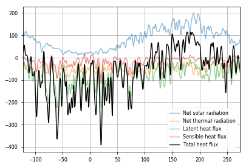


```python
sp = Dataset(folder+'../../Osmosis/Datasets/Reanalysis/surface_properties.nc','r')
lonindex = np.argmin(np.abs(sp.variables['longitude'][:]-360-OSMOSIS_LON))
latindex = np.argmin(np.abs(sp.variables['latitude'][:]-OSMOSIS_LAT))
print('Using data from %.2f %s and %.2f %s' % (sp.variables['longitude'][lonindex]-360,sp.variables['longitude'].units,sp.variables['latitude'][latindex],sp.variables['latitude'].units))
surfstress = np.sqrt(sp.variables['iews'][:,latindex,lonindex]**2 + sp.variables['inss'][:,latindex,lonindex]**2)
surftime = 1.*sp.variables['time'][:]/24-(dt.date(2013,1,1)-dt.date(1900,1,1)).days
surforientation = np.arctan(sp.variables['inss'][:,latindex,lonindex]/sp.variables['iews'][:,latindex,lonindex])
so = surforientation.copy()
current_offset = 0
offset = np.zeros(shape=so.shape)
for i in range(1,so.size):
    if so[i]-so[i-1]>np.pi/2:
        current_offset -= np.pi
    elif so[i-1]-so[i]>np.pi/2:
        current_offset += np.pi
    offset[i] = current_offset
so += offset
so_filter = gaussian_filter1d(so,8)
```

    Using data from -16.50 degrees_east and 48.75 degrees_north


```python
surfstress = gaussian_filter1d(surfstress,8)
```


```python
plt.plot(surftime,surfstress,'C0')
plt.ylabel('Surface stress',color='C0'); plt.xlabel('Time (days since 01 January 2013)'); plt.ylim([0,1.4]); plt.grid(True)
ax2 = plt.gca().twinx()
plt.scatter(surftime,so/np.pi,marker='.',s=1,color='C1')
plt.plot(surftime,so_filter/np.pi,'C1')
plt.ylabel(r'Stress orientation $\times \pi$',color='C1'); plt.ylim([-4,10]);
```


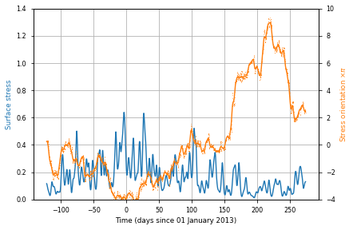


```python
so_interp = [np.interp(t_diff_l3[i],surftime,so_filter) for i in range(len(SG))]
surfstress_interp = [np.interp(t_diff_l3[i],surftime,surfstress) for i in range(len(SG))]
```


```python
glider_orientation = [np.arctan((np.diff(nc_SG_L3[i].variables['latitude'][0,:])*OSMOSIS_LAT_DEG)/(np.diff(nc_SG_L3[i].variables['longitude'][0,:])*OSMOSIS_LON_DEG)) for i in range(len(SG))]
go = [glider_orientation[i].copy() for i in range(len(SG))]
for gl in range(len(SG)):
    current_offset = 0
    offset = np.zeros(shape=go[gl].shape)
    for i in range(1,go[gl].size):
        if go[gl][i]-go[gl][i-1]>np.pi/2:
            current_offset -= np.pi
        elif go[gl][i-1]-go[gl][i]>np.pi/2:
            current_offset += np.pi
        offset[i] = current_offset
    go[gl] += offset
go = [gaussian_filter1d(go[i],3) for i in range(len(SG))]
go_interp = [np.interp(t[i],t_diff_l3[i],go[i]) for i in range(len(SG))]

```


```python
d_orientation = [np.mod(go[i]-so_interp[i],2*np.pi) for i in range(len(SG))]
do = [d_orientation[i].copy() for i in range(len(SG))]
for gl in range(len(SG)):
    current_offset = 0
    offset = np.zeros(shape=do[gl].shape)
    for i in range(1,do[gl].size):
        if do[gl][i]-do[gl][i-1]>np.pi/2:
            current_offset -= np.pi
        elif do[gl][i-1]-do[gl][i]>np.pi/2:
            current_offset += np.pi
        offset[i] = current_offset
    do[gl] += offset
```


```python
for i in range(len(do)):
    plt.scatter(t_diff_l3[i],do[i]/np.pi,c=np.mod(do[i],np.pi),cmap=plt.cm.hsv,edgecolor='none',s=5)
plt.colorbar(label='\Delta\phi')
plt.xlabel('Days since 01 January 2013')
plt.ylabel(r'$\Delta\phi\times\pi$')
plt.grid(True)
```


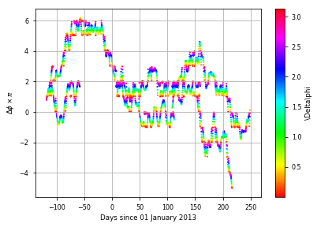


```python
Cp = 3985 # specific heat of seawater, J/kg/K
Bo = [thf[gl]*alpha_interp[gl]*g/Cp/rho0 for gl in range(len(SG))]
wstar_cu = [Bo[gl]*H[gl] for gl in range(len(SG))]
ustar_sq = [np.interp(t_diff_l3[gl],ecmwf_time,surfstress)/rho0 for gl in range(len(SG))]
```


```python
gl = 0; i = 0;
H[gl][i]
inds = np.where(z_phys[gl]>H[gl][i])[0]
```


```python
# calculate h
c = 14 # empirical constant
delta_v = ();
for gl in range(len(SG)):
    delta_v += (np.empty(shape=Bo[gl].shape),)
    for i in range(len(delta_v[gl])):
        inds = np.where(z_phys>H[gl][i])[0]
        if len(inds)>0:
            delta_v[gl][i] = np.nansum(v_z[gl][0:inds[0],i])*2  # 2 is dz
        else:
            delta_v[gl][i] = np.nan
aa = [c**3 * (wstar_cu[gl]/np.abs(delta_v[gl])**3 + ustar_sq[gl]/delta_v[gl]**2*np.cos(do[gl]))**2 for gl in range(len(SG))]
for gl in range(len(SG)):
    aa[gl][aa[gl]<=0] = np.nan
pp = [-3*(aa[gl]**2)/8-3*aa[gl] for gl in range(len(SG))]
qq = [aa[gl]/8*(((aa[gl]+6)**2) - 12) for gl in range(len(SG))] # NB Equation C.7 of Bachman et al. is wrong; this is right
QQ = [((27*(aa[gl]**2) + np.sqrt(729*(aa[gl]**4) + 6912*(aa[gl]**3)))/2)**(1/3) for gl in range(len(SG))]
SS = [0.5*np.sqrt(2*aa[gl]+(aa[gl]**2)/4 + (QQ[gl]-12*aa[gl]/QQ[gl])/3) for gl in range(len(SG))]
h_on_H = [-aa[gl]/4 -SS[gl] + 0.5*np.sqrt(-4*(SS[gl]**2) -2*pp[gl] +qq[gl]/SS[gl]) for gl in range(len(SG))]
for gl in range(len(SG)):
    h_on_H[gl][aa[gl]>1e10] = np.nan
h = [h_on_H[gl]*H[gl] for gl in range(len(SG))]
```

    /Library/Frameworks/Python.framework/Versions/3.6/lib/python3.6/site-packages/ipykernel_launcher.py:7: RuntimeWarning: invalid value encountered in greater
      import sys
    /Library/Frameworks/Python.framework/Versions/3.6/lib/python3.6/site-packages/ipykernel_launcher.py:14: RuntimeWarning: invalid value encountered in less_equal
      
    /Library/Frameworks/Python.framework/Versions/3.6/lib/python3.6/site-packages/ipykernel_launcher.py:21: RuntimeWarning: invalid value encountered in greater


```python
for gl in range(len(SG)):
    print(np.nanmax(h[gl]))
```

    695.6578380235007
    259.8799022460551
    762.2464094796252
    223.8500431580472
    709.2420090315754
    661.8740635330829
    832.938895084021


```python
for i in range(len(SG)):
    plt.plot(t_diff_l3[i],H[i],color='k')
    plt.plot(t_diff_l3[i],h[i],color='r')
```


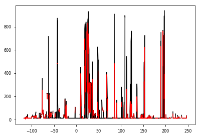


```python
MLD_interp = [(mld[0:-1]+mld[1::])/2 for mld in MLD]
```


```python
# MLI
Ce = 0.08
b_x_ML = [np.empty(shape=MLD_interp[gl].shape) for gl in range(len(SG))]
mu = [np.zeros(shape=(z_phys.size,b_x_ML[gl].size)) for gl in range(len(SG))]
for gl in range(len(SG)):
    for i in range(len(b_x_ML[gl])):
        inds = z_phys<MLD_interp[gl][i]
        b_x_ML[gl][i] = np.nanmean(b_x[gl][inds,i])
        mu[gl][:,i] = (1-(-2*z_phys/MLD_interp[gl][i]+1)**2)*(1+5/21*(-2*z_phys/MLD_interp[gl][i]+1)**2)
        mu[gl][z_phys>MLD_interp[gl][i],i] = 0
psi_e = [Ce*np.tile((MLD_interp[gl]**2*b_x_ML[gl]).reshape(1,-1),[z_phys.size,1])*mu[gl]/f for gl in range(len(SG))]
```

    /Library/Frameworks/Python.framework/Versions/3.6/lib/python3.6/site-packages/ipykernel_launcher.py:7: RuntimeWarning: invalid value encountered in less
      import sys
    /Library/Frameworks/Python.framework/Versions/3.6/lib/python3.6/site-packages/ipykernel_launcher.py:8: RuntimeWarning: Mean of empty slice
      
    /Library/Frameworks/Python.framework/Versions/3.6/lib/python3.6/site-packages/ipykernel_launcher.py:10: RuntimeWarning: invalid value encountered in greater
      # Remove the CWD from sys.path while we load stuff.


```python
distance_x = [distance[gl][0,0:-1]+np.diff(distance[gl],axis=1)/2 for gl in range(len(SG))]
w_MLI = [np.diff(psi_e[gl],axis=1)/np.tile(np.diff(distance_x[gl],axis=1),[psi_e[gl].shape[0],1]) for gl in range(len(SG))]
```


```python
# make figure
plt.figure(figsize=(8,4));
ax1 = plt.subplot(211)
ax2 = plt.subplot(212)

# make plots
im = ax1.contourf(t_l3[0][1:-1],z_phys,w_MLI[0]*86400,levels=np.arange(-50,51,1),cmap=plt.cm.bwr,extend='both')
ax1.contourf(t_l3[4][1:-1],z_phys,w_MLI[4]*86400,levels=np.arange(-50,51,1),cmap=plt.cm.bwr,extend='both')
ax1.plot(t_l3[0],MLD[0],'k')
ax1.plot(t_l3[4],MLD[4],'k')
l1, = ax2.plot(t_diff_l3[0],H[0],'b')
ax2.plot(t_diff_l3[4],H[4],'b')
l2, = ax2.plot(t_diff_l3[0],h[0],'r',linewidth=2)
ax2.plot(t_diff_l3[4],h[4],'r',linewidth=2)
l3, = ax2.plot(t_l3[0],MLD[0],'k')
ax2.plot(t_l3[4],MLD[4],'k')
ax2.legend([l1,l2,l3],['H','h','MLD'],loc=(1.02,.3))
ax2.plot(t_diff_l3[1],H[1],'b--')
ax2.plot(t_diff_l3[6],H[6],'b--')
ax2.plot(t_diff_l3[1],h[1],'r--',linewidth=2)
ax2.plot(t_diff_l3[6],h[6],'r--',linewidth=2)
ax2.plot(t_l3[1],MLD[1],'k--')
ax2.plot(t_l3[6],MLD[6],'k--')

# make labels
ax1.set_ylabel('Depth (m)'); ax2.set_yticks(np.arange(0,501,100))
ax1.set_xlim([40,150]); ax1.set_ylim([500,0])
ax2.set_ylabel('Depth (m)'); ax2.set_yticks(np.arange(0,501,100))
ax2.set_xlim([40,150]); ax2.set_ylim([500,0])
ax2.set_xlabel('Days since 01 Jan 2013')

# make time axes
timeax = ax1.twiny(); 
timeax.set_xticks([31+28,31+28+31,31+28+31+30,31+28+31+30+31,31+28+31+30+31+30,31+28+31+30+31+30+31,31+28+31+30+31+30+31+31,31+28+31+30+31+30+31+31+30])
timeax.set_xticklabels(['March','April','May','J','J','A','S'])
timeax.set_xlim([40,150]);
timeax = ax2.twiny(); 
timeax.set_xticks([31+28,31+28+31,31+28+31+30,31+28+31+30+31,31+28+31+30+31+30,31+28+31+30+31+30+31,31+28+31+30+31+30+31+31,31+28+31+30+31+30+31+31+30])
timeax.set_xticklabels([])
timeax.set_xlim([40,150]);


ax2.text(128.7,375,'Solid: Glider 1',fontsize=11)
ax2.text(125,450,'Dashed: Glider 2',fontsize=11)
    
# tighten up and make colorbars
plt.tight_layout();
plt.subplots_adjust(right=0.85)
cbar_ax = plt.axes([.87,.6,.01,.3])
cbar = plt.colorbar(im,cax=cbar_ax,label='$w_{MLI}$ (m/day)',ticks=np.arange(-50,51,25))

ax1.annotate('a', xy=(0,1),xycoords=ax1.transAxes,color='k',weight='bold',size=fontsize,xytext=(-5,5), textcoords="offset points")
ax2.annotate('b', xy=(0,1),xycoords=ax2.transAxes,color='k',weight='bold',size=fontsize,xytext=(-5,5), textcoords="offset points")

# add arrows
bbox_props = dict(boxstyle="darrow,pad=0.2", fc="w", ec="k", lw=1)
ax1.text(79.5, 400, "Anticy. per.", ha="center", va="center", size=15, bbox=bbox_props,fontsize=10)
ax1.text(104, 400, "Cyclone core", ha="center", va="center", size=15, bbox=bbox_props,fontsize=10)
ax1.text(128, 400, "Cyclone periphery", ha="center", va="center", size=15, bbox=bbox_props,fontsize=10)

plt.savefig('SI_MLI',dpi=300)
```


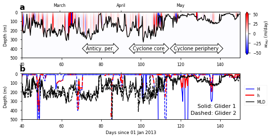


### MLD and stratification at base of MLD figure


```python
time_limits = np.array([-31-30-31-30,-31-30-31,-31-30,-31,0,31,31+28,31+28+31,31+28+31+30,31+28+31+30+31,31+28+31+30+31+30,31+28+31+30+31+30+31,31+28+31+30+31+30+31+31,31+28+31+30+31+30+31+31+30])
```


```python
b_z_MLD = ()
for gl in range(len(SG)):
    bzmld = np.empty(shape=MLD[gl].shape)
    for i in range(len(bzmld)):
        if np.isnan(MLD[gl][i]):
            bzmld[i] = np.nan
        else:
            depind = np.nanargmin(np.abs(z_diff_phys-MLD[gl][i]))
            bzmld[i] = b_z[gl][depind,i]
    b_z_MLD += (bzmld,)
```


```python
MLD_month_percentiles = np.nan*np.empty(shape=(len(SG),13,5))
b_z_month_percentiles = np.nan*np.empty(shape=(len(SG),13,5))
for gl in range(len(SG)):
    for i in range(13):
        inds = np.logical_and(t_l3[gl]>time_limits[i],t_l3[gl]<time_limits[i+1])
        if np.sum(inds)>10:
            MLD_month_percentiles[gl,i] = np.nanpercentile(MLD[gl][inds],[5,25,50,75,95]);
            b_z_month_percentiles[gl,i] = np.nanpercentile(b_z_MLD[gl][inds],[5,25,50,75,95]);            
MLD_month_percentiles[np.isnan(MLD_month_percentiles)] = -100;
b_z_month_percentiles[np.isnan(b_z_month_percentiles)] = -100;
```


```python
months = np.tile(np.array([9,10,11,12,1,2,3,4,5,6,7,8,9]),[len(SG),1])
spring_months = [4,5,6,7,8,9,10]
autumn_months = [10,11,12,0,1,2,3,4]
spring_transition_MLD = MLD_month_percentiles[:,spring_months,2]
spring_transition_b_z = b_z_month_percentiles[:,spring_months,2]
spring_transition_months = months[:,spring_months]
good_vals = np.logical_and(spring_transition_MLD!=-100,spring_transition_b_z!=-100)
spring_transition_MLD = spring_transition_MLD[good_vals].ravel()
spring_transition_b_z = spring_transition_b_z[good_vals].ravel()
spring_transition_months = spring_transition_months[good_vals].ravel()
autumn_transition_MLD = MLD_month_percentiles[:,autumn_months,2]
autumn_transition_b_z = b_z_month_percentiles[:,autumn_months,2]
autumn_transition_months = months[:,autumn_months]
good_vals = np.logical_and(autumn_transition_MLD!=-100,autumn_transition_b_z!=-100)
autumn_transition_MLD = autumn_transition_MLD[good_vals].ravel()
autumn_transition_b_z = autumn_transition_b_z[good_vals].ravel()
autumn_transition_months = autumn_transition_months[good_vals].ravel()
coeffs_spring = np.polyfit(np.log10(spring_transition_MLD),np.log10(spring_transition_b_z),1)
coeffs_autumn = np.polyfit(np.log10(autumn_transition_MLD),np.log10(autumn_transition_b_z),1)

```


```python
cyclic_cmap = LinearSegmentedColormap.from_list("my_colormap", cc.m_colorwheel_r(np.linspace(0,1,14)[[12,0,1,2,3,4,5,6,8,9,10,11]]), N=12, gamma=1.0)
```


```python
# make figure
plt.figure(figsize=(8,8))
gs = GridSpec(3,2)
ax = plt.subplot(gs[0:2,:])
ax1 = plt.subplot(gs[2,0]); ax2 = plt.subplot(gs[2,1]);

# make main plot
XLIM = np.array([-1e-5,3.1e-4]); YLIM = np.array([225,0]);
x = np.linspace(1,250,100)
l1, = ax.plot(10**(np.polyval(coeffs_spring,np.log10(x))),x,color='g',lw=3,alpha=0.5,zorder=1)
l2, = ax.plot(10**(np.polyval(coeffs_autumn,np.log10(x))),x,color='b',lw=3,alpha=0.5,zorder=1)
im = ()
for gl in range(len(SG)):
    marker = 'o' if np.isin(gl,Gl1) else 'd'
    im += (ax.scatter(b_z_month_percentiles[gl,:,2],MLD_month_percentiles[gl,:,2],s=100,c=np.array([9,10,11,12,1,2,3,4,5,6,7,8,9])-.5,cmap=cyclic_cmap,marker=marker,zorder=2,edgecolors='k',lw=1),)

# make labels    
ax.set_ylim(YLIM); ax.set_xlim(XLIM); ax.set_xticks(np.arange(0,0.00031,0.0001))
ax.legend([im[0],im[1],l1,l2],['Glider 1','Glider 2','Spring','Autumn'],loc='center right',scatterpoints=1,labelspacing=1)
ax.set_xlabel('$N^2$ at base of mixed layer (s$^{-2}$)')
ax.set_ylabel('MLD (m)')

# make colorbar
cax = plt.axes([.3,.5,.6,.03])
cbar = plt.colorbar(im[0],cax=cax,orientation='horizontal',ticks=np.arange(0,12,.92))
cbar.set_ticklabels(['J','F','M','A','M','J','J','A','S','O','N','D'])

# make annotations
ax.text(3e-5,180,'Winter',fontsize=14,rotation=90)
ax.text(2.2e-4,30,'Summer',fontsize=14)
ax.text(0e-5,20,'Spring',fontsize=14,rotation=45,color='g')
ax.text(5e-5,60,'Autumn',fontsize=14,rotation=45,color='b')

# make secondary plots
for i in np.arange(-1,1,.25):
    ax1.plot([i,i],[0,.5],color='k')
    ax1.plot(np.arange(i,i+2,.01),.5+np.sqrt(np.arange(0,2,.01)/1.5),color='k')
    ax2.plot([i,i],[0,.2],color='k')
    ax2.plot(np.arange(i,i+2,.01),.2+np.sqrt(np.arange(0,2,.01)/20),color='k')
ax1.plot([0,1],[0.5,0.5],color='k',ls=':')
ax2.plot([0,1],[0.2,0.2],color='k',ls=':')
ax1.set_xlim([0,1]); ax2.set_xlim([0,1]);
ax1.set_ylim([1,-.15]); ax2.set_ylim([1,-.15]);

# make annotations
ax1.annotate(' ', xy=(0.65, 0.9), xycoords='data',
            xytext=(0.35, 0.1), textcoords='data',
            arrowprops=dict(fc="0.6", ec="none", width=6,alpha=0.7,
                            connectionstyle="arc3,rad=.3"))
ax1.annotate(' ', xy=(0.8, 0.6), xycoords='data',
            xytext=(0.68, 0.87), textcoords='data',
            arrowprops=dict(fc="0.6", ec="none", width=6,alpha=0.7))
ax1.annotate(' ', xy=(0.8, 0.1), xycoords='data',
            xytext=(0.8, 0.57), textcoords='data',
            arrowprops=dict(fc="0.6", ec="none", width=6,alpha=0.7))
ax1.annotate(' ', xy=(0.38, 0.1), xycoords='data',
            xytext=(0.77, 0.1), textcoords='data',
            arrowprops=dict(fc="0.6", ec="none", width=6,alpha=0.7))

ax2.annotate(' ', xy=(0.35, 0.2), xycoords='data',
            xytext=(0.35, 0.04), textcoords='data',
            arrowprops=dict(fc="0.6", ec="none", width=6,alpha=0.7))
ax2.annotate(' ', xy=(0.77, 0.2), xycoords='data',
            xytext=(0.38, 0.2), textcoords='data',
            arrowprops=dict(fc="0.6", ec="none", width=6,alpha=0.7))
ax2.annotate(' ', xy=(0.8, 0.04), xycoords='data',
            xytext=(0.8, 0.2), textcoords='data',
            arrowprops=dict(fc="0.6", ec="none", width=6,alpha=0.7))
ax2.annotate(' ', xy=(0.38, 0.04), xycoords='data',
            xytext=(0.77, 0.04), textcoords='data',
            arrowprops=dict(fc="0.6", ec="none", width=6,alpha=0.7))

ax1.text(.2,-0.02,'Winter mixed layer',fontsize=14)
ax2.text(.2,-0.02,'Summer mixed layer',fontsize=14)
ax1.set_xticklabels([]); ax2.set_xticklabels([]);
ax1.set_yticklabels([]); ax2.set_yticklabels([]);
ax1.xaxis.set_ticks_position('none'); ax1.yaxis.set_ticks_position('none')
ax2.xaxis.set_ticks_position('none'); ax2.yaxis.set_ticks_position('none')

ax.annotate('a', xy=(0,1),xycoords=ax.transAxes,color='k',weight='bold',size=fontsize,xytext=(-5,5), textcoords="offset points")
ax1.annotate('b', xy=(0,1),xycoords=ax1.transAxes,color='k',weight='bold',size=fontsize,xytext=(-5,5), textcoords="offset points")
ax2.annotate('c', xy=(0,1),xycoords=ax2.transAxes,color='k',weight='bold',size=fontsize,xytext=(-5,5), textcoords="offset points")

plt.tight_layout(w_pad=5)
plt.savefig('Schematic1',dpi=300)
```

    /Library/Frameworks/Python.framework/Versions/3.6/lib/python3.6/site-packages/matplotlib/figure.py:1743: UserWarning: This figure includes Axes that are not compatible with tight_layout, so its results might be incorrect.
      warnings.warn("This figure includes Axes that are not "


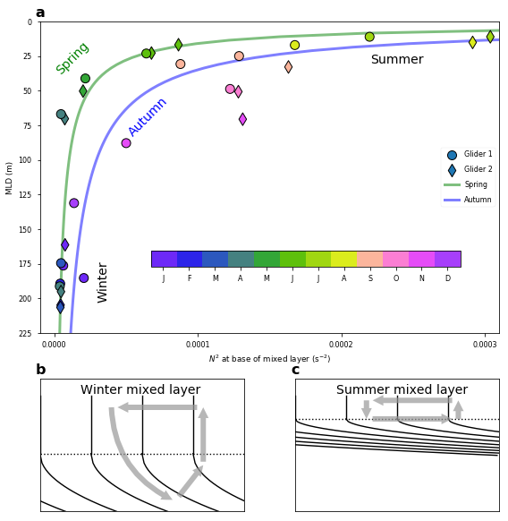


```python
# make figure
plt.figure(figsize=(8,8))
gs = GridSpec(3,2)
ax = plt.subplot(gs[0:2,:])
ax1 = plt.subplot(gs[2,0]); ax2 = plt.subplot(gs[2,1]);

# make main plot
XLIM = np.array([3e-6,5e-4]); YLIM = np.array([250,10]);
x = np.linspace(1,250,100)
l1, = ax.plot(10**(np.polyval(coeffs_spring,np.log10(x))),x,color='g',lw=3,alpha=0.5,zorder=1)
l2, = ax.plot(10**(np.polyval(coeffs_autumn,np.log10(x))),x,color='b',lw=3,alpha=0.5,zorder=1)
im = ()
for gl in range(len(SG)):
    marker = 'o' if np.isin(gl,Gl1) else 'd'
    im += (ax.scatter(b_z_month_percentiles[gl,:,2],MLD_month_percentiles[gl,:,2],s=100,c=np.array([9,10,11,12,1,2,3,4,5,6,7,8,9])-.5,cmap=cyclic_cmap,marker=marker,zorder=2,edgecolors='k',lw=1),)

# make labels    
ax.set_ylim(YLIM); ax.set_xlim(XLIM); #ax.set_xticks(np.arange(0,0.00031,0.0001))
ax.legend([im[0],im[1],l1,l2],['Glider 1','Glider 2','Spring','Autumn'],loc='upper left',scatterpoints=1,labelspacing=1)
ax.set_xlabel('$N^2$ at base of mixed layer (s$^{-2}$)')
ax.set_ylabel('MLD (m)')
ax.set_yscale('log'); ax.set_xscale('log');

# make colorbar
cax = plt.axes([.45,.45,.5,.03])
cbar = plt.colorbar(im[0],cax=cax,orientation='horizontal',ticks=np.arange(0,12,.92))
cbar.set_ticklabels(['J','F','M','A','M','J','J','A','S','O','N','D'])

# make annotations
ax.text(6e-6,220,'Winter',fontsize=14)
ax.text(6e-5,12,'Summer',fontsize=14)
ax.text(3e-5,40,'Spring',fontsize=14,rotation=45,color='g')
ax.text(6e-5,50,'Autumn',fontsize=14,rotation=45,color='b')

# make secondary plots
for i in np.arange(-1,1,.25):
    ax1.plot([i,i],[0,.5],color='k')
    ax1.plot(np.arange(i,i+2,.01),.5+np.sqrt(np.arange(0,2,.01)/1.5),color='k')
    ax2.plot([i,i],[0,.2],color='k')
    ax2.plot(np.arange(i,i+2,.01),.2+np.sqrt(np.arange(0,2,.01)/20),color='k')
ax1.plot([0,1],[0.5,0.5],color='k',ls=':')
ax2.plot([0,1],[0.2,0.2],color='k',ls=':')
ax1.set_xlim([0,1]); ax2.set_xlim([0,1]);
ax1.set_ylim([1,-.15]); ax2.set_ylim([1,-.15]);

# make annotations
ax1.annotate(' ', xy=(0.65, 0.9), xycoords='data',
            xytext=(0.35, 0.1), textcoords='data',
            arrowprops=dict(fc="0.6", ec="none", width=6,alpha=0.7,
                            connectionstyle="arc3,rad=.3"))
ax1.annotate(' ', xy=(0.8, 0.6), xycoords='data',
            xytext=(0.68, 0.87), textcoords='data',
            arrowprops=dict(fc="0.6", ec="none", width=6,alpha=0.7))
ax1.annotate(' ', xy=(0.8, 0.1), xycoords='data',
            xytext=(0.8, 0.57), textcoords='data',
            arrowprops=dict(fc="0.6", ec="none", width=6,alpha=0.7))
ax1.annotate(' ', xy=(0.38, 0.1), xycoords='data',
            xytext=(0.77, 0.1), textcoords='data',
            arrowprops=dict(fc="0.6", ec="none", width=6,alpha=0.7))

ax2.annotate(' ', xy=(0.35, 0.2), xycoords='data',
            xytext=(0.35, 0.04), textcoords='data',
            arrowprops=dict(fc="0.6", ec="none", width=6,alpha=0.7))
ax2.annotate(' ', xy=(0.77, 0.2), xycoords='data',
            xytext=(0.38, 0.2), textcoords='data',
            arrowprops=dict(fc="0.6", ec="none", width=6,alpha=0.7))
ax2.annotate(' ', xy=(0.8, 0.04), xycoords='data',
            xytext=(0.8, 0.2), textcoords='data',
            arrowprops=dict(fc="0.6", ec="none", width=6,alpha=0.7))
ax2.annotate(' ', xy=(0.38, 0.04), xycoords='data',
            xytext=(0.77, 0.04), textcoords='data',
            arrowprops=dict(fc="0.6", ec="none", width=6,alpha=0.7))

ax1.text(.2,-0.02,'Winter mixed layer',fontsize=14)
ax2.text(.2,-0.02,'Summer mixed layer',fontsize=14)
ax1.set_xticklabels([]); ax2.set_xticklabels([]);
ax1.set_yticklabels([]); ax2.set_yticklabels([]);
ax1.xaxis.set_ticks_position('none'); ax1.yaxis.set_ticks_position('none')
ax2.xaxis.set_ticks_position('none'); ax2.yaxis.set_ticks_position('none')

ax.annotate('a', xy=(0,1),xycoords=ax.transAxes,color='k',weight='bold',size=fontsize,xytext=(-5,5), textcoords="offset points")
ax1.annotate('b', xy=(0,1),xycoords=ax1.transAxes,color='k',weight='bold',size=fontsize,xytext=(-5,5), textcoords="offset points")
ax2.annotate('c', xy=(0,1),xycoords=ax2.transAxes,color='k',weight='bold',size=fontsize,xytext=(-5,5), textcoords="offset points")

plt.tight_layout(w_pad=5)
plt.savefig('Schematic1b',dpi=300)
```

    /Library/Frameworks/Python.framework/Versions/3.6/lib/python3.6/site-packages/matplotlib/figure.py:1743: UserWarning: This figure includes Axes that are not compatible with tight_layout, so its results might be incorrect.
      warnings.warn("This figure includes Axes that are not "


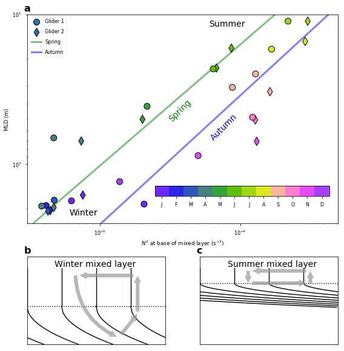


### Schematic figure


```python
# make figure
plt.figure(figsize=(8,4))
gs = GridSpec(6,3)
ax1 = plt.subplot(gs[0:2,:]);
ax2 = plt.subplot(gs[2:4,:]);
ax3 = plt.subplot(gs[4:6,:]);

# make plot
x = np.linspace(-1,1,100)
ax1.fill_between(x,-np.arctan(x*10)/1.5-.4,-np.arctan(x*10)+.2,color='b',alpha=0.5,edgecolor='none')
ax1.fill_between(x,np.arctan(x*10)-.1,np.arctan(x*10)+.1,color='r',alpha=0.5,edgecolor='none')
ax2.fill_between(x,-np.arctan(x*10)/1.5-.4,-np.arctan(x*10)+.2,color='b',alpha=0.5,edgecolor='none')
ax2.fill_between(x,np.arctan(x*10)/1.5-.2,np.arctan(x*10)+.4,color='r',alpha=0.5,edgecolor='none')
ax3.fill_between(x,(-np.arctan(x*10)/1.5+.9)*(np.arctan(x*10)/1.5+.9),(-np.arctan(x*10)+1.45)*(np.arctan(x*10)+1.45),color='g',alpha=0.5,edgecolor='none')

# pretty up
ax1.axis('off'); ax2.axis('off'); ax3.axis('off')
ax1.set_ylim([-1.6,1.8]); ax2.set_ylim([-1.3,1.8]); ax3.set_ylim([-0.2,2.2])
ax1.arrow(-.95,-1,0,1.8,width=.005,head_length=0.2,color='b')
ax1.text(-.93,.25,'MLD',rotation=90,fontweight='bold',color='b')
ax1.arrow(-.86,-1,0,1.8,width=.005,head_length=0.2,color='r')
ax1.text(-.84,.08,r'$N^2|_{MLD}$',rotation=90,fontweight='bold',color='r')
ax2.arrow(-.95,-1,0,1.8,width=.005,head_length=0.2,color='b')
ax2.text(-.93,.15,r"$w|_{MLD}$",rotation=90,fontweight='bold',color='b')
ax2.arrow(-.86,-1,0,1.8,width=.005,head_length=0.2,color='r')
ax2.text(-.84,.2,'POC',rotation=90,fontweight='bold',color='r')
ax3.arrow(-.95,0.3,0,1.5,width=.005,head_length=0.2,color='g')
ax3.text(-.93,1.5,'Export',rotation=90,fontweight='bold',color='g')
ax3.text(-.9,-.5,'Winter',fontweight='bold',color='k')
ax3.text(.7,-.5,'Summer',fontweight='bold',color='k')
ax3.text(-0.1,-.5,'Spring',fontweight='bold',color='k')

plt.savefig('Schematic2',dpi=300)
```


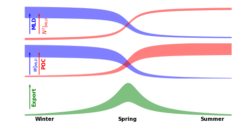

