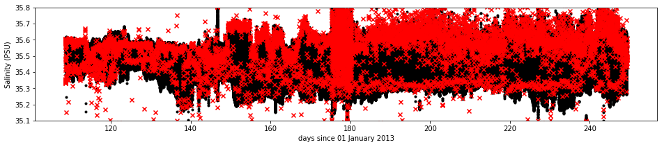

##### This script inputs a .mat file from the Seaglider toolbox and outputs a Level 1 dataset as a netCDF file.

The Seaglider toolbox was downloaded from https://bitbucket.org/bastienqueste/uea-seaglider-toolbox on January 19, 2017. Instructions for running the toolbox can be found at http://www.byqueste.com/toolbox.html. After adding the toolbox and the Gibb's seawater toolbox to the Matlab path, the following commands were run:

>\>\> load SG566_AprSep_condthlag_gfm_spk_salcal_oxycal_chlcal_final.mat
>\>\> data = SG566;  
>\>\> data.sg_calib_const.WETLabsCalData.Chlorophyll.wavelength = 695;  
>\>\> data.sg_calib_const.WETLabsCalData.Chlorophyll.darkCounts = 54;  
>\>\> data.sg_calib_const.WETLabsCalData.Chlorophyll.scaleFactor = 0.0124;  
>\>\> data.sg_calib_const.WETLabsCalData.Chlorophyll.maxOutput = 4130;  
>\>\> data.sg_calib_const.WETLabsCalData.Chlorophyll.resolution = 1.0;  
>\>\> data.sg_calib_const.WETLabsCalData.Chlorophyll.calTemperature = 22.3;  
>\>\> data.sg_calib_const.WETLabsCalData.CDOM.wavelength = 460;  
>\>\> data.sg_calib_const.WETLabsCalData.CDOM.darkCounts = 36;  
>\>\> data.sg_calib_const.WETLabsCalData.CDOM.scaleFactor = 0.1853;  
>\>\> data.sg_calib_const.WETLabsCalData.CDOM.maxOutput = 4130;  
>\>\> data.sg_calib_const.WETLabsCalData.CDOM.resolution = 1.5;  
>\>\> data.sg_calib_const.WETLabsCalData.CDOM.calTemperature = 22.3;  
>\>\> data.sg_calib_const.WETLabsCalData.Scatter_650.wavelength = 650;  
>\>\> data.sg_calib_const.WETLabsCalData.Scatter_650.scaleFactor = 4.160e-6;  
>\>\> data.sg_calib_const.WETLabsCalData.Scatter_650.darkCounts = 35;  
>\>\> data.sg_calib_const.WETLabsCalData.Scatter_650.resolution = 1.4;  
>\>\> data = gt_sg_process_data(data); % only process sbect and wetlabs  
>\>\> data = gt_sg_sensors_sbect(data,1);  
>\>\> save SG566_AprSep.mat data  

An automatic regression for flight parameters was performed as part of the Seaglider toolbox. A log of the results of the Seaglider toolbox was automatically generated, and saved as sg533_AprSep_processing.log.


```python
import numpy as np
import time as python_time
import matplotlib.pyplot as plt
import seawater as sw
from netCDF4 import Dataset
from scipy.io import loadmat
%matplotlib inline
```


```python
data = loadmat('sg566_AprSep.mat')['data'][0,0]
```


```python
lengths = np.empty(shape=(len(data['hydrography']),))
lengths = [len(data['hydrography']['pressure'][i][0][0]) for i in range(0,len(data['hydrography']))]
max_length = np.max(lengths)
num_dives = len(data['hydrography'])
FILL_VALUE = -999
```


```python
nc = Dataset('sg566_AprSep_L1.nc','w')
nc.title = 'Level 1 Seaglider data'
nc.mission = 'OSMOSIS (Ocean Surface Mixing, Ocean Sub-mesoscale Interaction Study)'
nc.institution = 'Caltech'
nc.glider = 'SG566'
nc.author = 'Zachary K Erickson'
nc.contact = 'zerickso@caltech.edu'
nc.comment = 'Code to create file at: https://github.com/zerickso/seaglider-processing/OSMOSIS_Level1_SG566_AprSep.html'
nc.history = 'Created '+ python_time.ctime(python_time.time())
nc.Conventions = 'CF-1.6'
nc.createDimension('dive',num_dives)
nc.createDimension('observation',np.max(max_length))
nc.createDimension('direction',2);

```

In this script, we input the Seaglider position from GPS of latitude, longitude, and time; CTD measurements of pressure, temperature, and salinity; Aanderaa oxygen; and WETLabs EcoPuck fluorescence, backscatter, and CDOM (colored dissolved organic matter). We output a netCDF file (classic format) 

> sg566_L1.nc  

with dimensions:

> dive  
> observation  
> direction  

where $dive$ is the divenumber; $observation$ is just a counter to denote each sequential measurement, and thus has a length equal to the number of measurements on the dive with the most measurements; and $direction$ is just to separate dive (right before downcast) with surfacing (right after upcast) GPS locations. The netCDF file outputs the following variables:

> GPS_lat (deg N)  
> GPS_lon (deg E)  
> GPS_time (days since 01 January 2015)  
> pressure (db)  
> time (days since 01 January 2015)  
> temperature (deg C)  
> salinity (PSU)  
> oxygen (micromol/kg)  
> fluorescence (equivalent chlorophyll concentration; mg/m^3)  
> backscatter (at 650nm; 1/m)  
> CDOM (ppm)  
> flag_temperature  
> flag_salinity  
> flag_oxygen  
> flag_fluorescence  
> flag_backscatter  
> flag_CDOM  

The flags are values follow those identified by the "Manual for Quality Control of Temperature and Salinity Data Observations from Gliders", from IOOS, Version 1.0 (May 2016), accessible at: https://gliders.ioos.us/static/pdf/Manual-for-QC-of-Glider-Data_05_09_16.pdf. The flags are as follows:
> 1: good data  
> 2: not assessed  
> 3: possibly bad (fails a low spike threshold test)  
> 4: bad (fails a high spike threshold test or another test)  


```python
GPS_LAT_RANGE = [48,49]
GPS_LON_RANGE = [-17,-15]
GPS_MAX_DISTANCE = 10 # km
GPS_MAX_TIME = 5./24 # days 

GPS_lat     = np.array( [data['gps_predive'][:,0],data['gps_postdive'][:,0]]).transpose()
GPS_lon     = np.array( [data['gps_predive'][:,1],data['gps_postdive'][:,1]]).transpose()
GPS_time    = np.array( [data['gps_predive'][:,2],data['gps_postdive'][:,2]]).transpose() -735235.
GPS_flag    = np.zeros(shape=GPS_lat.shape)

distance = np.concatenate([sw.dist(GPS_lat[i,:],GPS_lon[i,:],'km')[0] for i in range(GPS_lat.shape[0])])

# test if moved too far away during one dive (spike)
GPS_flag[distance>GPS_MAX_DISTANCE,:] += 1
# test if out of range
GPS_flag[np.logical_or(np.logical_or(GPS_lat<GPS_LAT_RANGE[0],GPS_lat>GPS_LAT_RANGE[1]),np.logical_or(GPS_lon<GPS_LON_RANGE[0],GPS_lon>GPS_LON_RANGE[1]))] += 2 
# test if took too long
GPS_flag[(np.diff(GPS_time,axis=1)>GPS_MAX_TIME).reshape(-1,),:] += 4
# test if did not seem to call in (no change from previous results
did_not_call = np.zeros(shape=GPS_lat.shape).astype('bool')
did_not_call[np.isclose(GPS_lat[:,0], GPS_lat[:,1],rtol=1e-8),:] = True
did_not_call[np.isclose( GPS_lon[:,0], GPS_lon[:,1],rtol=1e-8),:] = True
did_not_call[np.isclose(GPS_time[:,0],GPS_time[:,1],rtol=1e-8),:] = True
did_not_call[np.where(np.isclose( GPS_lat[0:-1,0], GPS_lat[1::,0],rtol=1e-8))[0],0] = True
did_not_call[np.where(np.isclose( GPS_lon[0:-1,0], GPS_lon[1::,0],rtol=1e-8))[0],0] = True
did_not_call[np.where(np.isclose(GPS_time[0:-1,0],GPS_time[1::,0],rtol=1e-8))[0],0] = True
did_not_call[np.where(np.isclose( GPS_lat[0:-1,1], GPS_lat[1::,1],rtol=1e-8))[0],1] = True
did_not_call[np.where(np.isclose( GPS_lon[0:-1,1], GPS_lon[1::,1],rtol=1e-8))[0],1] = True
did_not_call[np.where(np.isclose(GPS_time[0:-1,1],GPS_time[1::,1],rtol=1e-8))[0],1] = True
did_not_call[np.isnan(GPS_lat)] = True
did_not_call[np.isnan(GPS_lon)] = True
did_not_call[np.isnan(GPS_time)] = True
GPS_flag[did_not_call] += 8
```


```python
plt.figure(figsize=(16,6))
plt.subplot(121); plt.title('Dive locations') 
plt.plot(GPS_lon[GPS_flag[:,0]==0,0],GPS_lat[GPS_flag[:,0]==0,0],color='k')
plt.scatter(GPS_lon[GPS_flag[:,0]!=0,0],GPS_lat[GPS_flag[:,0]!=0,0],marker='x',color='r')
plt.subplot(122); plt.title('Surface locations') 
plt.plot(GPS_lon[GPS_flag[:,1]==0,1],GPS_lat[GPS_flag[:,1]==0,1],color='k')
plt.scatter(GPS_lon[GPS_flag[:,1]!=0,1],GPS_lat[GPS_flag[:,1]!=0,1],marker='x',color='r')
```


    <matplotlib.collections.PathCollection at 0x103cea358>


```python
nc_lat = nc.createVariable('GPS_lat',np.dtype('float64').char,('dive','direction'),fill_value=FILL_VALUE)
nc_lat.units = 'degrees north'
nc_lat.scale_factor = 1
nc_lat.add_offset = 0.
nc_lon = nc.createVariable('GPS_lon',np.dtype('float64').char,('dive','direction'),fill_value=FILL_VALUE)
nc_lon.units = 'degrees east'
nc_lon.scale_factor = 1
nc_lon.add_offset = 0.
nc_t = nc.createVariable('GPS_time',np.dtype('float64').char,('dive','direction'),fill_value=FILL_VALUE)
nc_t.units = 'days since January 1, 2013'
nc_t.scale_factor = 1
nc_t.add_offset = 0.
nc_flag_GPS = nc.createVariable('GPS_flag',np.dtype('uint8').char,('dive','direction'))
nc_flag_GPS.LAT_MIN = GPS_LAT_RANGE[0]
nc_flag_GPS.LAT_MAX = GPS_LAT_RANGE[1]
nc_flag_GPS.LON_MIN = GPS_LON_RANGE[0]
nc_flag_GPS.LON_MAX = GPS_LON_RANGE[1]
nc_flag_GPS.MAX_DISTANCE = GPS_MAX_DISTANCE
nc_flag_GPS.MAX_TIME = GPS_MAX_TIME
nc_lat[:] = GPS_lat
nc_lon[:] = GPS_lon
nc_t[:] = GPS_time
nc_flag_GPS[:] = GPS_flag
```


```python
pres = [];
t = [];
for i in range(len(data['hydrography'])):
    pres.append(data['hydrography']['pressure'][i][0][0])
    t.append(data['hydrography']['time'][i][0][0]-735235.)
pressure    = np.nan*np.empty(shape=(num_dives,max_length))
time        = np.nan*np.empty(shape=(num_dives,max_length))
```


```python
plt.figure(figsize=(16,3))
plt.plot(np.concatenate(t),np.concatenate(pres),'k',linewidth=0.5)
plt.xlabel('days since 01 January 2013'); plt.ylabel('Depth'); plt.title('Glider path')
```


    <matplotlib.text.Text at 0x141d77a58>


```python
for i in range(num_dives):
    pressure[i,0:len(pres[i])] = pres[i]
    time[i,0:len(t[i])] = t[i]
nc_pressure = nc.createVariable('pressure',np.dtype('float64').char,('dive','observation'),fill_value=FILL_VALUE)
nc_pressure.units = 'db'
nc_pressure.scale_factor = 1
nc_pressure.add_offset = 0.
nc_time = nc.createVariable('time',np.dtype('float64').char,('dive','observation'),fill_value=FILL_VALUE)
nc_time.units = 'days since January 1, 2013'
nc_time.scale_factor = 1
nc_time.add_offset = 0.
nc_pressure[:] = pressure
nc_time[:] = time
```

    /Library/Frameworks/Python.framework/Versions/3.6/lib/python3.6/site-packages/ipykernel_launcher.py:12: RuntimeWarning: invalid value encountered in less
      if sys.path[0] == '':
    /Library/Frameworks/Python.framework/Versions/3.6/lib/python3.6/site-packages/ipykernel_launcher.py:13: RuntimeWarning: invalid value encountered in less
      del sys.path[0]


```python
TEMP_SPIKE = 0.025; # deg C
TEMP_RANGE = [6,21] # deg C

temp = [];
temp_flag = [];
for i in range(len(data['hydrography'])):
    vals = data['hydrography']['temp'][i][0][0]
    flag = np.zeros(shape=vals.shape)
    
    # test for spikes
    flag[np.where(np.logical_or(np.logical_and(vals[2::]-vals[1:-1]>TEMP_SPIKE,vals[0:-2]-vals[1:-1]>TEMP_SPIKE),np.logical_and(vals[2::]-vals[1:-1]<-TEMP_SPIKE,vals[0:-2]-vals[1:-1]<-TEMP_SPIKE)))[0]+1] += 1
    # test for out or range
    flag[np.logical_or(vals<TEMP_RANGE[0],vals>TEMP_RANGE[1])] += 2
    # test for no data
    flag[np.isnan(vals)] += 16
    
    temp.append(vals)
    temp_flag.append(flag)

```


```python
plt.figure(figsize=(16,3))
plt.scatter(np.concatenate(t)[np.concatenate(temp_flag)==0],np.concatenate(temp)[np.concatenate(temp_flag)==0],marker='.',color='k')
plt.scatter(np.concatenate(t)[np.concatenate(temp_flag)!=0],np.concatenate(temp)[np.concatenate(temp_flag)!=0],marker='x',color='r')
plt.xlabel('days since 01 January 2013'); plt.ylabel('Temperature (deg C)');
```


```python
temperature = np.nan*np.empty(shape=(num_dives,max_length))
flag_temp = np.nan*np.empty(shape=(num_dives,max_length),dtype='uint8')
for i in range(num_dives):    
    temperature[i,0:len(temp[i])] = temp[i]
    flag_temp[i,0:len(temp_flag[i])] = temp_flag[i]
nc_temperature = nc.createVariable('temperature',np.dtype('float64').char,('dive','observation'),fill_value=FILL_VALUE)
nc_temperature.units = 'deg C'
nc_temperature.scale_factor = 1
nc_temperature.add_offset = 0.
nc_flag_temp = nc.createVariable('temp_flag',np.dtype('uint8').char,('dive','observation'))
nc_flag_temp.SPIKE_THRESHOLD = TEMP_SPIKE
nc_flag_temp.MIN_VALUE = TEMP_RANGE[0]
nc_flag_temp.MAX_VALUE = TEMP_RANGE[1]
nc_temperature[:] = temperature
nc_flag_temp[:] = flag_temp
```

    /Library/Frameworks/Python.framework/Versions/3.6/lib/python3.6/site-packages/ipykernel_launcher.py:14: RuntimeWarning: invalid value encountered in less
      


```python
SAL_SPIKE = 0.025; # PSU
SAL_RANGE = [35.1,35.8] # PSU
DEPTH_THRESHOLD = 2; # db
SPEED_THRESHOLD = 0.02; # db/s

sal = [];
sal_flag = [];
for i in range(len(data['hydrography'])):
    vals = data['hydrography']['salinity'][i][0][0]
    flag = np.zeros(shape=vals.shape)    
    
    vert_speed = data['flight']['glide_vert_spd'][i][0][0]
    
    # test for spikes
    flag[np.where(np.logical_or(np.logical_and(vals[2::]-vals[1:-1]>SAL_SPIKE,vals[0:-2]-vals[1:-1]>SAL_SPIKE),np.logical_and(vals[2::]-vals[1:-1]<-SAL_SPIKE,vals[0:-2]-vals[1:-1]<-SAL_SPIKE)))[0]+1] += 1
    # test for out or range
    flag[np.logical_or(vals<SAL_RANGE[0],vals>SAL_RANGE[1])] += 2
    # test for too shallow
    flag[pres[i]<DEPTH_THRESHOLD] += 4
    # test for too slow
    flag[np.abs(vert_speed)<SPEED_THRESHOLD] += 8
    # test for no data
    flag[np.isnan(vals)] += 16
    
    sal.append(vals)
    sal_flag.append(flag)

```


```python
plt.figure(figsize=(16,3))
plt.scatter(np.concatenate(t)[np.concatenate(sal_flag)==0],np.concatenate(sal)[np.concatenate(sal_flag)==0],marker='.',color='k')
plt.scatter(np.concatenate(t)[np.concatenate(sal_flag)!=0],np.concatenate(sal)[np.concatenate(sal_flag)!=0],marker='x',color='r')
plt.xlabel('days since 01 January 2013'); plt.ylabel('Salinity (PSU)');
```


```python
plt.figure(figsize=(16,3)); plt.ylim(SAL_RANGE)
plt.scatter(np.concatenate(t)[np.concatenate(sal_flag)==0],np.concatenate(sal)[np.concatenate(sal_flag)==0],marker='.',color='k')
plt.scatter(np.concatenate(t)[np.concatenate(sal_flag)!=0],np.concatenate(sal)[np.concatenate(sal_flag)!=0],marker='x',color='r')
plt.xlabel('days since 01 January 2013'); plt.ylabel('Salinity (PSU)');
```


```python
mean_sal = np.array([np.mean(sal[i][sal_flag[i]==0]) for i in range(len(sal))]);
mean_sal2 = np.array([np.mean(sal[i][np.logical_or(sal_flag[i]==0,sal_flag[i]==2)]) for i in range(len(sal))]);
mean_time = np.array([np.mean(t[i]) for i in range(len(sal))]);
plt.plot(mean_time,mean_sal)
plt.plot(mean_time,mean_sal2)
plt.xlim([160,190])
inds_to_modify = np.where(np.logical_and(mean_sal2<35,np.logical_and(mean_time>170,mean_time<185)))[0]
mean_sal_good = np.mean(np.concatenate([mean_sal[inds_to_modify[0]-10:inds_to_modify[0]-1],mean_sal[inds_to_modify[-1]+1:inds_to_modify[-1]+10]]))
mean_sal_bad = np.mean(mean_sal2[inds_to_modify])
offset = mean_sal_good-mean_sal_bad
print(mean_sal_good)
print(mean_sal_bad)
print(offset)
```

    35.4552468575
    34.8089464041
    0.646300453437


    /Library/Frameworks/Python.framework/Versions/3.6/lib/python3.6/site-packages/numpy/core/fromnumeric.py:2909: RuntimeWarning: Mean of empty slice.
      out=out, **kwargs)
    /Library/Frameworks/Python.framework/Versions/3.6/lib/python3.6/site-packages/numpy/core/_methods.py:80: RuntimeWarning: invalid value encountered in double_scalars
      ret = ret.dtype.type(ret / rcount)


```python
for i in inds_to_modify:
    vals = sal[i]
    flag = np.zeros(shape=vals.shape) + 32
    
    vert_speed = data['flight']['glide_vert_spd'][i][0][0]
    
    vals += offset
    
    # test for spikes
    flag[np.where(np.logical_or(np.logical_and(vals[2::]-vals[1:-1]>SAL_SPIKE,vals[0:-2]-vals[1:-1]>SAL_SPIKE),np.logical_and(vals[2::]-vals[1:-1]<-SAL_SPIKE,vals[0:-2]-vals[1:-1]<-SAL_SPIKE)))[0]+1] += 1
    # test for out or range
    flag[np.logical_or(vals<SAL_RANGE[0],vals>SAL_RANGE[1])] += 2
    # test for too shallow
    flag[pres[i]<DEPTH_THRESHOLD] += 4
    # test for too slow
    flag[np.abs(vert_speed)<SPEED_THRESHOLD] += 8
    # test for no data
    flag[np.isnan(vals)] += 16
    
    sal[i] = vals
    sal_flag[i] = flag

```


```python
plt.figure(figsize=(16,3)); plt.ylim(SAL_RANGE);
plt.scatter(np.concatenate(t)[np.mod(np.concatenate(sal_flag),32)==0],np.concatenate(sal)[np.mod(np.concatenate(sal_flag),32)==0],marker='.',color='k')
plt.scatter(np.concatenate(t)[np.mod(np.concatenate(sal_flag),32)!=0],np.concatenate(sal)[np.mod(np.concatenate(sal_flag),32)!=0],marker='x',color='r')
plt.xlabel('days since 01 January 2013'); plt.ylabel('Salinity (PSU)');
```





```python
plt.figure(figsize=(16,3)); plt.ylim(SAL_RANGE); plt.xlim([226,228])
plt.scatter(np.concatenate(t)[np.mod(np.concatenate(sal_flag),32)==0],np.concatenate(sal)[np.mod(np.concatenate(sal_flag),32)==0],marker='.',color='k')
plt.scatter(np.concatenate(t)[np.mod(np.concatenate(sal_flag),32)!=0],np.concatenate(sal)[np.mod(np.concatenate(sal_flag),32)!=0],marker='x',color='r')
plt.xlabel('days since 01 January 2013'); plt.ylabel('Salinity (PSU)');
```


```python
bad_dive = np.where(time[:,0]>146.5)[0][0]
plt.figure(figsize=(6,3))
plt.subplot(121); plt.xlabel('Salinity (PSU)'); plt.ylabel('Pressure (db)');
plt.scatter(sal[bad_dive][sal_flag[bad_dive]==0],pres[bad_dive][sal_flag[bad_dive]==0],color='k')
plt.scatter(sal[bad_dive][sal_flag[bad_dive]!=0],pres[bad_dive][sal_flag[bad_dive]!=0],color='r',marker='x')
plt.xlim(SAL_RANGE); plt.ylim([1000,0])
plt.subplot(122); plt.xlabel('Time (days)'); plt.ylabel('Pressure (db)');
plt.scatter(t[bad_dive][sal_flag[bad_dive]==0],pres[bad_dive][sal_flag[bad_dive]==0],s=10,c=sal[bad_dive][sal_flag[bad_dive]==0],cmap=plt.cm.nipy_spectral)
plt.colorbar(label='Salinity (PSU)')
plt.ylim([1000,0])
print('Dive %d' % bad_dive)
```

    Dive 233


Flag the downcast of this as bad


```python
maxpresindex = np.argmax(pres[bad_dive])
sal_flag[bad_dive][0:maxpresindex] += 64
```


```python
bad_dive = np.where(time[:,0]<227)[0][-1]
plt.figure(figsize=(8,3))
plt.subplot(121); plt.xlabel('Salinity (PSU)'); plt.ylabel('Pressure (db)');
plt.scatter(sal[bad_dive][sal_flag[bad_dive]==0],pres[bad_dive][sal_flag[bad_dive]==0],color='k')
plt.scatter(sal[bad_dive][sal_flag[bad_dive]!=0],pres[bad_dive][sal_flag[bad_dive]!=0],color='r',marker='x')
plt.xlim(SAL_RANGE); plt.ylim([1000,0])
plt.subplot(122); plt.xlabel('Time (days)'); plt.ylabel('Pressure (db)');
plt.scatter(t[bad_dive][sal_flag[bad_dive]==0],pres[bad_dive][sal_flag[bad_dive]==0],s=10,c=sal[bad_dive][sal_flag[bad_dive]==0],cmap=plt.cm.nipy_spectral)
plt.colorbar(label='Salinity (PSU)')
plt.ylim([1000,0])
print('Dive %d' % bad_dive)
```

    Dive 677


Flag the upcast as bad


```python
maxpresindex = np.argmax(pres[bad_dive])
sal_flag[bad_dive][maxpresindex::] += 64
```


```python
salinity    = np.nan*np.empty(shape=(num_dives,max_length))
flag_sal  = np.nan*np.empty(shape=(num_dives,max_length),dtype='uint8')
for i in range(num_dives):
    salinity[i,0:len(sal[i])] = sal[i]
    flag_sal[i,0:len(sal_flag[i])]   = sal_flag[i]
nc_salinity = nc.createVariable('salinity',np.dtype('float64').char,('dive','observation'),fill_value=FILL_VALUE)
nc_salinity.units = 'Practical Salinity Units'
nc_salinity.scale_factor = 1
nc_salinity.add_offset = 0.
nc_flag_sal = nc.createVariable('sal_flag',np.dtype('uint8').char,('dive','observation'))
nc_flag_sal.SPIKE_THRESHOLD = SAL_SPIKE
nc_flag_sal.DEPTH_THRESHOLD = DEPTH_THRESHOLD
nc_flag_sal.SPEED_THRESHOLD = SPEED_THRESHOLD
nc_flag_sal.MIN_VALUE = SAL_RANGE[0]
nc_flag_sal.MAX_VALUE = SAL_RANGE[1]
nc_salinity[:] = salinity
nc_flag_sal[:] = flag_sal
```

    /Library/Frameworks/Python.framework/Versions/3.6/lib/python3.6/site-packages/ipykernel_launcher.py:16: RuntimeWarning: invalid value encountered in less
      app.launch_new_instance()


```python
OXY_SPIKE = 10.; # micromol/kg
OXY_RANGE = [175., 300.] # micromol/kg

oxy = [];
oxy_flag = [];
all_oxygen_data = loadmat('SG566_AprSep_condthlag_gfm_spk_salcal_oxycal_chlcal_final.mat')['SG566'][0,0]['hydrography']['oxy_calibrated']
for i in range(len(data['hydrography'])):
    vals = all_oxygen_data[i][0][0]
    flag = np.zeros(shape=vals.shape)
    
    notnan = np.where(~np.isnan(vals))[0]
    
    # test for spikes
    flag[notnan][np.where(np.logical_or(np.logical_and(vals[notnan][2::]-vals[notnan][1:-1]>OXY_SPIKE,vals[notnan][0:-2]-vals[notnan][1:-1]>OXY_SPIKE),np.logical_and(vals[notnan][2::]-vals[notnan][1:-1]<-OXY_SPIKE,vals[notnan][0:-2]-vals[notnan][1:-1]<-OXY_SPIKE)))[0]+1] += 1
    # test for out or range
    flag[np.logical_or(vals<OXY_RANGE[0],vals>OXY_RANGE[1])] += 2
    # test for too shallow
    flag[pres[i]<DEPTH_THRESHOLD] += 4
    # test for no data
    flag[np.isnan(vals)] += 16
    
    oxy.append(vals)
    oxy_flag.append(flag)

```

    /Library/Frameworks/Python.framework/Versions/3.6/lib/python3.6/site-packages/ipykernel_launcher.py:16: RuntimeWarning: invalid value encountered in less
      app.launch_new_instance()
    /Library/Frameworks/Python.framework/Versions/3.6/lib/python3.6/site-packages/ipykernel_launcher.py:16: RuntimeWarning: invalid value encountered in greater
      app.launch_new_instance()


```python
plt.figure(figsize=(16,3))
plt.scatter(np.concatenate(t)[np.concatenate(oxy_flag)==0],np.concatenate(oxy)[np.concatenate(oxy_flag)==0],marker='.',color='k')
plt.scatter(np.concatenate(t)[np.concatenate(oxy_flag)!=0],np.concatenate(oxy)[np.concatenate(oxy_flag)!=0],marker='x',color='r')
plt.xlabel('days since 01 January 2013'); plt.ylabel(r'Oxygen ($\mu$mol/kg)');
```


```python
plt.figure(figsize=(16,3)); plt.ylim(OXY_RANGE)
plt.scatter(np.concatenate(t)[np.concatenate(oxy_flag)==0],np.concatenate(oxy)[np.concatenate(oxy_flag)==0],marker='.',color='k')
plt.scatter(np.concatenate(t)[np.concatenate(oxy_flag)!=0],np.concatenate(oxy)[np.concatenate(oxy_flag)!=0],marker='x',color='r')
plt.xlabel('days since 01 January 2013'); plt.ylabel(r'Oxygen ($\mu$mol/kg)');
```


```python
oxygen      = np.nan*np.empty(shape=(num_dives,max_length))
flag_oxy  = np.nan*np.empty(shape=(num_dives,max_length),dtype='uint8')
for i in range(num_dives):
    oxygen[i,0:len(oxy[i])] = oxy[i]
    flag_oxy[i,0:len(oxy_flag[i])]   = oxy_flag[i]
nc_oxygen = nc.createVariable('oxygen',np.dtype('float64').char,('dive','observation'),fill_value=FILL_VALUE)
nc_oxygen.units = 'micromol/kg'
nc_oxygen.scale_factor = 1
nc_oxygen.add_offset = 0.
nc_flag_oxy = nc.createVariable('oxy_flag',np.dtype('uint8').char,('dive','observation'))
nc_flag_oxy.SPIKE_THRESHOLD = OXY_SPIKE
nc_flag_oxy.DEPTH_THRESHOLD = DEPTH_THRESHOLD
nc_flag_oxy.MIN_VALUE = OXY_RANGE[0]
nc_flag_oxy.MAX_VALUE = OXY_RANGE[1]
nc_oxygen[:] = oxygen
nc_flag_oxy[:] = flag_oxy

```

    /Library/Frameworks/Python.framework/Versions/3.6/lib/python3.6/site-packages/ipykernel_launcher.py:15: RuntimeWarning: invalid value encountered in less
      from ipykernel import kernelapp as app


```python
FL_RANGE = [-1,10]; # mg/m^3

fl = [];
fl_flag = [];
for i in range(len(data['hydrography'])):
    vals = data['hydrography']['Chlorophyll'][i][0][0]
    flag = np.zeros(shape=vals.shape)
    
    # test for out or range
    flag[np.logical_or(vals<FL_RANGE[0],vals>FL_RANGE[1])] += 2
    # test for no data
    flag[np.isnan(vals)] += 16
    
    fl.append(vals)
    fl_flag.append(flag)

```

    /Library/Frameworks/Python.framework/Versions/3.6/lib/python3.6/site-packages/ipykernel_launcher.py:10: RuntimeWarning: invalid value encountered in less
      # Remove the CWD from sys.path while we load stuff.
    /Library/Frameworks/Python.framework/Versions/3.6/lib/python3.6/site-packages/ipykernel_launcher.py:10: RuntimeWarning: invalid value encountered in greater
      # Remove the CWD from sys.path while we load stuff.


```python
plt.figure(figsize=(16,3))
plt.scatter(np.concatenate(t)[np.concatenate(fl_flag)==0],np.concatenate(fl)[np.concatenate(fl_flag)==0],marker='.',color='k')
plt.scatter(np.concatenate(t)[np.concatenate(fl_flag)!=0],np.concatenate(fl)[np.concatenate(fl_flag)!=0],marker='x',color='r')
plt.xlabel('days since 01 January 2013'); plt.ylabel(r'Fluorescence (mg/m$^3$ equivalent chlorophyll)');
```


```python
fluorescence= np.nan*np.empty(shape=(num_dives,max_length))
flag_fluor= np.nan*np.empty(shape=(num_dives,max_length),dtype='uint8')
for i in range(num_dives):
    fluorescence[i,0:len(fl[i])] = fl[i]
    flag_fluor[i,0:len(fl_flag[i])]  = fl_flag[i]
nc_fluorescence = nc.createVariable('fluorescence',np.dtype('float64').char,('dive','observation'),fill_value=FILL_VALUE)
nc_fluorescence.units = 'Counts'
#nc_fluorescence.scale_factor = data['gt_sg_settings'][0,0]['WETLabsCalData'][0,0]['Chlorophyll'][0,0]['scaleFactor'][0,0]
#nc_fluorescence.add_offset = data['gt_sg_settings'][0,0]['WETLabsCalData'][0,0]['Chlorophyll'][0,0]['darkCounts'][0,0]
nc_flag_fluor = nc.createVariable('fluor_flag',np.dtype('uint8').char,('dive','observation'))
nc_flag_fluor.MIN_VALUE = FL_RANGE[0]
nc_flag_fluor.MAX_VALUE = FL_RANGE[1]
nc_fluorescence[:] = fluorescence
nc_flag_fluor[:] = flag_fluor

```


```python
BBP_RANGE = [-1e-3,3e-3]; # 1/m

bbp = [];
bbp_flag = [];
for i in range(len(data['hydrography'])):
    vals = data['hydrography']['Scatter_650'][i][0][0]
    flag = np.zeros(shape=vals.shape)
    
    # test for out or range
    flag[np.logical_or(vals<BBP_RANGE[0],vals>BBP_RANGE[1])] += 2
    # test for no data
    flag[np.isnan(vals)] += 16
    
    bbp.append(vals)
    bbp_flag.append(flag)

```

    /Library/Frameworks/Python.framework/Versions/3.6/lib/python3.6/site-packages/ipykernel_launcher.py:10: RuntimeWarning: invalid value encountered in less
      # Remove the CWD from sys.path while we load stuff.
    /Library/Frameworks/Python.framework/Versions/3.6/lib/python3.6/site-packages/ipykernel_launcher.py:10: RuntimeWarning: invalid value encountered in greater
      # Remove the CWD from sys.path while we load stuff.


```python
plt.figure(figsize=(16,3))
plt.scatter(np.concatenate(t)[np.concatenate(bbp_flag)==0],np.concatenate(bbp)[np.concatenate(bbp_flag)==0],marker='.',color='k')
plt.scatter(np.concatenate(t)[np.concatenate(bbp_flag)!=0],np.concatenate(bbp)[np.concatenate(bbp_flag)!=0],marker='x',color='r')
plt.xlabel('days since 01 January 2013'); plt.ylabel(r'Backscatter at 650 nm (1/m)');
```


```python
backscatter = np.nan*np.empty(shape=(num_dives,max_length))
flag_bbp  = np.nan*np.empty(shape=(num_dives,max_length),dtype='uint8')
for i in range(num_dives):
    backscatter[i,0:len(bbp[i])] = bbp[i]
    flag_bbp[i,0:len(bbp_flag[i])] = bbp_flag[i]
nc_backscatter = nc.createVariable('backscatter',np.dtype('float64').char,('dive','observation'),fill_value = FILL_VALUE)
nc_backscatter.units = '1/m'
nc_backscatter.wavelength = data['gt_sg_settings'][0,0]['WETLabsCalData'][0,0]['Scatter_650'][0,0]['wavelength'][0,0]
#nc_backscatter.scale_factor = data['gt_sg_settings'][0,0]['WETLabsCalData'][0,0]['Scatter_650'][0,0]['scaleFactor'][0,0]
#nc_backscatter.add_offset = data['gt_sg_settings'][0,0]['WETLabsCalData'][0,0]['Scatter_650'][0,0]['darkCounts'][0,0]
nc_flag_bbp = nc.createVariable('bbp_flag',np.dtype('uint8').char,('dive','observation'))
nc_flag_bbp.MIN_VALUE = BBP_RANGE[0]
nc_flag_bbp.MAX_VALUE = BBP_RANGE[1]
nc_backscatter[:] = backscatter
nc_flag_bbp[:] = flag_bbp

```


```python
CDOM_RANGE = [1,7]; # 1/m

cdom = [];
cdom_flag = [];
for i in range(len(data['hydrography'])):
    vals = data['hydrography']['CDOM'][i][0][0]
    flag = np.zeros(shape=vals.shape)
    
    # test for out or range
    flag[np.logical_or(vals<CDOM_RANGE[0],vals>CDOM_RANGE[1])] += 2
    # test for no data
    flag[np.isnan(vals)] += 16
    
    cdom.append(vals)
    cdom_flag.append(flag)

```

    /Library/Frameworks/Python.framework/Versions/3.6/lib/python3.6/site-packages/ipykernel_launcher.py:10: RuntimeWarning: invalid value encountered in less
      # Remove the CWD from sys.path while we load stuff.
    /Library/Frameworks/Python.framework/Versions/3.6/lib/python3.6/site-packages/ipykernel_launcher.py:10: RuntimeWarning: invalid value encountered in greater
      # Remove the CWD from sys.path while we load stuff.


```python
plt.figure(figsize=(16,3))
plt.scatter(np.concatenate(t)[np.concatenate(cdom_flag)==0],np.concatenate(cdom)[np.concatenate(cdom_flag)==0],marker='.',color='k')
plt.scatter(np.concatenate(t)[np.concatenate(cdom_flag)!=0],np.concatenate(cdom)[np.concatenate(cdom_flag)!=0],marker='x',color='r')
plt.xlabel('days since 01 January 2013'); plt.ylabel(r'CDOM (ppm)');
```


```python
plt.figure(figsize=(16,3)); plt.ylim(CDOM_RANGE)
plt.scatter(np.concatenate(t)[np.concatenate(cdom_flag)==0],np.concatenate(cdom)[np.concatenate(cdom_flag)==0],marker='.',color='k')
plt.scatter(np.concatenate(t)[np.concatenate(cdom_flag)!=0],np.concatenate(cdom)[np.concatenate(cdom_flag)!=0],marker='x',color='r')
plt.xlabel('days since 01 January 2013'); plt.ylabel(r'CDOM (ppm)');
```


```python
CDOM = np.nan*np.empty(shape=(num_dives,max_length))
flag_CDOM  = np.nan*np.empty(shape=(num_dives,max_length),dtype='uint8')
for i in range(num_dives):
    CDOM[i,0:len(bbp[i])] = cdom[i]
    flag_CDOM[i,0:len(cdom_flag[i])] = cdom_flag[i]
nc_CDOM = nc.createVariable('CDOM',np.dtype('float64').char,('dive','observation'),fill_value = FILL_VALUE)
nc_CDOM.units = '1/m'
nc_CDOM.wavelength = data['gt_sg_settings'][0,0]['WETLabsCalData'][0,0]['CDOM'][0,0]['wavelength'][0,0]
#nc_CDOM.scale_factor = data['gt_sg_settings'][0,0]['WETLabsCalData'][0,0]['CDOM'][0,0]['scaleFactor'][0,0]
#nc_CDOM.add_offset = data['gt_sg_settings'][0,0]['WETLabsCalData'][0,0]['CDOM'][0,0]['darkCounts'][0,0]
nc_flag_CDOM = nc.createVariable('CDOM_flag',np.dtype('uint8').char,('dive','observation'))
nc_flag_CDOM.MIN_VALUE = CDOM_RANGE[0]
nc_flag_CDOM.MAX_VALUE = CDOM_RANGE[1]
nc_CDOM[:] = CDOM
nc_flag_CDOM[:] = flag_CDOM

```


```python
lat = [];
lon = [];
latlon_flag = [];

for i in range(0,len(data['hydrography'])):
    lat_val = data['hydrography']['lat'][i][0][0]
    lon_val = data['hydrography']['lon'][i][0][0]
    flag = np.zeros(shape=lat_val.shape)
    
    # test for out or range
    flag[np.logical_or(np.logical_or(lat_val>np.max(GPS_lat[i,:])+0.001,lat_val<np.min(GPS_lat[i,:])-0.001),np.logical_or(lon_val>np.max(GPS_lon[i,:])+0.001,lon_val<np.min(GPS_lon[i,:])-0.001))] += 2
    # test for no data
    flag[np.logical_or(np.isnan(lat_val),np.isnan(lon_val))] += 16
    
    lat.append(lat_val)
    lon.append(lon_val)
    latlon_flag.append(flag)
```


```python
plt.plot(np.concatenate(lon)[np.concatenate(latlon_flag)==0],np.concatenate(lat)[np.concatenate(latlon_flag)==0],color='k')
plt.scatter(np.concatenate(lon)[np.concatenate(latlon_flag)!=0],np.concatenate(lat)[np.concatenate(latlon_flag)!=0],marker='x',color='r')
```


    <matplotlib.collections.PathCollection at 0x14b30c048>


```python
latitude    = np.nan*np.empty(shape=(num_dives,max_length))
longitude   = np.nan*np.empty(shape=(num_dives,max_length))
flag_latlon=np.nan*np.empty(shape=(num_dives,max_length),dtype='uint8')
for i in range(num_dives):
    latitude[i,0:len(lat[i])] = lat[i]
    longitude[i,0:len(lon[i])] = lon[i]
    flag_latlon[i,0:len(latlon_flag[i])] = latlon_flag[i]
nc_latitude = nc.createVariable('latitude',np.dtype('float64').char,('dive','observation'),fill_value=FILL_VALUE)
nc_latitude.units = 'degrees north'
nc_latitude.scale_factor = 1.
nc_latitude.add_offset = 0
nc_longitude = nc.createVariable('longitude',np.dtype('float64').char,('dive','observation'),fill_value=FILL_VALUE)
nc_longitude.units = 'degrees east'
nc_longitude.scale_factor = 1.
nc_longitude.add_offset = 0
nc_flag_latlon = nc.createVariable('latlon_flag',np.dtype('uint8').char,('dive','observation'))
nc_latitude[:] = latitude
nc_longitude[:] = longitude
nc_flag_latlon[:] = flag_latlon
```

    /Library/Frameworks/Python.framework/Versions/3.6/lib/python3.6/site-packages/ipykernel_launcher.py:17: RuntimeWarning: invalid value encountered in less
    /Library/Frameworks/Python.framework/Versions/3.6/lib/python3.6/site-packages/ipykernel_launcher.py:18: RuntimeWarning: invalid value encountered in less


```python
nc_DAC_U = nc.createVariable('DAC_U',np.dtype('float64').char,('dive',),fill_value=FILL_VALUE)
nc_DAC_U.units = 'm/s'
nc_DAC_U.scale_factor = 1.
nc_DAC_U.add_offset = 0.
nc_DAC_V = nc.createVariable('DAC_V',np.dtype('float64').char,('dive',),fill_value=FILL_VALUE)
nc_DAC_V.units = 'm/s'
nc_DAC_V.scale_factor = 1.
nc_DAC_V.add_offset = 0.
DAC_u = data['hydrography']['DAC_u'].astype('float64')
DAC_v = data['hydrography']['DAC_v'].astype('float64')
DAC_u[np.isinf(DAC_u)] = np.nan
DAC_v[np.isinf(DAC_v)] = np.nan
nc_DAC_U[:] = DAC_u
nc_DAC_V[:] = DAC_v
```

    /Library/Frameworks/Python.framework/Versions/3.6/lib/python3.6/site-packages/ipykernel_launcher.py:13: RuntimeWarning: invalid value encountered in less
      del sys.path[0]
    /Library/Frameworks/Python.framework/Versions/3.6/lib/python3.6/site-packages/ipykernel_launcher.py:14: RuntimeWarning: invalid value encountered in less
      


```python
nc.close()
```
