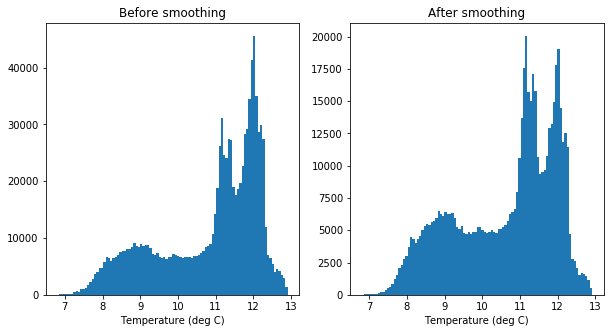
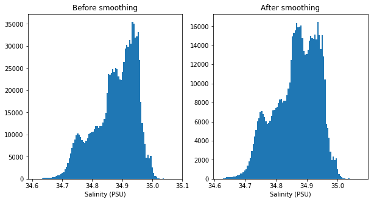
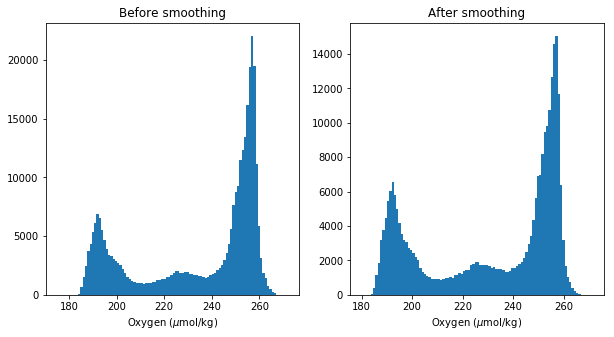
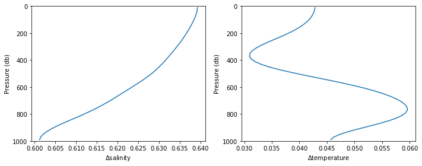
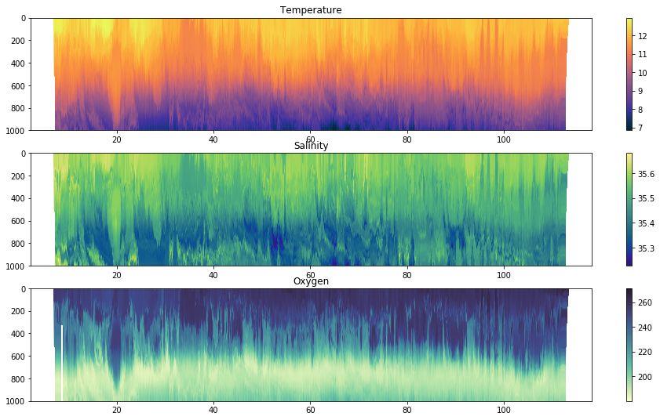
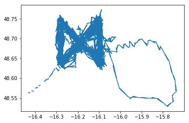
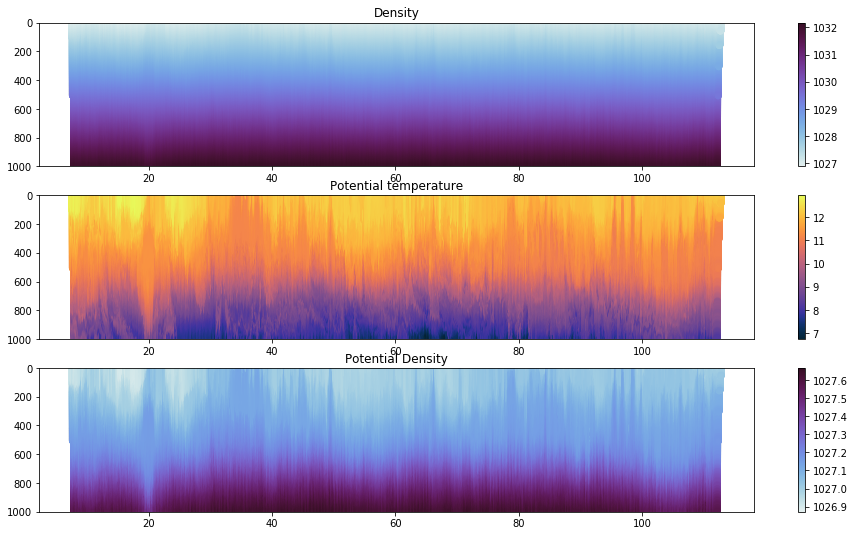

```python
import numpy as np
import matplotlib.pyplot as plt
import time as python_time
import seawater as sw
import os.path
import cmocean
from netCDF4 import Dataset
%matplotlib inline
```


```python
p_del = 1; # distance to smooth in each direction (smoothed over twice this distance)
```


```python
nc = Dataset('sg502_JanApr_L1.nc','r')
nc.variables
```


    OrderedDict([('GPS_lat', <class 'netCDF4._netCDF4.Variable'>
                  float64 GPS_lat(dive, direction)
                      _FillValue: -999.0
                      units: degrees north
                      scale_factor: 1
                      add_offset: 0.0
                  unlimited dimensions: 
                  current shape = (617, 2)
                  filling on), ('GPS_lon', <class 'netCDF4._netCDF4.Variable'>
                  float64 GPS_lon(dive, direction)
                      _FillValue: -999.0
                      units: degrees east
                      scale_factor: 1
                      add_offset: 0.0
                  unlimited dimensions: 
                  current shape = (617, 2)
                  filling on), ('GPS_time', <class 'netCDF4._netCDF4.Variable'>
                  float64 GPS_time(dive, direction)
                      _FillValue: -999.0
                      units: days since January 1, 2013
                      scale_factor: 1
                      add_offset: 0.0
                  unlimited dimensions: 
                  current shape = (617, 2)
                  filling on), ('GPS_flag', <class 'netCDF4._netCDF4.Variable'>
                  uint8 GPS_flag(dive, direction)
                      LAT_MIN: 48
                      LAT_MAX: 49
                      LON_MIN: -17
                      LON_MAX: -15
                      MAX_DISTANCE: 10
                      MAX_TIME: 0.208333333333
                  unlimited dimensions: 
                  current shape = (617, 2)
                  filling on, default _FillValue of 255 ignored), ('pressure',
                  <class 'netCDF4._netCDF4.Variable'>
                  float64 pressure(dive, observation)
                      _FillValue: -999.0
                      units: db
                      scale_factor: 1
                      add_offset: 0.0
                  unlimited dimensions: 
                  current shape = (617, 2130)
                  filling on), ('time', <class 'netCDF4._netCDF4.Variable'>
                  float64 time(dive, observation)
                      _FillValue: -999.0
                      units: days since January 1, 2013
                      scale_factor: 1
                      add_offset: 0.0
                  unlimited dimensions: 
                  current shape = (617, 2130)
                  filling on), ('temperature', <class 'netCDF4._netCDF4.Variable'>
                  float64 temperature(dive, observation)
                      _FillValue: -999.0
                      units: deg C
                      scale_factor: 1
                      add_offset: 0.0
                  unlimited dimensions: 
                  current shape = (617, 2130)
                  filling on), ('temp_flag', <class 'netCDF4._netCDF4.Variable'>
                  uint8 temp_flag(dive, observation)
                      SPIKE_THRESHOLD: 0.025
                      MIN_VALUE: 6
                      MAX_VALUE: 14
                  unlimited dimensions: 
                  current shape = (617, 2130)
                  filling on, default _FillValue of 255 ignored), ('salinity',
                  <class 'netCDF4._netCDF4.Variable'>
                  float64 salinity(dive, observation)
                      _FillValue: -999.0
                      units: Practical Salinity Units
                      scale_factor: 1
                      add_offset: 0.0
                  unlimited dimensions: 
                  current shape = (617, 2130)
                  filling on), ('sal_flag', <class 'netCDF4._netCDF4.Variable'>
                  uint8 sal_flag(dive, observation)
                      SPIKE_THRESHOLD: 0.025
                      DEPTH_THRESHOLD: 2
                      SPEED_THRESHOLD: 0.02
                      MIN_VALUE: 34.5
                      MAX_VALUE: 35.1
                  unlimited dimensions: 
                  current shape = (617, 2130)
                  filling on, default _FillValue of 255 ignored), ('oxygen',
                  <class 'netCDF4._netCDF4.Variable'>
                  float64 oxygen(dive, observation)
                      _FillValue: -999.0
                      units: micromol/kg
                      scale_factor: 1
                      add_offset: 0.0
                  unlimited dimensions: 
                  current shape = (617, 2130)
                  filling on), ('oxy_flag', <class 'netCDF4._netCDF4.Variable'>
                  uint8 oxy_flag(dive, observation)
                      SPIKE_THRESHOLD: 10.0
                      DEPTH_THRESHOLD: 2
                      MIN_VALUE: 175.0
                      MAX_VALUE: 275.0
                  unlimited dimensions: 
                  current shape = (617, 2130)
                  filling on, default _FillValue of 255 ignored), ('fluorescence',
                  <class 'netCDF4._netCDF4.Variable'>
                  float64 fluorescence(dive, observation)
                      _FillValue: -999.0
                      units: Counts
                  unlimited dimensions: 
                  current shape = (617, 2130)
                  filling on), ('fluor_flag', <class 'netCDF4._netCDF4.Variable'>
                  uint8 fluor_flag(dive, observation)
                      MIN_VALUE: -1
                      MAX_VALUE: 2
                  unlimited dimensions: 
                  current shape = (617, 2130)
                  filling on, default _FillValue of 255 ignored), ('backscatter',
                  <class 'netCDF4._netCDF4.Variable'>
                  float64 backscatter(dive, observation)
                      _FillValue: -999.0
                      units: 1/m
                      wavelength: 470
                  unlimited dimensions: 
                  current shape = (617, 2130)
                  filling on), ('bbp_flag', <class 'netCDF4._netCDF4.Variable'>
                  uint8 bbp_flag(dive, observation)
                      MIN_VALUE: -0.001
                      MAX_VALUE: 0.005
                  unlimited dimensions: 
                  current shape = (617, 2130)
                  filling on, default _FillValue of 255 ignored), ('backscatter2',
                  <class 'netCDF4._netCDF4.Variable'>
                  float64 backscatter2(dive, observation)
                      _FillValue: -999.0
                      units: 1/m
                      wavelength: 700
                  unlimited dimensions: 
                  current shape = (617, 2130)
                  filling on), ('bbp2_flag', <class 'netCDF4._netCDF4.Variable'>
                  uint8 bbp2_flag(dive, observation)
                      MIN_VALUE: -0.001
                      MAX_VALUE: 0.003
                  unlimited dimensions: 
                  current shape = (617, 2130)
                  filling on, default _FillValue of 255 ignored), ('latitude',
                  <class 'netCDF4._netCDF4.Variable'>
                  float64 latitude(dive, observation)
                      _FillValue: -999.0
                      units: degrees north
                      scale_factor: 1.0
                      add_offset: 0
                  unlimited dimensions: 
                  current shape = (617, 2130)
                  filling on), ('longitude', <class 'netCDF4._netCDF4.Variable'>
                  float64 longitude(dive, observation)
                      _FillValue: -999.0
                      units: degrees east
                      scale_factor: 1.0
                      add_offset: 0
                  unlimited dimensions: 
                  current shape = (617, 2130)
                  filling on), ('latlon_flag', <class 'netCDF4._netCDF4.Variable'>
                  uint8 latlon_flag(dive, observation)
                  unlimited dimensions: 
                  current shape = (617, 2130)
                  filling on, default _FillValue of 255 ignored), ('DAC_U',
                  <class 'netCDF4._netCDF4.Variable'>
                  float64 DAC_U(dive)
                      _FillValue: -999.0
                      units: m/s
                      scale_factor: 1.0
                      add_offset: 0.0
                  unlimited dimensions: 
                  current shape = (617,)
                  filling on), ('DAC_V', <class 'netCDF4._netCDF4.Variable'>
                  float64 DAC_V(dive)
                      _FillValue: -999.0
                      units: m/s
                      scale_factor: 1.0
                      add_offset: 0.0
                  unlimited dimensions: 
                  current shape = (617,)
                  filling on)])


```python
if os.path.isfile('glider_calibrations.nc'):
    cals = Dataset('glider_calibrations.nc','r')
    glidernum = np.where(cals.variables['glider'][:]==502)[0]
```


```python
pressure = np.arange(p_del,1000,2*p_del)
pressure_edges = np.arange(0,1000+p_del/2,2*p_del)
```


```python
time_sm = np.empty(shape=(nc.variables['time'].shape[0]*2,pressure.size))*np.nan
temp_sm = np.empty(shape=time_sm.shape)*np.nan
sal_sm = np.empty(shape=time_sm.shape)*np.nan
oxy_sm = np.empty(shape=time_sm.shape)*np.nan
time_n = np.empty(shape=time_sm.shape)*np.nan
temp_n = np.empty(shape=time_sm.shape)*np.nan
sal_n = np.empty(shape=time_sm.shape)*np.nan
oxy_n = np.empty(shape=time_sm.shape)*np.nan

for i in range(0,nc.variables['time'].shape[0]):
    press_max_ind = np.where(~np.isnan(nc.variables['pressure'][:][i,:]))[0][-1] # where start being nans
    
    maxindex = np.argmax(nc.variables['pressure'][i,0:press_max_ind])
    maxdepth = nc.variables['pressure'][i,maxindex]
    maxpressureindex = int(np.min([maxdepth,pressure[-1]])/(2*p_del))+1
    
    downcastinds = range(0,maxindex)
    good_sal = nc.variables['sal_flag'][i,downcastinds] == 0
    good_temp = nc.variables['temp_flag'][i,downcastinds] == 0
    good_oxy = nc.variables['oxy_flag'][i,downcastinds] == 0
    time = nc.variables['time'][i,downcastinds]
    sal = nc.variables['salinity'][i,downcastinds]
    temp = nc.variables['temperature'][i,downcastinds]
    oxy = nc.variables['oxygen'][i,downcastinds]
    
    inds = np.digitize(nc.variables['pressure'][i,0:maxindex],pressure_edges)-1
    for j in range(0,maxpressureindex):        
        time_inds = inds==j
        time_sm[i*2,j] = np.mean(time[inds==j])
        time_n[i*2,j] = np.sum(time_inds)
        
        sal_inds = np.logical_and(time_inds,good_sal)
        sal_sm[i*2,j] =  np.mean(sal[sal_inds])
        sal_n[i*2,j] = np.sum(sal_inds)
        
        temp_inds = np.logical_and(time_inds,good_temp)
        temp_sm[i*2,j] = np.mean(temp[temp_inds])
        temp_n[i*2,j] = np.sum(temp_inds)
        
        oxy_inds = np.logical_and(time_inds,good_oxy)
        oxy_sm[i*2,j] = np.mean(oxy[oxy_inds])
        oxy_n[i*2,j] = np.sum(oxy_inds)
        
    upcastinds = np.arange(maxindex,press_max_ind)
    if upcastinds.size == 0:
        continue
    good_sal = nc.variables['sal_flag'][i,upcastinds] == 0
    good_temp = nc.variables['temp_flag'][i,upcastinds] == 0
    good_oxy = nc.variables['oxy_flag'][i,upcastinds] == 0
    time = nc.variables['time'][i,upcastinds]
    sal = nc.variables['salinity'][i,upcastinds]
    temp = nc.variables['temperature'][i,upcastinds]
    oxy = nc.variables['oxygen'][i,upcastinds]
    
    inds = np.digitize(nc.variables['pressure'][i,upcastinds],pressure_edges)-1
    for j in range(0,maxpressureindex):        
        time_inds = inds==j
        time_sm[i*2+1,j] = np.mean(time[time_inds])
        time_n[i*2+1,j] = np.sum(time_inds)
        
        sal_inds = np.logical_and(time_inds,good_sal)
        sal_sm[i*2+1,j] =  np.mean(sal[sal_inds])
        sal_n[i*2+1,j] = np.sum(sal_inds)
        
        temp_inds = np.logical_and(time_inds,good_temp)
        temp_sm[i*2+1,j] = np.mean(temp[temp_inds])
        temp_n[i*2+1,j] = np.sum(temp_inds)
        
        oxy_inds = np.logical_and(time_inds,good_oxy)
        oxy_sm[i*2+1,j] = np.mean(oxy[oxy_inds])
        oxy_n[i*2+1,j] = np.sum(oxy_inds)

```

    /Library/Frameworks/Python.framework/Versions/3.6/lib/python3.6/site-packages/ipykernel_launcher.py:11: RuntimeWarning: invalid value encountered in less
      # This is added back by InteractiveShellApp.init_path()
    /Library/Frameworks/Python.framework/Versions/3.6/lib/python3.6/site-packages/ipykernel_launcher.py:24: RuntimeWarning: invalid value encountered in less
    /Library/Frameworks/Python.framework/Versions/3.6/lib/python3.6/site-packages/numpy/core/fromnumeric.py:2909: RuntimeWarning: Mean of empty slice.
      out=out, **kwargs)
    /Library/Frameworks/Python.framework/Versions/3.6/lib/python3.6/site-packages/numpy/core/_methods.py:80: RuntimeWarning: invalid value encountered in double_scalars
      ret = ret.dtype.type(ret / rcount)
    /Library/Frameworks/Python.framework/Versions/3.6/lib/python3.6/site-packages/ipykernel_launcher.py:53: RuntimeWarning: invalid value encountered in less


```python
plt.figure(figsize=(10,5))
plt.subplot(121); plt.hist(nc.variables['temperature'][:].ravel()[np.logical_and(nc.variables['temp_flag'][:].ravel()==0,~np.isnan(nc.variables['temperature'][:].ravel()))],100);
plt.title('Before smoothing'); plt.xlabel('Temperature (deg C)')
plt.subplot(122); plt.hist(temp_sm.ravel()[~np.isnan(temp_sm.ravel())],100);
plt.title('After smoothing'); plt.xlabel('Temperature (deg C)');
```

    /Library/Frameworks/Python.framework/Versions/3.6/lib/python3.6/site-packages/ipykernel_launcher.py:2: RuntimeWarning: invalid value encountered in less
      





```python
plt.figure(figsize=(10,5))
plt.subplot(121); plt.hist(nc.variables['salinity'][:].ravel()[np.logical_and(nc.variables['sal_flag'][:].ravel()==0,~np.isnan(nc.variables['salinity'][:].ravel()))],100);
plt.title('Before smoothing'); plt.xlabel('Salinity (PSU)')
plt.subplot(122); plt.hist(sal_sm.ravel()[~np.isnan(sal_sm.ravel())],100);
plt.title('After smoothing'); plt.xlabel('Salinity (PSU)');
```

    /Library/Frameworks/Python.framework/Versions/3.6/lib/python3.6/site-packages/ipykernel_launcher.py:2: RuntimeWarning: invalid value encountered in less
      





```python
plt.figure(figsize=(10,5))
plt.subplot(121); plt.hist(nc.variables['oxygen'][:].ravel()[np.logical_and(nc.variables['oxy_flag'][:].ravel()==0,~np.isnan(nc.variables['oxygen'][:].ravel()))],100);
plt.title('Before smoothing'); plt.xlabel(r'Oxygen ($\mu$mol/kg)')
plt.subplot(122); plt.hist(oxy_sm.ravel()[~np.isnan(oxy_sm.ravel())],100);
plt.title('After smoothing'); plt.xlabel(r'Oxygen ($\mu$mol/kg)');
```

    /Library/Frameworks/Python.framework/Versions/3.6/lib/python3.6/site-packages/ipykernel_launcher.py:2: RuntimeWarning: invalid value encountered in less
      





```python
# Average over places with no data
for i in range(0,time_sm.shape[0]):
    no_data = np.where(time_n[i,:] == 0)[0]
    yes_data = np.where(time_n[i,:] > 0)[0]
    if yes_data.size == 0:
        time_sm[i,no_data] = np.nan
    else:
        if no_data.size != 0:
            time_sm[i,no_data] = np.interp(pressure[no_data],pressure[yes_data],time_sm[i,yes_data],left=np.nan,right=np.nan)
    
    no_data = np.where(sal_n[i,:] == 0)[0]
    yes_data = np.where(sal_n[i,:] > 0)[0]
    if yes_data.size == 0:
        sal_sm[i,no_data] = np.nan
    else:
        if no_data.size != 0:
            sal_sm[i,no_data] = np.interp(pressure[no_data],pressure[yes_data],sal_sm[i,yes_data],left=np.nan,right=np.nan)

    no_data = np.where(temp_n[i,:] == 0)[0]
    yes_data = np.where(temp_n[i,:] > 0)[0]
    if yes_data.size == 0:
        temp_sm[i,no_data] = np.nan
    else:
        if no_data.size != 0:
            temp_sm[i,no_data] = np.interp(pressure[no_data],pressure[yes_data],temp_sm[i,yes_data],left=np.nan,right=np.nan)
            
    no_data = np.where(oxy_n[i,:] == 0)[0]
    yes_data = np.where(oxy_n[i,:] > 0)[0]
    if yes_data.size == 0:
        oxy_sm[i,no_data] = np.nan
    else:
        if no_data.size != 0:
            oxy_sm[i,no_data] = np.interp(pressure[no_data],pressure[yes_data],oxy_sm[i,yes_data],left=np.nan,right=np.nan)

```

    /Library/Frameworks/Python.framework/Versions/3.6/lib/python3.6/site-packages/ipykernel_launcher.py:4: RuntimeWarning: invalid value encountered in greater
      after removing the cwd from sys.path.
    /Library/Frameworks/Python.framework/Versions/3.6/lib/python3.6/site-packages/ipykernel_launcher.py:12: RuntimeWarning: invalid value encountered in greater
      if sys.path[0] == '':
    /Library/Frameworks/Python.framework/Versions/3.6/lib/python3.6/site-packages/ipykernel_launcher.py:20: RuntimeWarning: invalid value encountered in greater
    /Library/Frameworks/Python.framework/Versions/3.6/lib/python3.6/site-packages/ipykernel_launcher.py:28: RuntimeWarning: invalid value encountered in greater


```python
plt.figure(figsize=(16,9))
plt.subplot(311); plt.title('Temperature'); plt.ylim([1000,0])
plt.scatter(time_sm.ravel(),np.tile(pressure.reshape(1,-1),[time_sm.shape[0],1]).ravel(),c=temp_sm.ravel(),cmap=cmocean.cm.thermal); plt.colorbar();
plt.subplot(312); plt.title('Salinity'); plt.ylim([1000,0])
plt.scatter(time_sm.ravel(),np.tile(pressure.reshape(1,-1),[time_sm.shape[0],1]).ravel(),c=sal_sm.ravel(),cmap=cmocean.cm.haline); plt.colorbar();
plt.subplot(313); plt.title('Oxygen'); plt.ylim([1000,0])
plt.scatter(time_sm.ravel(),np.tile(pressure.reshape(1,-1),[time_sm.shape[0],1]).ravel(),c=oxy_sm.ravel(),cmap=cmocean.cm.deep); plt.colorbar();
```


```python
if os.path.isfile('glider_calibrations.nc'):
    plt.figure(figsize=(10,4));
    plt.subplot(121)
    plt.plot(cals.variables['salinity_cal'][glidernum,:].reshape(-1,),cals.variables['pressure'][:])
    plt.xlabel(r'$\Delta$salinity'); plt.ylabel('Pressure (db)'); plt.ylim([1000,0]);
    plt.subplot(122)
    plt.plot(cals.variables['temperature_cal'][glidernum,:].reshape(-1,),cals.variables['pressure'][:])
    plt.xlabel(r'$\Delta$temperature'); plt.ylabel('Pressure (db)'); plt.ylim([1000,0]);
    plt.tight_layout()
```





```python
# calibrate
if os.path.isfile('glider_calibrations.nc'): 
    for i in range(sal_sm.shape[0]):
        sal_sm[i,:] += np.interp(pressure,cals.variables['pressure'][:],cals.variables['salinity_cal'][glidernum,:].reshape(-1,))
        temp_sm[i,:] += np.interp(pressure,cals.variables['pressure'][:],cals.variables['temperature_cal'][glidernum,:].reshape(-1,))
```


```python
if os.path.isfile('glider_calibrations.nc'):
    plt.figure(figsize=(16,9))
    plt.subplot(311); plt.title('Temperature'); plt.ylim([1000,0])
    plt.scatter(time_sm.ravel(),np.tile(pressure.reshape(1,-1),[time_sm.shape[0],1]).ravel(),c=temp_sm.ravel(),cmap=cmocean.cm.thermal); plt.colorbar();
    plt.subplot(312); plt.title('Salinity'); plt.ylim([1000,0])
    plt.scatter(time_sm.ravel(),np.tile(pressure.reshape(1,-1),[time_sm.shape[0],1]).ravel(),c=sal_sm.ravel(),cmap=cmocean.cm.haline); plt.colorbar();
    plt.subplot(313); plt.title('Oxygen'); plt.ylim([1000,0])
    plt.scatter(time_sm.ravel(),np.tile(pressure.reshape(1,-1),[time_sm.shape[0],1]).ravel(),c=oxy_sm.ravel(),cmap=cmocean.cm.deep); plt.colorbar();
```





```python
# This way is assuming constant horizontal movement between surface locations
lat_sm = np.nan*np.ones(shape=time_sm.shape)
lon_sm = np.nan*np.ones(shape=lat_sm.shape)

for i in range(1,nc.variables['time'].shape[0]):
    GPS_lat = nc.variables['GPS_lat'][i,:]
    GPS_lon = nc.variables['GPS_lon'][i,:]
    GPS_time =nc.variables['GPS_time'][i,:]
    GPS_flag =nc.variables['GPS_flag'][i,:]
    if np.any(GPS_flag!=0):
        continue
        
    good_indices = np.where(~np.isnan(time_sm[i*2,:]))[0]
    lat_sm[i*2,good_indices] = np.interp(time_sm[i*2,good_indices],GPS_time,GPS_lat,right=np.nan)
    lon_sm[i*2,good_indices] = np.interp(time_sm[i*2,good_indices],GPS_time,GPS_lon,right=np.nan)
    good_indices = np.where(~np.isnan(time_sm[i*2+1,:]))[0]
    lat_sm[i*2+1,good_indices] = np.interp(time_sm[i*2+1,good_indices],GPS_time,GPS_lat,left=np.nan)
    lon_sm[i*2+1,good_indices] = np.interp(time_sm[i*2+1,good_indices],GPS_time,GPS_lon,left=np.nan)

```


```python
plt.plot(lon_sm.ravel(),lat_sm.ravel())
```


    [<matplotlib.lines.Line2D at 0x10f08a128>]


```python
# This way is using the flight model from the Seaglider toolbox
lat_fm_sm = np.nan*np.empty(shape=time_sm.shape)
lon_fm_sm = np.nan*np.empty(shape=time_sm.shape)

for i in range(0,nc.variables['time'].shape[0]): 
    GPS_flag = nc.variables['GPS_flag'][i,:]
    if np.any(GPS_flag>2):
        continue
        
    press_max_ind = np.where(~np.isnan(nc.variables['pressure'][:][i,:]))[0][-1] # where start being nans
        
    maxindex = np.argmax(nc.variables['pressure'][i,0:press_max_ind])
    maxdepth = nc.variables['pressure'][i,maxindex]
    maxpressureindex = int(np.nanmin([maxdepth,pressure[-1]])/(2*p_del))+1
    
    downcastinds = range(0,maxindex)
    lat = nc.variables['latitude'][i,downcastinds]
    lon = nc.variables['longitude'][i,downcastinds]
    good_latlon = nc.variables['latlon_flag'][i,downcastinds] == 0
    
    inds = np.digitize(nc.variables['pressure'][i,0:maxindex],pressure_edges)-1
    for j in range(0,maxpressureindex): 
        latlon_inds = np.logical_and(inds==j,good_latlon)
        lat_fm_sm[i*2,j] = np.mean(lat[latlon_inds])
        lon_fm_sm[i*2,j] = np.mean(lon[latlon_inds])
        
    upcastinds = np.arange(maxindex,press_max_ind)
    if upcastinds.size == 0:
        continue
    lat = nc.variables['latitude'][i,upcastinds]
    lon = nc.variables['longitude'][i,upcastinds]
    good_latlon = nc.variables['latlon_flag'][i,upcastinds] == 0
    
    inds = np.digitize(nc.variables['pressure'][i,upcastinds],pressure_edges)-1
    for j in range(0,maxpressureindex):        
        latlon_inds = np.logical_and(inds==j,good_latlon)
        lat_fm_sm[i*2+1,j] = np.mean(lat[latlon_inds])
        lon_fm_sm[i*2+1,j] = np.mean(lon[latlon_inds])
```

    /Library/Frameworks/Python.framework/Versions/3.6/lib/python3.6/site-packages/ipykernel_launcher.py:10: RuntimeWarning: invalid value encountered in less
      # Remove the CWD from sys.path while we load stuff.
    /Library/Frameworks/Python.framework/Versions/3.6/lib/python3.6/site-packages/numpy/core/fromnumeric.py:2909: RuntimeWarning: Mean of empty slice.
      out=out, **kwargs)
    /Library/Frameworks/Python.framework/Versions/3.6/lib/python3.6/site-packages/numpy/core/_methods.py:80: RuntimeWarning: invalid value encountered in double_scalars
      ret = ret.dtype.type(ret / rcount)


```python
plt.plot(lon_fm_sm.ravel(),lat_fm_sm.ravel())
```


    [<matplotlib.lines.Line2D at 0x10f611048>]





```python
# Make derived values
pressure_grid = np.tile(pressure.reshape(1,-1),[time_sm.shape[0],1])
dens_sm = sw.dens(sal_sm,temp_sm,pressure_grid)
ptmp_sm = sw.ptmp(sal_sm,temp_sm,pressure_grid)
pdens_sm= sw.pden(sal_sm,temp_sm,pressure_grid)
```


```python
plt.figure(figsize=(16,9))
plt.subplot(311); plt.title('Density'); plt.ylim([1000,0])
plt.scatter(time_sm.ravel(),pressure_grid.ravel(),c=dens_sm.ravel(),cmap=cmocean.cm.dense); plt.colorbar();
plt.subplot(312); plt.title('Potential temperature'); plt.ylim([1000,0])
plt.scatter(time_sm.ravel(),pressure_grid.ravel(),c=ptmp_sm.ravel(),cmap=cmocean.cm.thermal); plt.colorbar();
plt.subplot(313); plt.title('Potential Density'); plt.ylim([1000,0])
plt.scatter(time_sm.ravel(),pressure_grid.ravel(),c=pdens_sm.ravel(),cmap=cmocean.cm.dense); plt.colorbar();

```





```python
FILL_VALUE = -999

NC = Dataset('sg502_JanApr_L2_2m.nc','w')
NC.title = 'Level 2 Glider data from SG502'
NC.mission = 'OSMOSIS (Ocean Surface Mixing, Ocean Sub-mesoscale Interaction Study)'
NC.institution = 'Caltech'
NC.glider = 'SG502'
NC.author = 'Zachary K Erickson'
NC.contact = 'zerickso@caltech.edu'
#NC.comment = 'Code to create file at http://web.gps.caltech.edu/~zerickso/Data/OSMOSIS/Level2_SG502_JanApr_2m.html. Also see http://web.gps.caltech.edu/~zerickso/Data/OSMOSIS/Query_SG502_JanApr_L2_2m.html.'
NC.history = 'Created '+ python_time.ctime(python_time.time())
NC.Conventions = 'CF-1.6'
NC.createDimension('cast',time_sm.shape[0])
NC.createDimension('pressure',pressure.size)
nc_divenum = NC.createVariable('divenum',np.dtype('int16').char,('cast'))
nc_downcast = NC.createVariable('downcast',np.dtype('int8').char,('cast'))
nc_pressure = NC.createVariable('pressure',np.dtype('int16').char,('pressure'))
nc_pressure.units = 'db'
nc_pressure.scale_factor = 1.
nc_pressure.add_offset = 0.
nc_DAC_U = NC.createVariable('DAC_U',np.dtype('float64').char,('cast',),fill_value=-999.)
nc_DAC_U.units = 'm/s'
nc_DAC_U.scale_factor = 1.
nc_DAC_U.add_offset = 0.
nc_DAC_V = NC.createVariable('DAC_V',np.dtype('float64').char,('cast',),fill_value=-999.)
nc_DAC_V.units = 'm/s'
nc_DAC_V.scale_factor = 1.
nc_DAC_V.add_offset = 0.
nc_lat = NC.createVariable('latitude',np.dtype('float64').char,('cast','pressure'),fill_value=FILL_VALUE)
nc_lat.units = 'degrees north'
nc_lat.scale_factor = 1.
nc_lat.add_offset = 0.
nc_lon = NC.createVariable('longitude',np.dtype('float64').char,('cast','pressure'),fill_value=FILL_VALUE)
nc_lon.units = 'degrees east'
nc_lon.scale_factor = 1.
nc_lon.add_offset = 0.
nc_lat_fm = NC.createVariable('latitude_flightmodel',np.dtype('float64').char,('cast','pressure'),fill_value=FILL_VALUE)
nc_lat_fm.units = 'degrees north'
nc_lat_fm.scale_factor = 1.
nc_lat_fm.add_offset = 0.
nc_lon_fm = NC.createVariable('longitude_flightmodel',np.dtype('float64').char,('cast','pressure'),fill_value=FILL_VALUE)
nc_lon_fm.units = 'degrees east'
nc_lon_fm.scale_factor = 1.
nc_lon_fm.add_offset = 0.
nc_time = NC.createVariable('time',np.dtype('float64').char,('cast','pressure'),fill_value=FILL_VALUE)
nc_time.units = 'days since January 1, 2013'
nc_time.scale_factor = 1
nc_time.add_offset = 0.
nc_temperature = NC.createVariable('temperature',np.dtype('float64').char,('cast','pressure'),fill_value=FILL_VALUE)
nc_temperature.units = 'deg C'
nc_temperature.scale_factor = 1
nc_temperature.add_offset = 0.
nc_salinity = NC.createVariable('salinity',np.dtype('float64').char,('cast','pressure'),fill_value=FILL_VALUE)
nc_salinity.units = 'Practical Salinity Units'
nc_salinity.scale_factor = 1
nc_salinity.add_offset = 0.
nc_oxygen = NC.createVariable('oxygen',np.dtype('float64').char,('cast','pressure'),fill_value=FILL_VALUE)
nc_oxygen.units = 'micromol/kg'
nc_oxygen.scale_factor = 1.
nc_oxygen.add_offset = 0.
nc_density = NC.createVariable('density',np.dtype('float64').char,('cast','pressure'),fill_value=FILL_VALUE)
nc_density.units = 'kg/m^3'
nc_density.scale_factor = 1
nc_density.add_offset = 0.
nc_pot_temperature = NC.createVariable('pot_temperature',np.dtype('float64').char,('cast','pressure'),fill_value=FILL_VALUE)
nc_pot_temperature.units = 'deg C'
nc_pot_temperature.scale_factor = 1
nc_pot_temperature.add_offset = 0.
nc_pot_density = NC.createVariable('pot_density',np.dtype('float64').char,('cast','pressure'),fill_value=FILL_VALUE)
nc_pot_density.units = 'kg/m^3'
nc_pot_density.scale_factor = 1
nc_pot_density.add_offset = 0.
nc_time_n = NC.createVariable('n_time',np.dtype('int8').char,('cast','pressure'),fill_value=FILL_VALUE)
nc_temperature_n = NC.createVariable('n_temperature',np.dtype('int8').char,('cast','pressure'),fill_value=FILL_VALUE)
nc_salinity_n = NC.createVariable('n_salinity',np.dtype('int8').char,('cast','pressure'),fill_value=FILL_VALUE)
nc_oxygen_n = NC.createVariable('n_oxygen',np.dtype('int8').char,('cast','pressure'),fill_value=FILL_VALUE)

nc_pressure[:] = pressure;
nc_divenum[:] = np.round(np.arange(.6,time_sm.shape[0]/2+.5,0.5)).astype('int') # somewhat kludgy
nc_downcast[:] = np.tile(np.array([[1],[0]]),[int(time_sm.shape[0]/2),1]) # somewhat kludgy
nc_DAC_U[:] = np.tile(nc.variables['DAC_U'][:].reshape(-1,1),[1,2]).reshape(-1,)
nc_DAC_V[:] = np.tile(nc.variables['DAC_V'][:].reshape(-1,1),[1,2]).reshape(-1,)
nc_lat[:] = lat_sm
nc_lon[:] = lon_sm
nc_lat_fm[:] = lat_fm_sm;
nc_lon_fm[:] = lon_fm_sm;
nc_time[:] = time_sm
nc_temperature[:] = temp_sm
nc_salinity[:] = sal_sm
nc_oxygen[:] = oxy_sm
nc_density[:] = dens_sm
nc_pot_temperature[:] = ptmp_sm
nc_pot_density[:] = pdens_sm
nc_time_n[:] = time_n
nc_temperature_n[:] = temp_n
nc_salinity_n[:] = sal_n
nc_oxygen_n[:] = oxy_n
```

    /Library/Frameworks/Python.framework/Versions/3.6/lib/python3.6/site-packages/ipykernel_launcher.py:83: RuntimeWarning: invalid value encountered in less
    /Library/Frameworks/Python.framework/Versions/3.6/lib/python3.6/site-packages/ipykernel_launcher.py:84: RuntimeWarning: invalid value encountered in less
    /Library/Frameworks/Python.framework/Versions/3.6/lib/python3.6/site-packages/ipykernel_launcher.py:85: RuntimeWarning: invalid value encountered in less
    /Library/Frameworks/Python.framework/Versions/3.6/lib/python3.6/site-packages/ipykernel_launcher.py:86: RuntimeWarning: invalid value encountered in less
    /Library/Frameworks/Python.framework/Versions/3.6/lib/python3.6/site-packages/ipykernel_launcher.py:87: RuntimeWarning: invalid value encountered in less
    /Library/Frameworks/Python.framework/Versions/3.6/lib/python3.6/site-packages/ipykernel_launcher.py:88: RuntimeWarning: invalid value encountered in less
    /Library/Frameworks/Python.framework/Versions/3.6/lib/python3.6/site-packages/ipykernel_launcher.py:89: RuntimeWarning: invalid value encountered in less
    /Library/Frameworks/Python.framework/Versions/3.6/lib/python3.6/site-packages/ipykernel_launcher.py:90: RuntimeWarning: invalid value encountered in less
    /Library/Frameworks/Python.framework/Versions/3.6/lib/python3.6/site-packages/ipykernel_launcher.py:91: RuntimeWarning: invalid value encountered in less
    /Library/Frameworks/Python.framework/Versions/3.6/lib/python3.6/site-packages/ipykernel_launcher.py:92: RuntimeWarning: invalid value encountered in less
    /Library/Frameworks/Python.framework/Versions/3.6/lib/python3.6/site-packages/ipykernel_launcher.py:93: RuntimeWarning: invalid value encountered in less


```python
nc.close()
NC.close()
cals.close()

```
