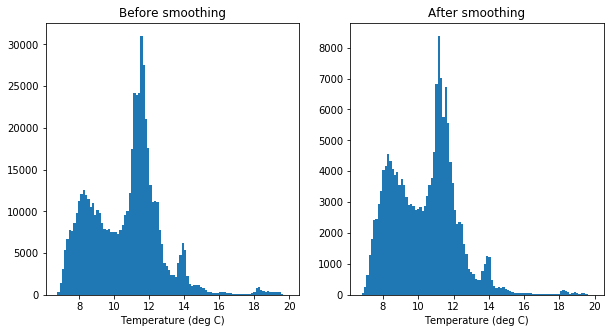
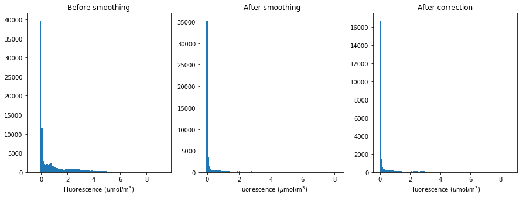
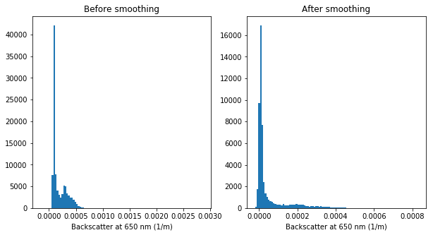
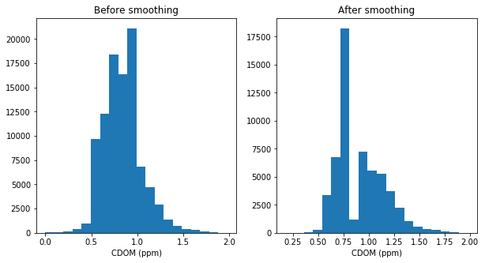
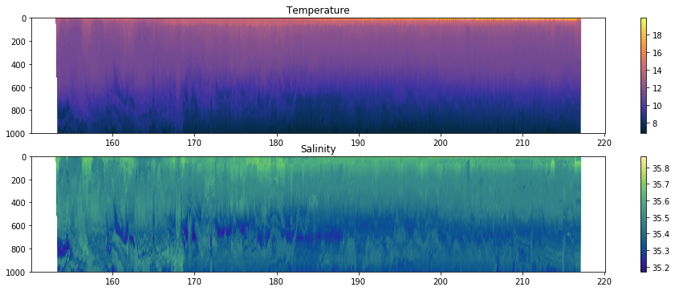
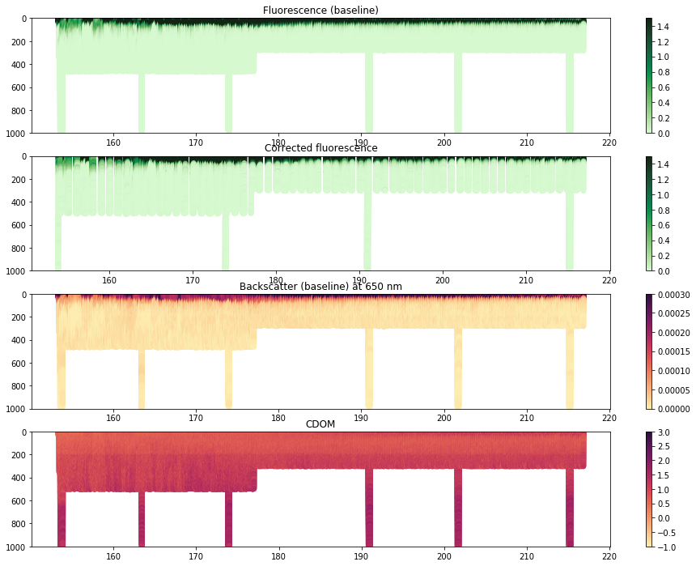
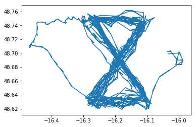

```python
import numpy as np
import matplotlib.pyplot as plt
import time as python_time
import seawater as sw
import os.path
import cmocean
import astral
import datetime as dt
from netCDF4 import Dataset
%matplotlib inline
```


```python
ast = astral.Astral(astral.AstralGeocoder)
```


```python
p_del = 2.5; # distance to smooth in each direction (smoothed over twice this distance)
```


```python
nc = Dataset('SG533_AprSep_L1.nc','r')
for var in nc.variables.keys():
    print(var, end=' ')
```

    GPS_lat GPS_lon GPS_time GPS_flag pressure time temperature temp_flag salinity sal_flag fluorescence fluor_flag backscatter bbp_flag CDOM CDOM_flag latitude longitude latlon_flag DAC_U DAC_V 


```python
if os.path.isfile('glider_calibrations.nc'):
    cals = Dataset('glider_calibrations.nc','r')
    glidernum = np.where(np.logical_and(cals.variables['glider'][:]==533,cals.variables['time_range'][:,0]>0))[0]
```


```python
pressure = np.arange(p_del,1000,2*p_del)
pressure_edges = np.arange(0,1000+p_del/2,2*p_del)
```


```python
time_sm = np.empty(shape=(nc.variables['time'].shape[0]*2,pressure.size))*np.nan
temp_sm = np.empty(shape=time_sm.shape)*np.nan
sal_sm = np.empty(shape=time_sm.shape)*np.nan
#oxy_sm = np.empty(shape=time_sm.shape)*np.nan
fl_bln_sm = np.empty(shape=time_sm.shape)*np.nan
fl_spk_sm = np.empty(shape=time_sm.shape)*np.nan
fl_corr_sm = np.empty(shape=time_sm.shape)*np.nan
bbp_bln_sm = np.empty(shape=time_sm.shape)*np.nan
bbp_spk_sm = np.empty(shape=time_sm.shape)*np.nan
cdom_sm = np.empty(shape=time_sm.shape)*np.nan
time_n = np.empty(shape=time_sm.shape)*np.nan
temp_n = np.empty(shape=time_sm.shape)*np.nan
sal_n = np.empty(shape=time_sm.shape)*np.nan
#oxy_n = np.empty(shape=time_sm.shape)*np.nan
fl_n = np.empty(shape=time_sm.shape)*np.nan
fl_corr_n = np.empty(shape=time_sm.shape)*np.nan
bbp_n = np.empty(shape=time_sm.shape)*np.nan
cdom_n = np.empty(shape=time_sm.shape)*np.nan

daytime = np.empty(shape=(time_sm.shape[0],),dtype='bool')
NPQ_corr = np.empty(shape=(time_sm.shape[0],),dtype='bool')

for i in range(0,nc.variables['time'].shape[0]):
    press_max_ind = np.where(~np.isnan(nc.variables['pressure'][:][i,:]))[0][-1] # where start being nans
    
    maxindex = np.argmax(nc.variables['pressure'][i,0:press_max_ind])
    maxdepth = nc.variables['pressure'][i,maxindex]
    maxpressureindex = int(np.min([maxdepth,pressure[-1]])/(2*p_del))+1
    
    downcastinds = range(0,maxindex)
    p = nc.variables['pressure'][i,downcastinds]
    good_sal = nc.variables['sal_flag'][i,downcastinds] == 0
    good_temp = nc.variables['temp_flag'][i,downcastinds] == 0
    #good_oxy = nc.variables['oxy_flag'][i,downcastinds] == 0
    good_fl = nc.variables['fluor_flag'][i,downcastinds] == 0
    good_bbp = nc.variables['bbp_flag'][i,downcastinds] == 0
    good_cdom = nc.variables['CDOM_flag'][i,downcastinds] == 0
    time = nc.variables['time'][i,downcastinds]
    sal = nc.variables['salinity'][i,downcastinds]
    temp = nc.variables['temperature'][i,downcastinds]
    #oxy = nc.variables['oxygen'][i,downcastinds]
    fl = nc.variables['fluorescence'][i,downcastinds]
    bbp = nc.variables['backscatter'][i,downcastinds]
    cdom = nc.variables['CDOM'][i,downcastinds]
    
    fl[~good_fl] = np.nan
    bbp[~good_bbp] = np.nan
    
    # find baseline and spike values
    fl_bln = np.nan*np.empty(shape=fl.shape)
    fl_spk = np.nan*np.empty(shape=fl.shape)
    inds = np.where(~np.isnan(fl))[0]
    min_filter = np.nan*np.empty(shape=(len(inds),))
    for k in range(2,len(inds)-2):
        min_filter[k] = np.min(fl[inds][k-2:k+3]) # 5 points
    for k in range(4,len(inds)-4):
        fl_bln[inds[k]] = np.max(min_filter[k-2:k+3])
    fl_spk = fl-fl_bln
    bbp_bln = np.nan*np.empty(shape=bbp.shape)
    bbp_spk = np.nan*np.empty(shape=bbp.shape)
    inds = np.where(~np.isnan(bbp))[0]
    min_filter = np.nan*np.empty(shape=(len(inds),))
    for k in range(2,len(inds)-2):
        min_filter[k] = np.min(bbp[inds][k-2:k+3]) # 5 points
    for k in range(4,len(inds)-4):
        bbp_bln[inds[k]] = np.max(min_filter[k-2:k+3])
    bbp_spk = bbp-bbp_bln
        
    sunrise = ast.sunrise_utc(dt.datetime(2013,1,1,0,0,0)+dt.timedelta(days=time[0]),48.7,-16.2)
    sunset = ast.sunset_utc(dt.datetime(2013,1,1,0,0,0)+dt.timedelta(days=time[0]),48.7,-16.2)
    if (time[0]-np.floor(time[0]))*24<sunrise.hour+1.*sunrise.minute/60 or (time[0]-np.floor(time[0]))*24>sunset.hour+1.*sunset.minute/60:
        daytime[i*2] = False
    else:
        daytime[i*2] = True
    if ~daytime[i*2]:
        fl_corr = fl # nighttime; no correction needed
        NPQ_corr[i*2] = False
    else:
        pdens = sw.pden(sal,temp,p)
        pdens[np.logical_or(~good_sal,~good_temp)] = np.nan
        pdens_10 = np.nanmean(pdens[np.abs(p-10)<2])
        MLD_index = np.where(pdens-pdens_10>0.01)[0]
        if len(MLD_index)==0 or ~np.any(good_fl) or ~np.any(good_bbp):
            fl_corr = np.nan*np.ones(shape=fl.shape) # cannot correct fluorescence; no measurements below ML
            NPQ_corr[i*2] = False
        else:
            MLD = p[MLD_index[0]]
            
            indices = np.where(np.logical_and(p<MLD,np.logical_and(p>20,np.logical_and(good_fl,good_bbp))))[0]
            if indices.size<5:
                fl_corr = np.nan*np.ones(shape=fl_bln.shape) # no correction possible: too few indices within ML
                NPQ_corr[i*2] = False
            else:
                # find best fit straight line
                p_anom = p[indices]
                ratio = (fl_bln/bbp_bln)[indices]
                coeffs = np.polyfit(p_anom,ratio,1)
                fl_weights = (p-20)/np.min([30,MLD-20]); fl_weights[fl_weights<0] = 0; fl_weights[fl_weights>1] = 1;
                fl_corr = fl_bln*fl_weights + np.polyval(coeffs,p)*bbp_bln*(1-fl_weights)
                NPQ_corr[i*2] = True
    fl_corr[fl_corr>1.5*(nc.variables['fluor_flag'].MAX_VALUE-nc.variables['fluor_flag'].MIN_VALUE)] = np.nan
    fl_corr[fl_corr<fl_bln] = fl[fl_corr<fl_bln]
    
    inds = np.digitize(nc.variables['pressure'][i,0:maxindex],pressure_edges)-1
    for j in range(0,maxpressureindex):        
        time_inds = inds==j
        time_sm[i*2,j] = np.mean(time[inds==j])
        time_n[i*2,j] = np.sum(time_inds)
        
        sal_inds = np.logical_and(time_inds,good_sal)
        sal_sm[i*2,j] =  np.mean(sal[sal_inds])
        sal_n[i*2,j] = np.sum(sal_inds)
        
        temp_inds = np.logical_and(time_inds,good_temp)
        temp_sm[i*2,j] = np.mean(temp[temp_inds])
        temp_n[i*2,j] = np.sum(temp_inds)
        
        #oxy_inds = np.logical_and(time_inds,good_oxy)
        #oxy_sm[i*2,j] = np.mean(oxy[oxy_inds])
        #oxy_n[i*2,j] = np.sum(oxy_inds)
        
        fl_inds = np.logical_and(time_inds,good_fl)
        fl_bln_sm[i*2,j] = np.mean(fl_bln[fl_inds])
        fl_spk_sm[i*2,j] = np.mean(fl_spk[fl_inds])
        fl_n[i*2,j] = np.sum(fl_inds)
        
        fl_corr_inds = np.logical_and(time_inds,np.logical_and(good_fl,good_bbp))
        fl_corr_sm[i*2,j] = np.mean(fl_corr[fl_corr_inds])
        fl_corr_n[i*2,j] = np.sum(fl_corr_inds)
        
        bbp_inds = np.logical_and(time_inds,good_bbp)
        bbp_bln_sm[i*2,j] = np.mean(bbp_bln[bbp_inds])
        bbp_spk_sm[i*2,j] = np.mean(bbp_spk[bbp_inds])
        bbp_n[i*2,j] = np.sum(bbp_inds)
        
        cdom_inds = np.logical_and(time_inds,good_cdom)
        cdom_sm[i*2,j] = np.median(cdom[cdom_inds])
        cdom_n[i*2,j] = np.sum(cdom_inds)
        
    upcastinds = np.arange(maxindex,press_max_ind)
    if upcastinds.size == 0:
        continue
    p = nc.variables['pressure'][i,upcastinds]
    good_sal = nc.variables['sal_flag'][i,upcastinds] == 0
    good_temp = nc.variables['temp_flag'][i,upcastinds] == 0
    #good_oxy = nc.variables['oxy_flag'][i,upcastinds] == 0
    good_fl = nc.variables['fluor_flag'][i,upcastinds] == 0
    good_bbp = nc.variables['bbp_flag'][i,upcastinds] == 0
    good_cdom = nc.variables['CDOM_flag'][i,upcastinds] == 0
    time = nc.variables['time'][i,upcastinds]
    sal = nc.variables['salinity'][i,upcastinds]
    temp = nc.variables['temperature'][i,upcastinds]
    #oxy = nc.variables['oxygen'][i,upcastinds]
    fl = nc.variables['fluorescence'][i,upcastinds]
    bbp = nc.variables['backscatter'][i,upcastinds]
    cdom = nc.variables['CDOM'][i,upcastinds]
    
    fl[~good_fl] = np.nan
    bbp[~good_bbp] = np.nan
    
    # find baseline and spike values
    fl_bln = np.nan*np.empty(shape=fl.shape)
    fl_spk = np.nan*np.empty(shape=fl.shape)
    inds = np.where(~np.isnan(fl))[0]
    min_filter = np.nan*np.empty(shape=(len(inds),))
    for k in range(2,len(inds)-2):
        min_filter[k] = np.min(fl[inds][k-2:k+3]) # 5 points
    for k in range(4,len(inds)-4):
        fl_bln[inds[k]] = np.max(min_filter[k-2:k+3])
    fl_spk = fl-fl_bln
    bbp_bln = np.nan*np.empty(shape=bbp.shape)
    bbp_spk = np.nan*np.empty(shape=bbp.shape)
    inds = np.where(~np.isnan(bbp))[0]
    min_filter = np.nan*np.empty(shape=(len(inds),))
    for k in range(2,len(inds)-2):
        min_filter[k] = np.min(bbp[inds][k-2:k+3]) # 5 points
    for k in range(4,len(inds)-4):
        bbp_bln[inds[k]] = np.max(min_filter[k-2:k+3])
    bbp_spk = bbp-bbp_bln
    
    sunrise = ast.sunrise_utc(dt.datetime(2013,1,1,0,0,0)+dt.timedelta(days=time[-1]),48.7,-16.2)
    sunset = ast.sunset_utc(dt.datetime(2013,1,1,0,0,0)+dt.timedelta(days=time[-1]),48.7,-16.2)
    if (time[-1]-np.floor(time[-1]))*24<sunrise.hour+1.*sunrise.minute/60 or (time[-1]-np.floor(time[-1]))*24>sunset.hour+1.*sunset.minute/60:
        daytime[i*2+1] = False
    else:
        daytime[i*2+1] = True
    if ~daytime[i*2+1]:
        fl_corr = fl # nighttime; no correction needed
        NPQ_corr[i*2+1] = False
    else:
        pdens = sw.pden(sal,temp,p)
        pdens[np.logical_or(~good_sal,~good_temp)] = np.nan
        pdens_10 = np.nanmean(pdens[np.abs(p-10)<2])
        MLD_index = np.where(pdens-pdens_10>0.01)[0]
        if len(MLD_index)==0 or ~np.any(good_fl) or ~np.any(good_bbp):
            fl_corr = np.nan*np.ones(shape=fl_bln.shape) # cannot correct fluorescence; no measurements below ML
            NPQ_corr[i*2+1] = False
        else:
            MLD = p[MLD_index[-1]]
            
            indices = np.where(np.logical_and(p<MLD,np.logical_and(p>20,np.logical_and(good_fl,good_bbp))))[0]
            if indices.size<5:
                fl_corr = np.nan*np.ones(shape=fl_bln.shape) # no correction possible: too few indices within ML
                NPQ_corr[i*2+1] = False
            else:
                # find best fit straight line
                p_anom = p[indices]
                ratio = (fl_bln/bbp_bln)[indices]
                coeffs = np.polyfit(p_anom,ratio,1)
                fl_weights = (p-20)/np.min([30,MLD-20]); fl_weights[fl_weights<0] = 0; fl_weights[fl_weights>1] = 1;
                fl_corr = fl_bln*fl_weights + np.polyval(coeffs,p)*bbp_bln*(1-fl_weights)
                NPQ_corr[i*2+1] = True
    fl_corr[fl_corr>1.5*(nc.variables['fluor_flag'].MAX_VALUE-nc.variables['fluor_flag'].MIN_VALUE)] = np.nan
    fl_corr[fl_corr<fl_bln] = fl_bln[fl_corr<fl_bln]

    inds = np.digitize(nc.variables['pressure'][i,upcastinds],pressure_edges)-1
    for j in range(0,maxpressureindex):        
        time_inds = inds==j
        time_sm[i*2+1,j] = np.mean(time[time_inds])
        time_n[i*2+1,j] = np.sum(time_inds)
        
        sal_inds = np.logical_and(time_inds,good_sal)
        sal_sm[i*2+1,j] =  np.mean(sal[sal_inds])
        sal_n[i*2+1,j] = np.sum(sal_inds)
        
        temp_inds = np.logical_and(time_inds,good_temp)
        temp_sm[i*2+1,j] = np.mean(temp[temp_inds])
        temp_n[i*2+1,j] = np.sum(temp_inds)
        
        #oxy_inds = np.logical_and(time_inds,good_oxy)
        #oxy_sm[i*2+1,j] = np.mean(oxy[oxy_inds])
        #oxy_n[i*2+1,j] = np.sum(oxy_inds)
        
        fl_inds = np.logical_and(time_inds,good_fl)
        fl_bln_sm[i*2+1,j] = np.mean(fl_bln[fl_inds])
        fl_spk_sm[i*2+1,j] = np.mean(fl_spk[fl_inds])
        fl_n[i*2+1,j] = np.sum(fl_inds)
        
        fl_corr_inds = np.logical_and(time_inds,np.logical_and(good_fl,good_bbp))
        fl_corr_sm[i*2+1,j] = np.mean(fl_corr[fl_corr_inds])
        fl_corr_n[i*2+1,j] = np.sum(fl_corr_inds)
        
        bbp_inds = np.logical_and(time_inds,good_bbp)
        bbp_bln_sm[i*2+1,j] = np.mean(bbp_bln[bbp_inds])
        bbp_spk_sm[i*2+1,j] = np.mean(bbp_spk[bbp_inds])
        bbp_n[i*2+1,j] = np.sum(bbp_inds)
        
        cdom_inds = np.logical_and(time_inds,good_cdom)
        cdom_sm[i*2+1,j] = np.median(cdom[cdom_inds])
        cdom_n[i*2+1,j] = np.sum(cdom_inds)


```

    /Library/Frameworks/Python.framework/Versions/3.6/lib/python3.6/site-packages/ipykernel_launcher.py:24: RuntimeWarning: invalid value encountered in less
    /Library/Frameworks/Python.framework/Versions/3.6/lib/python3.6/site-packages/ipykernel_launcher.py:81: RuntimeWarning: Mean of empty slice
    /Library/Frameworks/Python.framework/Versions/3.6/lib/python3.6/site-packages/ipykernel_launcher.py:82: RuntimeWarning: invalid value encountered in greater
    /Library/Frameworks/Python.framework/Versions/3.6/lib/python3.6/site-packages/ipykernel_launcher.py:101: RuntimeWarning: invalid value encountered in greater
    /Library/Frameworks/Python.framework/Versions/3.6/lib/python3.6/site-packages/ipykernel_launcher.py:102: RuntimeWarning: invalid value encountered in less
    /Library/Frameworks/Python.framework/Versions/3.6/lib/python3.6/site-packages/ipykernel_launcher.py:193: RuntimeWarning: Mean of empty slice
    /Library/Frameworks/Python.framework/Versions/3.6/lib/python3.6/site-packages/ipykernel_launcher.py:194: RuntimeWarning: invalid value encountered in greater
    /Library/Frameworks/Python.framework/Versions/3.6/lib/python3.6/site-packages/ipykernel_launcher.py:213: RuntimeWarning: invalid value encountered in greater
    /Library/Frameworks/Python.framework/Versions/3.6/lib/python3.6/site-packages/ipykernel_launcher.py:214: RuntimeWarning: invalid value encountered in less
    /Library/Frameworks/Python.framework/Versions/3.6/lib/python3.6/site-packages/numpy/core/fromnumeric.py:2909: RuntimeWarning: Mean of empty slice.
      out=out, **kwargs)
    /Library/Frameworks/Python.framework/Versions/3.6/lib/python3.6/site-packages/numpy/core/_methods.py:80: RuntimeWarning: invalid value encountered in double_scalars
      ret = ret.dtype.type(ret / rcount)
    /Library/Frameworks/Python.framework/Versions/3.6/lib/python3.6/site-packages/ipykernel_launcher.py:42: RuntimeWarning: invalid value encountered in less
    /Library/Frameworks/Python.framework/Versions/3.6/lib/python3.6/site-packages/ipykernel_launcher.py:43: RuntimeWarning: invalid value encountered in less
    /Library/Frameworks/Python.framework/Versions/3.6/lib/python3.6/site-packages/ipykernel_launcher.py:44: RuntimeWarning: invalid value encountered in less
    /Library/Frameworks/Python.framework/Versions/3.6/lib/python3.6/site-packages/ipykernel_launcher.py:154: RuntimeWarning: invalid value encountered in less
    /Library/Frameworks/Python.framework/Versions/3.6/lib/python3.6/site-packages/ipykernel_launcher.py:155: RuntimeWarning: invalid value encountered in less
    /Library/Frameworks/Python.framework/Versions/3.6/lib/python3.6/site-packages/ipykernel_launcher.py:156: RuntimeWarning: invalid value encountered in less


```python
# determine offset as the 5th percentile of all measurements below 600 db
deep_p_inds = pressure>600
fluor_offset = np.nanpercentile(fl_bln_sm[:,deep_p_inds].ravel(),50)
bbp_offset = np.nanpercentile(bbp_bln_sm[:,deep_p_inds].ravel(),50)
```


```python
fl_bln_sm -= fluor_offset
fl_corr_sm -= fluor_offset
bbp_bln_sm -= bbp_offset
```


```python
print('Fluorescence offset: %.2e' % fluor_offset)
print('Backscatter offset: %.2e' % bbp_offset)
```

    Fluorescence offset: -1.20e-02
    Backscatter offset: 7.42e-05


```python
plt.figure(figsize=(10,5))
plt.subplot(121); plt.hist(nc.variables['temperature'][:].ravel()[np.logical_and(nc.variables['temp_flag'][:].ravel()==0,~np.isnan(nc.variables['temperature'][:].ravel()))],100);
plt.title('Before smoothing'); plt.xlabel('Temperature (deg C)')
plt.subplot(122); plt.hist(temp_sm.ravel()[~np.isnan(temp_sm.ravel())],100);
plt.title('After smoothing'); plt.xlabel('Temperature (deg C)');
```

    /Library/Frameworks/Python.framework/Versions/3.6/lib/python3.6/site-packages/ipykernel_launcher.py:2: RuntimeWarning: invalid value encountered in less
      





```python
plt.figure(figsize=(10,5))
plt.subplot(121); plt.hist(nc.variables['salinity'][:].ravel()[np.logical_and(nc.variables['sal_flag'][:].ravel()==0,~np.isnan(nc.variables['salinity'][:].ravel()))],100);
plt.title('Before smoothing'); plt.xlabel('Salinity (PSU)')
plt.subplot(122); plt.hist(sal_sm.ravel()[~np.isnan(sal_sm.ravel())],100);
plt.title('After smoothing'); plt.xlabel('Salinity (PSU)');
```

    /Library/Frameworks/Python.framework/Versions/3.6/lib/python3.6/site-packages/ipykernel_launcher.py:2: RuntimeWarning: invalid value encountered in less
      


plt.figure(figsize=(10,5))
plt.subplot(121); plt.hist(nc.variables['oxygen'][:].ravel()[np.logical_and(nc.variables['oxy_flag'][:].ravel()==0,~np.isnan(nc.variables['oxygen'][:].ravel()))],100);
plt.title('Before smoothing'); plt.xlabel(r'Oxygen ($\mu$mol/kg)')
plt.subplot(122); plt.hist(oxy_sm.ravel()[~np.isnan(oxy_sm.ravel())],100);
plt.title('After smoothing'); plt.xlabel(r'Oxygen ($\mu$mol/kg)');


```python
plt.figure(figsize=(15,5))
plt.subplot(131); plt.hist(nc.variables['fluorescence'][:].ravel()[np.logical_and(nc.variables['fluor_flag'][:].ravel()==0,~np.isnan(nc.variables['fluorescence'][:].ravel()))],100);
plt.title('Before smoothing'); plt.xlabel(r'Fluorescence ($\mu$mol/m$^3$)');
plt.subplot(132); plt.hist(fl_bln_sm.ravel()[~np.isnan(fl_bln_sm.ravel())],100);
plt.title('After smoothing'); plt.xlabel(r'Fluorescence ($\mu$mol/m$^3$)');
plt.subplot(133); plt.hist(fl_corr_sm.ravel()[~np.isnan(fl_corr_sm.ravel())],100);
plt.title('After correction'); plt.xlabel(r'Fluorescence ($\mu$mol/m$^3$)');
```

    /Library/Frameworks/Python.framework/Versions/3.6/lib/python3.6/site-packages/ipykernel_launcher.py:2: RuntimeWarning: invalid value encountered in less
      





```python
plt.figure(figsize=(10,5))
plt.subplot(121); plt.hist(nc.variables['backscatter'][:].ravel()[np.logical_and(nc.variables['bbp_flag'][:].ravel()==0,~np.isnan(nc.variables['backscatter'][:].ravel()))],100);
plt.title('Before smoothing'); plt.xlabel('Backscatter at %d nm (1/m)' % nc.variables['backscatter'].wavelength)
plt.subplot(122); plt.hist(bbp_bln_sm.ravel()[~np.isnan(bbp_bln_sm.ravel())],100);
plt.title('After smoothing'); plt.xlabel('Backscatter at %d nm (1/m)' % nc.variables['backscatter'].wavelength);
```

    /Library/Frameworks/Python.framework/Versions/3.6/lib/python3.6/site-packages/ipykernel_launcher.py:2: RuntimeWarning: invalid value encountered in less
      





```python
plt.figure(figsize=(10,5))
plt.subplot(121); plt.hist(nc.variables['CDOM'][:].ravel()[np.logical_and(nc.variables['CDOM_flag'][:].ravel()==0,~np.isnan(nc.variables['CDOM'][:].ravel()))],20);
plt.title('Before smoothing'); plt.xlabel('CDOM (ppm)')
plt.subplot(122); plt.hist(cdom_sm.ravel()[~np.isnan(cdom_sm.ravel())],20);
plt.title('After smoothing'); plt.xlabel('CDOM (ppm)');
```

    /Library/Frameworks/Python.framework/Versions/3.6/lib/python3.6/site-packages/ipykernel_launcher.py:2: RuntimeWarning: invalid value encountered in less
      





```python
# Average over places with no data
for i in range(0,time_sm.shape[0]):
    no_data = np.where(time_n[i,:] == 0)[0]
    yes_data = np.where(time_n[i,:] > 0)[0]
    if yes_data.size == 0:
        time_sm[i,no_data] = np.nan
    else:
        if no_data.size != 0:
            time_sm[i,no_data] = np.interp(pressure[no_data],pressure[yes_data],time_sm[i,yes_data],left=np.nan,right=np.nan)
    
    no_data = np.where(sal_n[i,:] == 0)[0]
    yes_data = np.where(sal_n[i,:] > 0)[0]
    if yes_data.size == 0:
        sal_sm[i,no_data] = np.nan
    else:
        if no_data.size != 0:
            sal_sm[i,no_data] = np.interp(pressure[no_data],pressure[yes_data],sal_sm[i,yes_data],left=np.nan,right=np.nan)

    no_data = np.where(temp_n[i,:] == 0)[0]
    yes_data = np.where(temp_n[i,:] > 0)[0]
    if yes_data.size == 0:
        temp_sm[i,no_data] = np.nan
    else:
        if no_data.size != 0:
            temp_sm[i,no_data] = np.interp(pressure[no_data],pressure[yes_data],temp_sm[i,yes_data],left=np.nan,right=np.nan)
            
    #no_data = np.where(oxy_n[i,:] == 0)[0]
    #yes_data = np.where(oxy_n[i,:] > 0)[0]
    #if yes_data.size == 0:
    #    oxy_sm[i,no_data] = np.nan
    #else:
    #    if no_data.size != 0:
    #        oxy_sm[i,no_data] = np.interp(pressure[no_data],pressure[yes_data],oxy_sm[i,yes_data],left=np.nan,right=np.nan)

    no_data = np.where(fl_n[i,:] == 0)[0]
    yes_data = np.where(fl_n[i,:] > 0)[0]
    if yes_data.size == 0:
        fl_bln_sm[i,no_data] = np.nan
    else:
        if no_data.size != 0:
            fl_bln_sm[i,no_data] = np.interp(pressure[no_data],pressure[yes_data],fl_bln_sm[i,yes_data],left=np.nan,right=np.nan)
            
    no_data = np.where(fl_corr_n[i,:] == 0)[0]
    yes_data = np.where(fl_corr_n[i,:] > 0)[0]
    if yes_data.size == 0:
        fl_corr_sm[i,no_data] = np.nan
    else:
        if no_data.size != 0:
            fl_corr_sm[i,no_data] = np.interp(pressure[no_data],pressure[yes_data],fl_corr_sm[i,yes_data],left=np.nan,right=np.nan)
    
    no_data = np.where(bbp_n[i,:] == 0)[0]
    yes_data = np.where(bbp_n[i,:] > 0)[0]
    if yes_data.size == 0:
        bbp_sm[i,no_data] = np.nan
    else:
        if no_data.size != 0:
            bbp_bln_sm[i,no_data] = np.interp(pressure[no_data],pressure[yes_data],bbp_bln_sm[i,yes_data],left=np.nan,right=np.nan)
            
    no_data = np.where(cdom_n[i,:] == 0)[0]
    yes_data = np.where(cdom_n[i,:] > 0)[0]
    if yes_data.size == 0:
        cdom_sm[i,no_data] = np.nan
    else:
        if no_data.size != 0:
            cdom_sm[i,no_data] = np.interp(pressure[no_data],pressure[yes_data],cdom_sm[i,yes_data],left=np.nan,right=np.nan)

```

    /Library/Frameworks/Python.framework/Versions/3.6/lib/python3.6/site-packages/ipykernel_launcher.py:4: RuntimeWarning: invalid value encountered in greater
      after removing the cwd from sys.path.
    /Library/Frameworks/Python.framework/Versions/3.6/lib/python3.6/site-packages/ipykernel_launcher.py:12: RuntimeWarning: invalid value encountered in greater
      if sys.path[0] == '':
    /Library/Frameworks/Python.framework/Versions/3.6/lib/python3.6/site-packages/ipykernel_launcher.py:20: RuntimeWarning: invalid value encountered in greater
    /Library/Frameworks/Python.framework/Versions/3.6/lib/python3.6/site-packages/ipykernel_launcher.py:36: RuntimeWarning: invalid value encountered in greater
    /Library/Frameworks/Python.framework/Versions/3.6/lib/python3.6/site-packages/ipykernel_launcher.py:44: RuntimeWarning: invalid value encountered in greater
    /Library/Frameworks/Python.framework/Versions/3.6/lib/python3.6/site-packages/ipykernel_launcher.py:52: RuntimeWarning: invalid value encountered in greater
    /Library/Frameworks/Python.framework/Versions/3.6/lib/python3.6/site-packages/ipykernel_launcher.py:60: RuntimeWarning: invalid value encountered in greater


```python
plt.figure(figsize=(16,9))
plt.subplot(311); plt.title('Temperature'); plt.ylim([1000,0]);
plt.scatter(time_sm.ravel(),np.tile(pressure.reshape(1,-1),[time_sm.shape[0],1]).ravel(),c=temp_sm.ravel(),cmap=cmocean.cm.thermal,edgecolor='none'); plt.colorbar();
plt.subplot(312); plt.title('Salinity'); plt.ylim([1000,0])
plt.scatter(time_sm.ravel(),np.tile(pressure.reshape(1,-1),[time_sm.shape[0],1]).ravel(),c=sal_sm.ravel(),cmap=cmocean.cm.haline,edgecolor='none'); plt.colorbar();
#plt.subplot(313); plt.title('Oxygen'); plt.ylim([1000,0])
#plt.scatter(time_sm.ravel(),np.tile(pressure.reshape(1,-1),[time_sm.shape[0],1]).ravel(),c=oxy_sm.ravel(),cmap=cmocean.cm.deep,edgecolor='none'); plt.colorbar();
```


```python
if os.path.isfile('glider_calibrations.nc'):
    plt.figure(figsize=(10,4));
    plt.subplot(121)
    plt.plot(cals.variables['salinity_cal'][glidernum,:].reshape(-1,),cals.variables['pressure'][:])
    plt.xlabel(r'$\Delta$salinity'); plt.ylabel('Pressure (db)'); plt.ylim([1000,0]);
    plt.subplot(122)
    plt.plot(cals.variables['temperature_cal'][glidernum,:].reshape(-1,),cals.variables['pressure'][:])
    plt.xlabel(r'$\Delta$temperature'); plt.ylabel('Pressure (db)'); plt.ylim([1000,0]);
    plt.tight_layout()
```


```python
# calibrate
if os.path.isfile('glider_calibrations.nc'): 
    for i in range(sal_sm.shape[0]):
        sal_sm[i,:] += np.interp(pressure,cals.variables['pressure'][:],cals.variables['salinity_cal'][glidernum,:].reshape(-1,))
        temp_sm[i,:] += np.interp(pressure,cals.variables['pressure'][:],cals.variables['temperature_cal'][glidernum,:].reshape(-1,))
```


```python
if os.path.isfile('glider_calibrations.nc'):
    plt.figure(figsize=(16,9))
    plt.subplot(311); plt.title('Temperature'); plt.ylim([1000,0]);
    plt.scatter(time_sm.ravel(),np.tile(pressure.reshape(1,-1),[time_sm.shape[0],1]).ravel(),c=temp_sm.ravel(),cmap=cmocean.cm.thermal,edgecolor='none'); plt.colorbar();
    plt.subplot(312); plt.title('Salinity'); plt.ylim([1000,0])
    plt.scatter(time_sm.ravel(),np.tile(pressure.reshape(1,-1),[time_sm.shape[0],1]).ravel(),c=sal_sm.ravel(),cmap=cmocean.cm.haline,edgecolor='none'); plt.colorbar();
    #plt.subplot(313); plt.title('Oxygen'); plt.ylim([1000,0])
    #plt.scatter(time_sm.ravel(),np.tile(pressure.reshape(1,-1),[time_sm.shape[0],1]).ravel(),c=oxy_sm.ravel(),cmap=cmocean.cm.deep,edgecolor='none'); plt.colorbar();
```





```python
plt.figure(figsize=(16,12))
plt.subplot(411); plt.title('Fluorescence (baseline)'); plt.ylim([1000,0])
plt.scatter(time_sm.ravel(),np.tile(pressure.reshape(1,-1),[time_sm.shape[0],1]).ravel(),c=fl_bln_sm.ravel(),vmin=0,vmax=1.5,cmap=cmocean.cm.algae); plt.colorbar();
plt.subplot(412); plt.title('Corrected fluorescence'); plt.ylim([1000,0])
plt.scatter(time_sm.ravel(),np.tile(pressure.reshape(1,-1),[time_sm.shape[0],1]).ravel(),c=fl_corr_sm.ravel(),vmin=0,vmax=1.5,cmap=cmocean.cm.algae); plt.colorbar();
plt.subplot(413); plt.title('Backscatter (baseline) at %d nm' % nc.variables['backscatter'].wavelength); plt.ylim([1000,0])
plt.scatter(time_sm.ravel(),np.tile(pressure.reshape(1,-1),[time_sm.shape[0],1]).ravel(),c=bbp_bln_sm.ravel(),vmin=0,vmax=3e-4,cmap=cmocean.cm.matter); plt.colorbar();
plt.subplot(414); plt.title('CDOM'); plt.ylim([1000,0])
plt.scatter(time_sm.ravel(),np.tile(pressure.reshape(1,-1),[time_sm.shape[0],1]).ravel(),c=cdom_sm.ravel(),vmin=-1,vmax=3,cmap=cmocean.cm.matter); plt.colorbar();
```





```python
# This way is assuming constant horizontal movement between surface locations
lat_sm = np.nan*np.ones(shape=time_sm.shape)
lon_sm = np.nan*np.ones(shape=lat_sm.shape)

for i in range(1,nc.variables['time'].shape[0]):
    GPS_lat = nc.variables['GPS_lat'][i,:]
    GPS_lon = nc.variables['GPS_lon'][i,:]
    GPS_time =nc.variables['GPS_time'][i,:]
    GPS_flag =nc.variables['GPS_flag'][i,:]
    if np.any(GPS_flag!=0):
        continue
        
    good_indices = np.where(~np.isnan(time_sm[i*2,:]))[0]
    lat_sm[i*2,good_indices] = np.interp(time_sm[i*2,good_indices],GPS_time,GPS_lat,right=np.nan)
    lon_sm[i*2,good_indices] = np.interp(time_sm[i*2,good_indices],GPS_time,GPS_lon,right=np.nan)
    good_indices = np.where(~np.isnan(time_sm[i*2+1,:]))[0]
    lat_sm[i*2+1,good_indices] = np.interp(time_sm[i*2+1,good_indices],GPS_time,GPS_lat,left=np.nan)
    lon_sm[i*2+1,good_indices] = np.interp(time_sm[i*2+1,good_indices],GPS_time,GPS_lon,left=np.nan)

```


```python
plt.plot(lon_sm.ravel(),lat_sm.ravel())
```


    [<matplotlib.lines.Line2D at 0x10da06eb8>]





```python
# This way is using the flight model from the Seaglider toolbox
lat_fm_sm = np.nan*np.empty(shape=time_sm.shape)
lon_fm_sm = np.nan*np.empty(shape=time_sm.shape)

for i in range(0,nc.variables['time'].shape[0]): 
    GPS_flag = nc.variables['GPS_flag'][i,:]
    if np.any(GPS_flag>2):
        continue
        
    press_max_ind = np.where(~np.isnan(nc.variables['pressure'][:][i,:]))[0][-1] # where start being nans
        
    maxindex = np.argmax(nc.variables['pressure'][i,0:press_max_ind])
    maxdepth = nc.variables['pressure'][i,maxindex]
    maxpressureindex = int(np.nanmin([maxdepth,pressure[-1]])/(2*p_del))+1
    
    downcastinds = range(0,maxindex)
    lat = nc.variables['latitude'][i,downcastinds]
    lon = nc.variables['longitude'][i,downcastinds]
    good_latlon = nc.variables['latlon_flag'][i,downcastinds] == 0
    
    inds = np.digitize(nc.variables['pressure'][i,0:maxindex],pressure_edges)-1
    for j in range(0,maxpressureindex): 
        latlon_inds = np.logical_and(inds==j,good_latlon)
        lat_fm_sm[i*2,j] = np.mean(lat[latlon_inds])
        lon_fm_sm[i*2,j] = np.mean(lon[latlon_inds])
        
    upcastinds = np.arange(maxindex,press_max_ind)
    if upcastinds.size == 0:
        continue
    lat = nc.variables['latitude'][i,upcastinds]
    lon = nc.variables['longitude'][i,upcastinds]
    good_latlon = nc.variables['latlon_flag'][i,upcastinds] == 0
    
    inds = np.digitize(nc.variables['pressure'][i,upcastinds],pressure_edges)-1
    for j in range(0,maxpressureindex):        
        latlon_inds = np.logical_and(inds==j,good_latlon)
        lat_fm_sm[i*2+1,j] = np.mean(lat[latlon_inds])
        lon_fm_sm[i*2+1,j] = np.mean(lon[latlon_inds])
```

    /Library/Frameworks/Python.framework/Versions/3.6/lib/python3.6/site-packages/ipykernel_launcher.py:10: RuntimeWarning: invalid value encountered in less
      # Remove the CWD from sys.path while we load stuff.
    /Library/Frameworks/Python.framework/Versions/3.6/lib/python3.6/site-packages/numpy/core/fromnumeric.py:2909: RuntimeWarning: Mean of empty slice.
      out=out, **kwargs)
    /Library/Frameworks/Python.framework/Versions/3.6/lib/python3.6/site-packages/numpy/core/_methods.py:80: RuntimeWarning: invalid value encountered in double_scalars
      ret = ret.dtype.type(ret / rcount)


```python
plt.plot(lon_fm_sm.ravel(),lat_fm_sm.ravel())
```


    [<matplotlib.lines.Line2D at 0x10daa46a0>]


```python
# Make derived values
pressure_grid = np.tile(pressure.reshape(1,-1),[time_sm.shape[0],1])
dens_sm = sw.dens(sal_sm,temp_sm,pressure_grid)
ptmp_sm = sw.ptmp(sal_sm,temp_sm,pressure_grid)
pdens_sm= sw.pden(sal_sm,temp_sm,pressure_grid)
```


```python
plt.figure(figsize=(16,9))
plt.subplot(311); plt.title('Density'); plt.ylim([1000,0])
plt.scatter(time_sm.ravel(),pressure_grid.ravel(),c=dens_sm.ravel(),cmap=cmocean.cm.dense,edgecolor='none'); plt.colorbar();
plt.subplot(312); plt.title('Potential temperature'); plt.ylim([1000,0])
plt.scatter(time_sm.ravel(),pressure_grid.ravel(),c=ptmp_sm.ravel(),cmap=cmocean.cm.thermal,edgecolor='none'); plt.colorbar();
plt.subplot(313); plt.title('Potential Density'); plt.ylim([1000,0])
plt.scatter(time_sm.ravel(),pressure_grid.ravel(),c=pdens_sm.ravel(),cmap=cmocean.cm.dense,edgecolor='none'); plt.colorbar();

```


```python
DAC_U = np.tile(nc.variables['DAC_U'][:].reshape(-1,1),[1,2]).reshape(-1,)
DAC_V = np.tile(nc.variables['DAC_V'][:].reshape(-1,1),[1,2]).reshape(-1,)
DAC_U[np.logical_or(np.abs(DAC_U)>1,np.abs(DAC_V)>1)] = np.nan
DAC_V[np.logical_or(np.abs(DAC_U)>1,np.abs(DAC_V)>1)] = np.nan
```


```python
FILL_VALUE = -999

NC = Dataset('sg533_AprSep_L2_5m.nc','w')
NC.title = 'Level 2 Glider data from SG502'
NC.mission = 'OSMOSIS (Ocean Surface Mixing, Ocean Sub-mesoscale Interaction Study)'
NC.institution = 'Caltech'
NC.glider = 'SG533'
NC.author = 'Zachary K Erickson'
NC.contact = 'zerickso@caltech.edu'
#NC.comment = 'Code to create file at http://web.gps.caltech.edu/~zerickso/Data/OSMOSIS/Level2_SG533_JanApr_2m.html. Also see http://web.gps.caltech.edu/~zerickso/Data/OSMOSIS/Query_SG502_JanApr_L2_2m.html.'
NC.history = 'Created '+ python_time.ctime(python_time.time())
NC.Conventions = 'CF-1.6'
NC.createDimension('cast',time_sm.shape[0])
NC.createDimension('pressure',pressure.size)
nc_divenum = NC.createVariable('divenum',np.dtype('int16').char,('cast'))
nc_downcast = NC.createVariable('downcast',np.dtype('int8').char,('cast'))
nc_pressure = NC.createVariable('pressure',np.dtype('float64').char,('pressure'))
nc_pressure.units = 'db'
nc_pressure.scale_factor = 1.
nc_pressure.add_offset = 0.
nc_daytime = NC.createVariable('daytime','u8',('cast'),)
nc_DAC_U = NC.createVariable('DAC_U',np.dtype('float64').char,('cast',),fill_value=-999.)
nc_DAC_U.units = 'm/s'
nc_DAC_U.scale_factor = 1.
nc_DAC_U.add_offset = 0.
nc_DAC_V = NC.createVariable('DAC_V',np.dtype('float64').char,('cast',),fill_value=-999.)
nc_DAC_V.units = 'm/s'
nc_DAC_V.scale_factor = 1.
nc_DAC_V.add_offset = 0.
nc_lat = NC.createVariable('latitude',np.dtype('float64').char,('cast','pressure'),fill_value=FILL_VALUE)
nc_lat.units = 'degrees north'
nc_lat.scale_factor = 1.
nc_lat.add_offset = 0.
nc_lon = NC.createVariable('longitude',np.dtype('float64').char,('cast','pressure'),fill_value=FILL_VALUE)
nc_lon.units = 'degrees east'
nc_lon.scale_factor = 1.
nc_lon.add_offset = 0.
nc_lat_fm = NC.createVariable('latitude_flightmodel',np.dtype('float64').char,('cast','pressure'),fill_value=FILL_VALUE)
nc_lat_fm.units = 'degrees north'
nc_lat_fm.scale_factor = 1.
nc_lat_fm.add_offset = 0.
nc_lon_fm = NC.createVariable('longitude_flightmodel',np.dtype('float64').char,('cast','pressure'),fill_value=FILL_VALUE)
nc_lon_fm.units = 'degrees east'
nc_lon_fm.scale_factor = 1.
nc_lon_fm.add_offset = 0.
nc_time = NC.createVariable('time',np.dtype('float64').char,('cast','pressure'),fill_value=FILL_VALUE)
nc_time.units = 'days since January 1, 2013'
nc_time.scale_factor = 1
nc_time.add_offset = 0.
nc_temperature = NC.createVariable('temperature',np.dtype('float64').char,('cast','pressure'),fill_value=FILL_VALUE)
nc_temperature.units = 'deg C'
nc_temperature.scale_factor = 1
nc_temperature.add_offset = 0.
nc_salinity = NC.createVariable('salinity',np.dtype('float64').char,('cast','pressure'),fill_value=FILL_VALUE)
nc_salinity.units = 'Practical Salinity Units'
nc_salinity.scale_factor = 1
nc_salinity.add_offset = 0.
#nc_oxygen = NC.createVariable('oxygen',np.dtype('float64').char,('cast','pressure'),fill_value=FILL_VALUE)
#nc_oxygen.units = 'micromol/kg'
#nc_oxygen.scale_factor = 1
#nc_oxygen.add_offset = 0.
nc_density = NC.createVariable('density',np.dtype('float64').char,('cast','pressure'),fill_value=FILL_VALUE)
nc_density.units = 'kg/m^3'
nc_density.scale_factor = 1
nc_density.add_offset = 1000.
nc_pot_temperature = NC.createVariable('pot_temperature',np.dtype('float64').char,('cast','pressure'),fill_value=FILL_VALUE)
nc_pot_temperature.units = 'deg C'
nc_pot_temperature.scale_factor = 1
nc_pot_temperature.add_offset = 0.
nc_pot_density = NC.createVariable('pot_density',np.dtype('float64').char,('cast','pressure'),fill_value=FILL_VALUE)
nc_pot_density.units = 'kg/m^3'
nc_pot_density.scale_factor = 1
nc_pot_density.add_offset = 1000.
nc_fluorescence = NC.createVariable('fluorescence',np.dtype('float64').char,('cast','pressure'),fill_value=FILL_VALUE)
nc_fluorescence.units = 'mg/m^3 equivalent chlorophyll'
nc_fluorescence.scale_factor = 1
nc_fluorescence.add_offset = 0
nc_fluorescence_spk = NC.createVariable('fluorescence_spike',np.dtype('float64').char,('cast','pressure'),fill_value=FILL_VALUE)
nc_fluorescence_spk.units = 'mg/m^3 equivalent chlorophyll'
nc_fluorescence_spk.scale_factor = 1
nc_fluorescence_spk.add_offset = 0
nc_fluorescence_corr = NC.createVariable('fluorescence_corrected',np.dtype('float64').char,('cast','pressure'),fill_value=FILL_VALUE)
nc_fluorescence_corr.units = 'mg/m^3 equivalent chlorophyll'
nc_fluorescence_corr.scale_factor = 1
nc_fluorescence_corr.add_offset = 0
nc_backscatter = NC.createVariable('backscatter',np.dtype('float64').char,('cast','pressure'),fill_value = FILL_VALUE)
nc_backscatter.units = '1/m'
nc_backscatter.wavelength = nc.variables['backscatter'].wavelength
nc_backscatter.scale_factor = 1
nc_backscatter.add_offset = 0.
nc_backscatter_spk = NC.createVariable('backscatter_spike',np.dtype('float64').char,('cast','pressure'),fill_value = FILL_VALUE)
nc_backscatter_spk.units = '1/m'
nc_backscatter_spk.wavelength = nc.variables['backscatter'].wavelength
nc_backscatter_spk.scale_factor = 1
nc_backscatter_spk.add_offset = 0.
nc_CDOM = NC.createVariable('CDOM',np.dtype('float64').char,('cast','pressure'),fill_value = FILL_VALUE)
nc_CDOM.units = 'ppm'
nc_CDOM.scale_factor = 1
nc_CDOM.add_offset = 0.
nc_time_n = NC.createVariable('n_time',np.dtype('int8').char,('cast','pressure'),fill_value=FILL_VALUE)
nc_temperature_n = NC.createVariable('n_temperature',np.dtype('int8').char,('cast','pressure'),fill_value=FILL_VALUE)
nc_salinity_n = NC.createVariable('n_salinity',np.dtype('int8').char,('cast','pressure'),fill_value=FILL_VALUE)
#nc_oxygen_n = NC.createVariable('n_oxygen',np.dtype('int8').char,('cast','pressure'),fill_value=FILL_VALUE)
nc_fluorescence_n = NC.createVariable('n_fluorescence',np.dtype('int8').char,('cast','pressure'),fill_value=FILL_VALUE)
nc_backscatter_n = NC.createVariable('n_backscatter',np.dtype('int8').char,('cast','pressure'),fill_value=FILL_VALUE)
nc_CDOM_n = NC.createVariable('n_CDOM',np.dtype('int8').char,('cast','pressure'),fill_value=FILL_VALUE)

nc_pressure[:] = pressure;
nc_divenum[:] = np.round(np.arange(.6,time_sm.shape[0]/2+.5,0.5)).astype('int') # somewhat kludgy
nc_downcast[:] = np.tile(np.array([[1],[0]]),[int(time_sm.shape[0]/2),1]) # somewhat kludgy
nc_daytime[:] = daytime.astype('int')
nc_DAC_U[:] = DAC_U
nc_DAC_V[:] = DAC_V
nc_lat[:] = lat_sm
nc_lon[:] = lon_sm
nc_lat_fm[:] = lat_fm_sm;
nc_lon_fm[:] = lon_fm_sm;
nc_time[:] = time_sm
nc_temperature[:] = temp_sm
nc_salinity[:] = sal_sm
#nc_oxygen[:] = oxy_sm
nc_density[:] = dens_sm
nc_pot_temperature[:] = ptmp_sm
nc_pot_density[:] = pdens_sm
nc_fluorescence[:] = fl_bln_sm
nc_fluorescence_spk[:] = fl_spk_sm
nc_fluorescence_corr[:] = fl_corr_sm
nc_backscatter[:] = bbp_bln_sm
nc_backscatter_spk[:] = bbp_spk_sm
nc_CDOM[:] = cdom_sm
nc_time_n[:] = time_n
nc_temperature_n[:] = temp_n
nc_salinity_n[:] = sal_n
#nc_oxygen_n[:] = oxy_n
nc_fluorescence_n[:] = fl_n
nc_backscatter_n[:] = bbp_n
nc_CDOM_n[:] = cdom_n
```

    /Library/Frameworks/Python.framework/Versions/3.6/lib/python3.6/site-packages/ipykernel_launcher.py:114: RuntimeWarning: invalid value encountered in less
    /Library/Frameworks/Python.framework/Versions/3.6/lib/python3.6/site-packages/ipykernel_launcher.py:115: RuntimeWarning: invalid value encountered in less
    /Library/Frameworks/Python.framework/Versions/3.6/lib/python3.6/site-packages/ipykernel_launcher.py:116: RuntimeWarning: invalid value encountered in less
    /Library/Frameworks/Python.framework/Versions/3.6/lib/python3.6/site-packages/ipykernel_launcher.py:117: RuntimeWarning: invalid value encountered in less
    /Library/Frameworks/Python.framework/Versions/3.6/lib/python3.6/site-packages/ipykernel_launcher.py:118: RuntimeWarning: invalid value encountered in less
    /Library/Frameworks/Python.framework/Versions/3.6/lib/python3.6/site-packages/ipykernel_launcher.py:119: RuntimeWarning: invalid value encountered in less
    /Library/Frameworks/Python.framework/Versions/3.6/lib/python3.6/site-packages/ipykernel_launcher.py:120: RuntimeWarning: invalid value encountered in less
    /Library/Frameworks/Python.framework/Versions/3.6/lib/python3.6/site-packages/ipykernel_launcher.py:122: RuntimeWarning: invalid value encountered in less
    /Library/Frameworks/Python.framework/Versions/3.6/lib/python3.6/site-packages/ipykernel_launcher.py:123: RuntimeWarning: invalid value encountered in less
    /Library/Frameworks/Python.framework/Versions/3.6/lib/python3.6/site-packages/ipykernel_launcher.py:124: RuntimeWarning: invalid value encountered in less
    /Library/Frameworks/Python.framework/Versions/3.6/lib/python3.6/site-packages/ipykernel_launcher.py:125: RuntimeWarning: invalid value encountered in less
    /Library/Frameworks/Python.framework/Versions/3.6/lib/python3.6/site-packages/ipykernel_launcher.py:126: RuntimeWarning: invalid value encountered in less
    /Library/Frameworks/Python.framework/Versions/3.6/lib/python3.6/site-packages/ipykernel_launcher.py:127: RuntimeWarning: invalid value encountered in less
    /Library/Frameworks/Python.framework/Versions/3.6/lib/python3.6/site-packages/ipykernel_launcher.py:128: RuntimeWarning: invalid value encountered in less
    /Library/Frameworks/Python.framework/Versions/3.6/lib/python3.6/site-packages/ipykernel_launcher.py:129: RuntimeWarning: invalid value encountered in less
    /Library/Frameworks/Python.framework/Versions/3.6/lib/python3.6/site-packages/ipykernel_launcher.py:130: RuntimeWarning: invalid value encountered in less


```python
NC.close()
```


```python
nc.close()
```


```python
cals.close()
```
