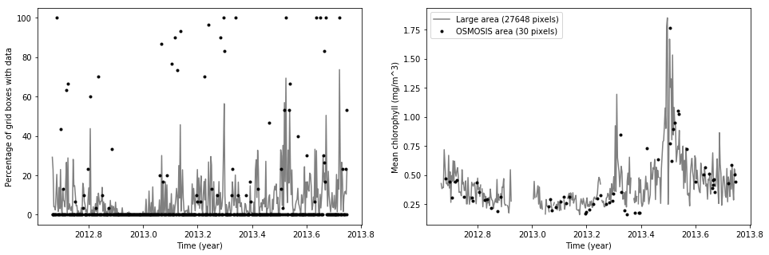
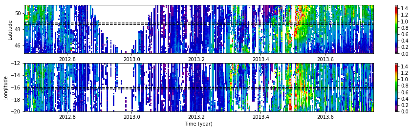
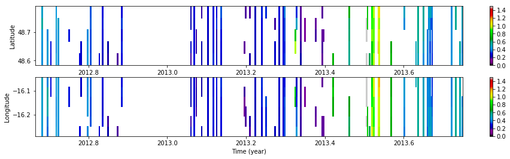

```python
from netCDF4 import Dataset
import numpy as np
import matplotlib.pyplot as plt
import cmocean

%matplotlib inline
```


```python
url = 'https://oceandata.sci.gsfc.nasa.gov:443/opendap/MODISA/L3SMI/%04d/%03d/A%04d%03d.L3m_DAY_CHL_chl_ocx_4km.nc?chl_ocx[936:1:1079][3840:1:4031],lat[936:1:1079],lon[3840:1:4031]'
time = np.arange(2012.+244./366,2013.+275./366,1./366) # September 01, 2012 until October 01, 2013
years = time.astype('int')
days = (np.mod(time,1)*366).astype('int')+1
days[days==0] = 366
files = [url % (years[i],days[i],years[i],days[i]) for i in range(len(time))]
```


```python
nc = [Dataset(files[i],'r') for i in range(len(files))]
```


```python
lon = nc[0].variables['lon'][:]
lat = nc[0].variables['lat'][:]
chl = np.ma.masked_array(np.empty(shape=(lat.size,lon.size,len(nc))))
for i in range(len(nc)):
    chl[:,:,i] = nc[i].variables['chl_ocx'][:]
```


```python
NC = Dataset('Oceancolor_ocx.nc','w')

NC.createDimension('latitude',len(lat))
NC.createDimension('longitude',len(lon))
NC.createDimension('time',len(time))
nc_lat = NC.createVariable('latitude',np.dtype('float64').char,('latitude'))
nc_lat.units = 'degrees north'
nc_lon = NC.createVariable('longitude',np.dtype('float64').char,('longitude'))
nc_lon.units = 'degrees east'
nc_t = NC.createVariable('time',np.dtype('float64').char,('time'))
nc_t.units = 'year'
nc_chl = NC.createVariable('chl',np.dtype('float64').char,('latitude','longitude','time'))
nc_chl.units = 'mg/m^3'
nc_chl.history = 'OCx algorithm, from MODIS Aqua, http://oceancolor.gsfc.nasa.gov'

nc_lat[:] = lat
nc_lon[:] = lon
nc_t[:] = time
nc_chl[:] = chl

NC.close()
```


```python
latindices = np.where(np.logical_and(lat>=48.6,lat<=48.8))[0]
lonindices = np.where(np.logical_and(lon>=-16.3,lon<=-16.05))[0]
```


```python
plt.figure(figsize=(16,5))
plt.subplot(121)
plt.plot(time,100.*np.ma.count(chl.reshape(-1,len(nc)),axis=0)/len(lon)/len(lat),c='grey',label='Large area (%d pixels)' % (lat.size*lon.size))
plt.plot(time,100.*np.ma.count(chl[latindices,:,:][:,lonindices,:].reshape(-1,len(nc)),axis=0)/len(lonindices)/len(latindices),'ko',markersize=3,label='OSMOSIS area (%d pixels)' % (len(lonindices)*len(latindices)))
plt.ylabel('Percentage of grid boxes with data')
plt.xlabel('Time (year)')
plt.subplot(122)
plt.plot(time,np.ma.mean(chl.reshape(-1,len(nc)),axis=0),c='grey',label='Large area (%d pixels)' % (lat.size*lon.size))
plt.plot(time,np.ma.mean(chl[latindices,:,:][:,lonindices,:].reshape(-1,len(nc)),axis=0),'ko',markersize=3,label='OSMOSIS area (%d pixels)' % (len(lonindices)*len(latindices)))
plt.ylabel('Mean chlorophyll (mg/m^3)')
plt.xlabel('Time (year)')
plt.legend()
```


    <matplotlib.legend.Legend at 0x1201a7c10>





```python
lat_edges = lat[latindices[0]-1:latindices[-1]+1]+np.diff(lat[latindices[0]-1:latindices[-1]+2])/2
lon_edges = lon[lonindices[0]-1:lonindices[-1]+1]+np.diff(lon[lonindices[0]-1:lonindices[-1]+2])/2
d_time = np.mean(np.diff(time))
time_edges = np.arange(time[0]-d_time/2,time[-1]+d_time,d_time)
```


```python
plt.figure(figsize=(16,4))
plt.subplot(211)
plt.pcolor(time,lat,np.ma.mean(chl,axis=1),cmap=plt.get_cmap('nipy_spectral'),vmin=0,vmax=1.5)
plt.plot([time[0],time[-1]],np.min(lat[latindices])*np.ones(shape=(2,)),'--',c='k')
plt.plot([time[0],time[-1]],np.max(lat[latindices])*np.ones(shape=(2,)),'--',c='k')
plt.plot()
plt.colorbar()
plt.ylabel('Latitude')
plt.subplot(212)
plt.pcolormesh(time,lon,np.ma.mean(chl,axis=0),cmap=plt.get_cmap('nipy_spectral'),vmin=0,vmax=1.5)
plt.plot([time[0],time[-1]],np.min(lon[lonindices])*np.ones(shape=(2,)),'--',c='k')
plt.plot([time[0],time[-1]],np.max(lon[lonindices])*np.ones(shape=(2,)),'--',c='k')
plt.colorbar()
plt.ylabel('Longitude')
plt.xlabel('Time (year)')
```


    <matplotlib.text.Text at 0x120463dd0>





```python
plt.figure(figsize=(16,4))
plt.subplot(211)
plt.pcolor(time_edges,lat_edges,np.ma.mean(chl[latindices,:,:][:,lonindices,:],axis=1),cmap=plt.get_cmap('nipy_spectral'),vmin=0,vmax=1.5)
plt.colorbar()
plt.ylabel('Latitude')
plt.subplot(212)
plt.pcolormesh(time_edges,lon_edges,np.ma.mean(chl[latindices,:,:][:,lonindices,:],axis=0),cmap=plt.get_cmap('nipy_spectral'),vmin=0,vmax=1.5)
plt.colorbar()
plt.ylabel('Longitude')
plt.xlabel('Time (year)')
```


    <matplotlib.text.Text at 0x112b7fd90>




