```python
import numpy as np, matplotlib.pyplot as plt, matplotlib.colors as colors, spectral.io.envi as envi, csv, cmocean
from netCDF4 import Dataset
from scipy.ndimage import morphology
from scipy.optimize import curve_fit
from scipy.ndimage.filters import gaussian_filter1d
from scipy.interpolate import interp1d
from scipy.special import erf
from matplotlib.gridspec import GridSpec

plt.style.use('seaborn-paper')
%matplotlib inline
```


```python
folder = '/Users/Zach/Google Drive/Research/PRISM/'
fontsize=14
```


```python
def skew_normal_distribution(x,mode,sigma,amp,alpha):
    f = np.empty(shape=x.shape)
    f[x<mode] = np.exp(-(x[x<mode]-mode)**2/2/sigma**2/(1+alpha)**2)/np.sqrt(2*np.pi*sigma**2)
    f[x>=mode] = np.exp(-(x[x>=mode]-mode)**2/2/sigma**2/(1-alpha)**2)/np.sqrt(2*np.pi*sigma**2)
    return (f*amp)

def fit_curve(data, x=None, linear_fit_inds=None, allow_skew = False, best_guess = [683,25,1,0], bounds=None):
    d = data.copy()
    
    if np.any(np.isnan(d)):
        raise ValueError()
    
    if x is None:
        x = np.arange(len(data))
        
    if linear_fit_inds is not None:
        linfit_coeff = np.polyfit(x[linear_fit_inds],d[linear_fit_inds],1)
        d -= np.polyval(linfit_coeff,x)
        
    if allow_skew:
        func = skew_normal_distribution
        guess = best_guess[0:4]
    else:
        func = normal_distribution
        guess = best_guess[0:3]
        
    if bounds is None:
        fit,covar = curve_fit(func, x, d, p0=guess)
    else:
        fit,covar = curve_fit(func, x, d, p0=guess, bounds=bounds)

    if linear_fit_inds is not None:
        return fit,covar,linfit_coeff
    else:
        return fit,covar
```


```python
nc = Dataset(folder+'prm20160118t163646.nc')
wl = nc.variables['wavelength'][:]
loc_filename = folder+'prm20160118t163646_rdn_v1k/prm20160118t163646_rdn_v1k_loc'
loc_file = envi.open(loc_filename+'.hdr', loc_filename)
loc = loc_file.read_bands(bands=[0,1]) # third band, Elevation, just gives 0's
```


```python
cloud_index = np.argmin(np.abs(wl-600));
cloud_threshold = 0.05
clouds = nc.variables['reflectance'][:,:,cloud_index]>cloud_threshold
```


```python
FLH_bands = [633,683,733] # first two are for baseline, third is the maximum fluorescence signal
FLH_band_inds = np.array([np.argmin(np.abs(wl-band)) for band in FLH_bands])
baseline = np.mean(nc.variables['radiance'][:,:,[FLH_band_inds[0],FLH_band_inds[2]]],axis=2)
flh = nc.variables['radiance'][:,:,FLH_band_inds[1]]-baseline
baseline[morphology.binary_dilation(clouds,iterations=10)] = np.nan
flh[morphology.binary_dilation(clouds,iterations=10)] = np.nan
flh[flh==0] = np.nan
```


```python
plt.matshow(flh.T,vmin=0,vmax=0.05,cmap=plt.cm.nipy_spectral); plt.colorbar(); plt.suptitle('Fluorescence above baseline ($\mu$W/cm$^2$/nm/sr)')
baseline_inds = np.abs(flh)<0.015
plt.matshow(baseline_inds.T,cmap=plt.cm.binary);
plt.figure()
plt.semilogy(np.sum(baseline_inds,axis=0))
plt.ylim([10,2000]); plt.xlabel('Sensor number')
plt.title('Number of "low-chl" (< 0.015 $\mu$W/cm$^2$/nm/sr) indices for each sensor');
```

    /Library/Frameworks/Python.framework/Versions/3.6/lib/python3.6/site-packages/ipykernel_launcher.py:2: RuntimeWarning: invalid value encountered in less
      


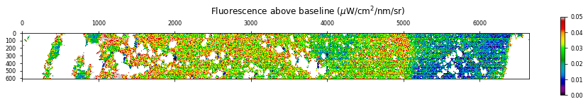


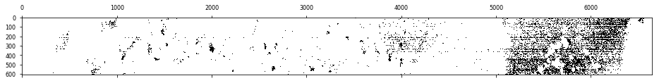


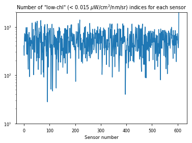


```python
baseline_spectra = np.nan*np.empty(shape=(baseline_inds.shape[1],len(wl)))
for i in range(baseline_inds.shape[1]):
    baseline_spectra[i] = np.nanmedian(nc.variables['radiance'][baseline_inds[:,i],i],axis=0)
plt.plot(wl,baseline_spectra.T,color='k',lw=0.5);
```

    /Library/Frameworks/Python.framework/Versions/3.6/lib/python3.6/site-packages/ipykernel_launcher.py:1: RuntimeWarning: invalid value encountered in multiply
      """Entry point for launching an IPython kernel.


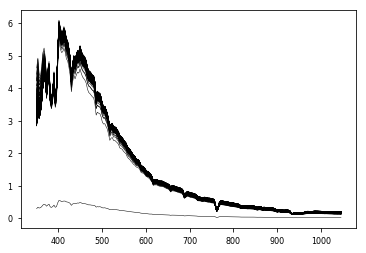


```python
wl_fit_inds = np.logical_and(wl>640,wl<755)
wl_sm = wl[wl_fit_inds]
for i in range(baseline_spectra.shape[0]):
    baseline_spectra[i] /= np.mean(baseline_spectra[i][wl_fit_inds])
plt.plot(wl_sm,baseline_spectra.T[wl_fit_inds],color='k',lw=0.5);
plt.xlabel('Wavelength (nm)')
plt.ylabel('Normalized radiance (unitless)');
```


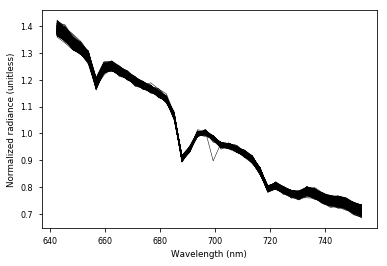


```python
loc_sm = np.nanmean(loc[0:6640][:,0:600].reshape(664,10,60,10,-1),axis=(1,3))
clouds_sm = np.nanmean(clouds[0:6640][:,0:600].reshape(664,10,60,10,-1),axis=(1,3))
flightpath = np.zeros(shape=loc_sm[:,:,0].shape); flightpath[[0,-1],:] = 1; flightpath[:,[0,-1]] = 1;

```


```python
data  = nc.variables['radiance'][:,:,wl_fit_inds]
data[morphology.binary_dilation(clouds,iterations=10)] = np.nan
```


```python
# make new dataset
dataset = np.nan*np.empty(shape=data.shape)
for i in range(dataset.shape[1]):
    bs = baseline_spectra[i,wl_fit_inds]
    bs /= np.polyval(np.polyfit(wl_sm,bs,1),wl_sm)
    for j in range(dataset.shape[0]):
        if np.any(np.isnan(data[j,i])):
            continue
        bs_r = bs*np.polyval(np.polyfit(wl_sm,data[j,i],1),wl_sm)
        dataset[j,i] = data[j,i]/bs_r
dataset_sm = np.nanmean(dataset[0:6640][:,0:600].reshape(664,10,60,10,-1),axis=(1,3))

```

    /Library/Frameworks/Python.framework/Versions/3.6/lib/python3.6/site-packages/ipykernel_launcher.py:10: RuntimeWarning: invalid value encountered in true_divide
      # Remove the CWD from sys.path while we load stuff.
    /Library/Frameworks/Python.framework/Versions/3.6/lib/python3.6/site-packages/ipykernel_launcher.py:11: RuntimeWarning: Mean of empty slice
      # This is added back by InteractiveShellApp.init_path()


```python
fit_inds = np.logical_or(wl_sm<660,wl_sm>710)

```


```python
import pickle
pickle.dump( dataset_sm, open( "dataset_sm.p", "wb" ) )
```


```python
fit1,covar1,lin_coeffs1 = fit_curve(dataset[2200,500],x=wl_sm,linear_fit_inds=fit_inds,allow_skew=True, best_guess = [683,10.6,1,0],bounds=([600,0,0,-.5],[700,50,np.inf,1]))
print(fit1)
fit2,covar2,lin_coeffs2 = fit_curve(dataset_sm[220,50],x=wl_sm,linear_fit_inds=fit_inds,allow_skew=True, best_guess = [683,10.6,1,0],bounds=([600,0,0,-.5],[700,50,np.inf,1]))
print(fit2)
```

    [ 6.78499855e+02  1.00419350e+01  5.63378900e-01 -4.02400823e-01]
    [ 6.78589459e+02  1.05880258e+01  5.65165358e-01 -3.91449047e-01]


```python
plt.scatter(wl_sm,dataset[2200,500],marker='.')
plt.plot(wl_sm,np.polyval(lin_coeffs1,wl_sm))
plt.plot(wl_sm,np.polyval(lin_coeffs1,wl_sm)+skew_normal_distribution(wl_sm,fit1[0],fit1[1],fit1[2],fit1[3]))
```


    [<matplotlib.lines.Line2D at 0x12185cfd0>]


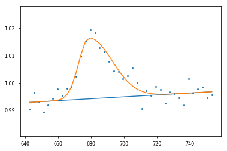


```python
plt.scatter(wl_sm,dataset_sm[220,50],marker='.')
plt.plot(wl_sm,np.polyval(lin_coeffs2,wl_sm))
plt.plot(wl_sm,np.polyval(lin_coeffs2,wl_sm)+skew_normal_distribution(wl_sm,fit2[0],fit2[1],fit2[2],fit2[3]))
```


    [<matplotlib.lines.Line2D at 0x12185bb00>]


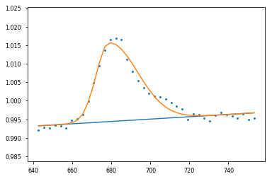


## Figure 1


```python
MODIS_bands = np.array([[662,673,743],[672,683,753]])
```


```python
ii = 2200; jj = 500;
II = 220; JJ = 50;
best_guess = wl_sm[np.argmax(dataset[ii,jj])]
fit1,covar1,lin_coeffs1 = fit_curve(dataset[ii,jj],x=wl_sm,linear_fit_inds=fit_inds,allow_skew=True, best_guess = [best_guess,10.6,0.1,0],bounds=([best_guess-5,5,0,-1],[best_guess+5,50,np.inf,1]))
av_err1 = np.sqrt(np.mean((dataset[ii,jj]-np.polyval(lin_coeffs1,x=wl_sm)-skew_normal_distribution(wl_sm,fit1[0],fit1[1],fit1[2],fit1[3]))**2))
print(fit1,av_err1)
best_guess = wl_sm[np.argmax(dataset_sm[II,JJ])]
fit2,covar2,lin_coeffs2 = fit_curve(dataset_sm[II,JJ],x=wl_sm,linear_fit_inds=fit_inds,allow_skew=True, best_guess = [best_guess,10.6,0.1,0],bounds=([best_guess-5,5,0,-1],[best_guess+5,50,np.inf,1]))
av_err2 = np.sqrt(np.mean((dataset_sm[II,JJ]-np.polyval(lin_coeffs2,x=wl_sm)-skew_normal_distribution(wl_sm,fit2[0],fit2[1],fit2[2],fit2[3]))**2))
print(fit2,av_err2)
```

    [ 6.78499914e+02  1.00419760e+01  5.63380056e-01 -4.02393528e-01] 0.0026194285303804423
    [ 6.78589449e+02  1.05880347e+01  5.65165597e-01 -3.91450090e-01] 0.0011918675555578288


```python
fs = 10;

plt.figure(figsize=(7,4))
gs = GridSpec(2,4)
ax1 = plt.subplot(gs[0,1:3]);
ax2 = plt.subplot(gs[1,0:2]);
ax3 = plt.subplot(gs[1,2::]);

ax1.plot(wl,nc.variables['radiance'][ii,jj,:]*10,color='k')
ax1.plot(wl,baseline_spectra[jj,:]*10,color='0.5')
ax1.legend(['Sample spectrum','Baseline spectrum'],loc='upper right')
 
ax2.set_title('Sample spectrum')
ax2.scatter(wl_sm,dataset[ii,jj]*10,s=5,color='k')
ax2.plot(wl_sm,np.polyval(lin_coeffs1,wl_sm)*10,color='k',alpha=0.5)
ax2.plot(wl_sm,np.polyval(lin_coeffs1,wl_sm)*10+skew_normal_distribution(wl_sm,fit1[0],fit1[1],fit1[2],fit1[3])*10,color='k',alpha=0.5)
ax2.text(.6,.85,r'$M$ = %.1f' % fit1[0],fontsize=fs,transform=ax2.transAxes)
ax2.text(.6,.71,r'$\sigma$  =   %.1f' % fit1[1],fontsize=fs,transform=ax2.transAxes)
ax2.text(.6,.57,r'$\gamma$  =     %.2f' % (-fit1[3]),fontsize=fs,transform=ax2.transAxes)
ax2.text(.5,.1,'RMSE = %.3f' % (av_err1*10),fontsize=fs,transform=ax2.transAxes)  
    
ax3.set_title('Averaged spectrum (10x10)')
ax3.scatter(wl_sm,dataset_sm[II,JJ]*10,s=5,color='k')
ax3.plot(wl_sm,np.polyval(lin_coeffs2,wl_sm)*10,color='k',alpha=0.5)
ax3.plot(wl_sm,np.polyval(lin_coeffs2,wl_sm)*10+skew_normal_distribution(wl_sm,fit2[0],fit2[1],fit2[2],fit2[3])*10,color='k',alpha=0.5)
ax3.text(.6,.85,r'$M$ = %.1f' % fit2[0],fontsize=fs,transform=ax3.transAxes)
ax3.text(.6,.71,r'$\sigma$  =   %.1f' % fit2[1],fontsize=fs,transform=ax3.transAxes)
ax3.text(.6,.57,r'$\gamma$  =     %.2f' % (-fit2[3]),fontsize=fs,transform=ax3.transAxes)
ax3.text(.5,.1,'RMSE = %.3f' % (av_err2*10),fontsize=fs,transform=ax3.transAxes)

# make pretty
for ax in [ax1,ax2,ax3]:
    ax.set_xlim([wl_sm[0],wl_sm[-1]])
    ax.set_xlabel('Wavelength (nm)');
    for k in range(MODIS_bands.shape[1]):
        ax.fill_betweenx([0,100],MODIS_bands[0,[k,k]],MODIS_bands[1,[k,k]],alpha=0.2,color='k',edgecolor='w')
ax1.set_ylim([5,15]); ax1.set_ylabel('Radiance\n(W m$^{-2}$ $\mu$m$^{-1}$ sr$^{-1}$)'); ax1.set_yticks(np.arange(6,15,2))
for ax in [ax2,ax3]:
    ax.set_ylim([9.8,10.2]);
    ax.set_yticks(np.arange(9.8,10.25,.2))
    ax.set_yticklabels(['9.8','10.0','10.2'])
ax2.set_ylabel('Corrected radiance\n(W m$^{-2}$ $\mu$m$^{-1}$ sr$^{-1}$)')


plt.tight_layout()

ax1.text(0,1.02,'a',fontsize=fontsize,fontweight='bold',transform=ax1.transAxes)
ax2.text(0,1.02,'b',fontsize=fontsize,fontweight='bold',transform=ax2.transAxes)
ax3.text(0,1.02,'c',fontsize=fontsize,fontweight='bold',transform=ax3.transAxes)

plt.tight_layout(h_pad=0)
plt.savefig('Fig1',dpi=300)
```


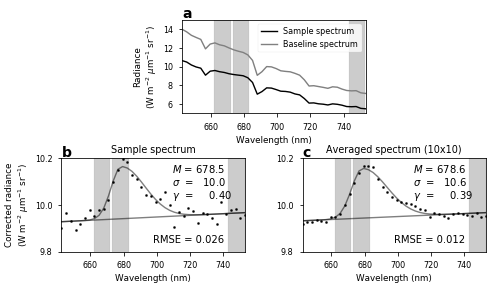


```python
fits = np.nan*np.empty(shape=(dataset_sm.shape[0],dataset_sm.shape[1],4))
covars = np.nan*np.empty(shape=(dataset_sm.shape[0],dataset_sm.shape[1],4,4))
linfits = np.nan*np.empty(shape=(dataset_sm.shape[0],dataset_sm.shape[1],2))
sqerr = np.nan*np.empty(shape=(dataset_sm.shape[0],dataset_sm.shape[1]))
for i in range(dataset_sm.shape[0]):
    if np.mod(i,10)==0:
        print(i,end='')
    else:
        print('.',end='')
    for j in range(dataset_sm.shape[1]):
        if np.any(np.isnan(dataset_sm[i,j])):
            continue
        try:
            best_guess = wl_sm[np.argmax(dataset_sm[i,j])]
            fit,covar,linfit = fit_curve(dataset_sm[i,j],x=wl_sm,linear_fit_inds=fit_inds,allow_skew=True, best_guess = [best_guess,10.6,0.1,0],bounds=([best_guess-10,5,0,-1],[best_guess+10,50,np.inf,1]))
            fits[i,j] = fit
            covars[i,j] = covar
            linfits[i,j] = linfit
            sqerr[i,j] = np.sum((dataset_sm[i,j]-np.polyval(linfit,wl_sm)-skew_normal_distribution(wl_sm,fit[0],fit[1],fit[2],fit[3]))**2)/len(wl_sm)
        except RuntimeError:
            print('(Runtime error for %d)' % j, end=' ')
            continue;
```

    0(Runtime error for 13) (Runtime error for 16) (Runtime error for 17) (Runtime error for 30) (Runtime error for 31) .........10.........20.........30.........40.........50.........60.........70.........80.........90.........100........(Runtime error for 39) (Runtime error for 40) .110.........120.........130.........140.........150.........160.........170.........180.........190.........200.........210.........220.........230.........240.........250.........260.........270.........280.........290.........300.........310.........320.........330.........340.........350.........360.........370.........380.........390.........400.(Runtime error for 46) ........410.........420.........430.........440.........450.........460.........470.........480.........490.........500.........510.........520.........530.........540.........(Runtime error for 56) 550.........(Runtime error for 50) 560....(Runtime error for 31) .(Runtime error for 52) ....(Runtime error for 44) (Runtime error for 46) 570(Runtime error for 45) ..(Runtime error for 49) .....(Runtime error for 24) ..580....(Runtime error for 57) .....590.........600....(Runtime error for 8) .....610(Runtime error for 21) .(Runtime error for 24) ....(Runtime error for 18) .(Runtime error for 16) .(Runtime error for 18) ..620..(Runtime error for 19) .(Runtime error for 18) .(Runtime error for 1) (Runtime error for 20) ..(Runtime error for 2) ...630.(Runtime error for 1) .(Runtime error for 2) .......640.........650.........660...


```python
plt.figure(figsize=(15,7))
plt.subplot(151); plt.title('Av. error ($\mu$W/cm$^2$/nm/sr)');
plt.contourf(loc_sm[:,:,0],loc_sm[:,:,1],np.sqrt(sqerr[:,:]),levels=np.arange(0,3.01e-3,1e-5),extend='both',cmap=plt.cm.nipy_spectral)
plt.colorbar(orientation='horizontal',ticks=np.arange(0,3.1e-3,1e-3))
plt.subplot(152); plt.title('Mode (nm)')
plt.contourf(loc_sm[:,:,0],loc_sm[:,:,1],fits[:,:,0],levels=np.arange(675,685.1,.1),extend='both',cmap=plt.cm.nipy_spectral)
plt.colorbar(orientation='horizontal',ticks=np.arange(675,705,5))
plt.subplot(153); plt.title('Sigma (nm)')
plt.contourf(loc_sm[:,:,0],loc_sm[:,:,1],fits[:,:,1],levels=np.arange(10,20.1,.1),extend='both',cmap=plt.cm.nipy_spectral)
plt.colorbar(orientation='horizontal',ticks=np.arange(10,35,5))
plt.subplot(154); plt.title('Amplitude ($\mu$W/cm$^2$/nm/sr)')
plt.contourf(loc_sm[:,:,0],loc_sm[:,:,1],fits[:,:,2],levels=np.arange(0,1.01,0.01),extend='both',cmap=plt.cm.nipy_spectral)
plt.colorbar(orientation='horizontal',ticks=np.arange(0,1.01,0.5))
plt.subplot(155); plt.title('Skew')
plt.contourf(loc_sm[:,:,0],loc_sm[:,:,1],fits[:,:,3],levels=np.arange(-.4,0.01,.01),extend='both',cmap=plt.cm.nipy_spectral)
plt.colorbar(orientation='horizontal',ticks=np.arange(-.4,0.01,.1))
```


    <matplotlib.colorbar.Colorbar at 0x1d298d828>


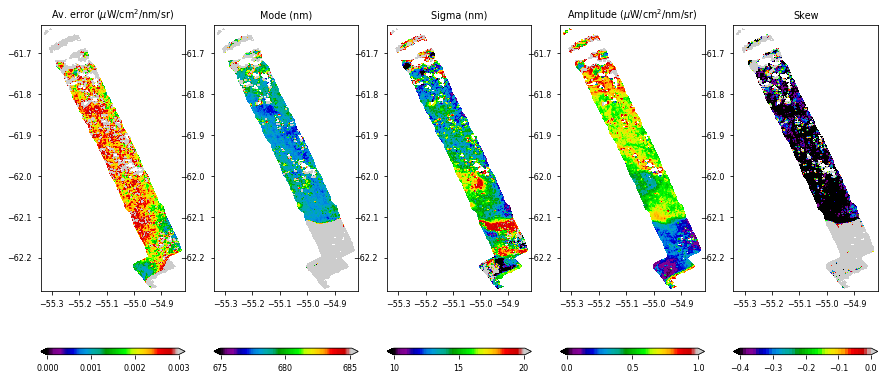


```python
plt.hist(np.sqrt(sqerr[~np.isnan(sqerr)]),100);
plt.plot(np.arange(0,0.02,.0001),4000*np.exp(-(np.arange(0,0.02,.0001)-0.002)**2/2/.0005**2))
```


    [<matplotlib.lines.Line2D at 0x1d2eef160>]


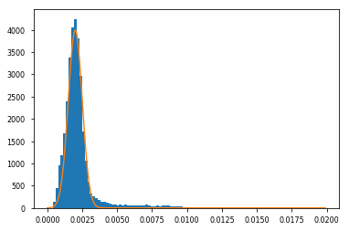


```python
def chl_modis(wl,refl):
    sigma = 10/2.355
    s1 = np.trapz(refl*np.exp(-(wl-443)**2/2/sigma**2)/np.sqrt(2*np.pi*sigma**2),x=wl)
    s2 = np.trapz(refl*np.exp(-(wl-488)**2/2/sigma**2)/np.sqrt(2*np.pi*sigma**2),x=wl)
    s3 = np.trapz(refl*np.exp(-(wl-551)**2/2/sigma**2)/np.sqrt(2*np.pi*sigma**2),x=wl)
    a0 = 0.2424; a1 = -2.7423; a2 = 1.8017; a3 = 0.0015; a4 = -1.2280
    r = np.log10(np.max([s1,s2])/s3)
    return 10**(a0+a1*r+a2*r**2+a3*r**3+a4*r**4)
def chl_modis_Johnson_etal(wl,refl):
    sigma = 10/2.355
    s1 = np.trapz(refl*np.exp(-(wl-443)**2/2/sigma**2)/np.sqrt(2*np.pi*sigma**2),x=wl)
    s2 = np.trapz(refl*np.exp(-(wl-488)**2/2/sigma**2)/np.sqrt(2*np.pi*sigma**2),x=wl)
    s3 = np.trapz(refl*np.exp(-(wl-551)**2/2/sigma**2)/np.sqrt(2*np.pi*sigma**2),x=wl)
    a0 = 0.6994; a1 = -2.0384; a2 = -0.4656; a3 = 0.4337; a4 = 0
    r = np.log10(np.max([s1,s2])/s3)
    return 10**(a0+a1*r+a2*r**2+a3*r**3+a4*r**4)
def flh_modis(wl,rad): # in units of uW/cm^2/nm/sr (multiply by 10 to get W/m^2/um/sr)
    sigma = 10/2.355
    b1 = np.trapz(rad*np.exp(-(wl-667)**2/2/sigma**2)/np.sqrt(2*np.pi*sigma**2),x=wl)
    b2 = np.trapz(rad*np.exp(-(wl-748)**2/2/sigma**2)/np.sqrt(2*np.pi*sigma**2),x=wl)
    fl = np.trapz(rad*np.exp(-(wl-678)**2/2/sigma**2)/np.sqrt(2*np.pi*sigma**2),x=wl)
    return fl-np.interp(678,[667,748],[b1,b2]);
def flh_opt(wl,rad): # in units of uW/cm^2/nm/sr (multiply by 10 to get W/m^2/um/sr)
    sigma = 10/2.355
    b1 = np.trapz(rad*np.exp(-(wl-655)**2/2/sigma**2)/np.sqrt(2*np.pi*sigma**2),x=wl)
    b2 = np.trapz(rad*np.exp(-(wl-725)**2/2/sigma**2)/np.sqrt(2*np.pi*sigma**2),x=wl)
    fl = np.trapz(rad*np.exp(-(wl-683)**2/2/sigma**2)/np.sqrt(2*np.pi*sigma**2),x=wl)
    return fl-np.interp(683,[655,725],[b1,b2]);
```


```python
chl_wl_inds = np.logical_and(wl>410,wl<590);
refl = nc.variables['reflectance'][:,:,chl_wl_inds]
refl_sm = np.mean(refl[0:6640][:,0:600].reshape(664,10,60,10,-1),axis=(1,3))
del refl
flh_wl_inds = np.logical_and(wl>630,wl<780);
rad = nc.variables['radiance'][:,:,flh_wl_inds]
rad_sm = np.mean(rad[0:6640][:,0:600].reshape(664,10,60,10,-1),axis=(1,3))
del rad
```


```python
chl_sm = np.nan*np.empty(shape=refl_sm[:,:,0].shape)
flh_sm = np.nan*np.empty(shape=rad_sm[:,:,0].shape)
flh_opt_sm = np.nan*np.empty(shape=rad_sm[:,:,0].shape)
for i in range(dataset_sm.shape[0]):
    for j in range(dataset_sm.shape[1]):
        if clouds_sm[i,j,0] == 0:
            chl_sm[i,j] = chl_modis(wl[chl_wl_inds],refl_sm[i,j])
            flh_sm[i,j] = flh_modis(wl[flh_wl_inds],rad_sm[i,j])
            flh_opt_sm[i,j] = flh_opt(wl[flh_wl_inds],rad_sm[i,j])
```

    /Library/Frameworks/Python.framework/Versions/3.6/lib/python3.6/site-packages/ipykernel_launcher.py:7: RuntimeWarning: invalid value encountered in log10
      import sys


```python
chl_Johnson_sm = np.nan*np.empty(shape=chl_sm.shape)
for i in range(dataset_sm.shape[0]):
    for j in range(dataset_sm.shape[1]):
        if clouds_sm[i,j,0] == 0:
            chl_Johnson_sm[i,j] = chl_modis_Johnson_etal(wl[chl_wl_inds],refl_sm[i,j])

```

    /Library/Frameworks/Python.framework/Versions/3.6/lib/python3.6/site-packages/ipykernel_launcher.py:15: RuntimeWarning: invalid value encountered in log10
      from ipykernel import kernelapp as app


## Figure 2


```python
fs = 10;
plt.figure(figsize=(7,6))
ax1 = plt.axes([0.1,0.49,0.2,0.42]); cax1 = plt.axes([0.11,0.5,0.02,0.2]);
ax2 = plt.axes([0.32,0.49,0.2,0.42]); cax2 = plt.axes([0.33,0.5,0.02,0.2]);
ax3 = plt.axes([0.54,0.49,0.2,0.42]); cax3 = plt.axes([0.55,0.5,0.02,0.2]);
ax4 = plt.axes([0.76,0.49,0.2,0.42]); cax4 = plt.axes([0.77,0.5,0.02,0.2]);
ax5 = plt.axes([0.1,0.1,0.22,0.26]);
ax6 = plt.axes([0.4175,0.1,0.22,0.26]);
ax7 = plt.axes([0.735,0.1,0.22,0.26]);

im1 = ax1.contourf(loc_sm[:,:,0],loc_sm[:,:,1],fits[:,:,2]/100,levels=np.arange(0,.0101,.00025),cmap=cmocean.cm.algae,extend='both'); 
im2 = ax2.contourf(loc_sm[:,:,0],loc_sm[:,:,1],fits[:,:,0],levels=np.arange(676,680.1,.1),cmap=plt.cm.viridis); 
im3 = ax3.contourf(loc_sm[:,:,0],loc_sm[:,:,1],fits[:,:,1],levels=np.arange(7,20.1,.1),cmap=plt.cm.winter); 
im4 = ax4.contourf(loc_sm[:,:,0],loc_sm[:,:,1],-fits[:,:,3],levels=np.arange(0,.76,.01),cmap=plt.cm.plasma); 
im5 = ax5.scatter(flh_sm.ravel()*10+0.05,(fits[:,:,2]/np.sqrt(2*np.pi*fits[:,:,1]**2)).ravel()*10,c=fits[:,:,1].ravel(),marker='.',s=2,vmin=7,vmax=20,cmap=plt.cm.winter);
im6 = ax6.scatter(fits[:,:,0].ravel(),-fits[:,:,3].ravel(),c=fits[:,:,1].ravel(),marker='.',s=2,vmin=7,vmax=20,cmap=plt.cm.winter);
im7 = ax7.scatter(fits[:,:,0].ravel(),fits[:,:,1].ravel(),c=-fits[:,:,3].ravel(),marker='.',s=2,vmin=0,vmax=0.75,cmap=plt.cm.plasma);

ax1.set_ylabel('Latitude');
for ax in [ax1,ax2,ax3,ax4]:
    ax.contour(loc_sm[:,:,0],loc_sm[:,:,1],flightpath,[0],colors='k',lw=1)
    ax.set_xlim([-55.35,-54.8]); ax.set_ylim([-62.3,-61.6])
    ax.set_xlabel('Longitude'); ax.set_xticks(np.arange(-55.2,-54.7,.2));
for ax in [ax2,ax3,ax4]:
    ax.set_yticklabels([])

ax1.text(0.31,0.87,'Fluorescence\n (W m$^{-2}$ sr$^{-1}$)',fontsize=fs,transform=ax1.transAxes);
ax2.text(0.31,0.94,r'Mode ($M$; nm)',fontsize=fs,transform=ax2.transAxes);
ax3.text(0.33,0.81,'Standard\n  deviation\n    ($\sigma$; nm)',fontsize=fs,transform=ax3.transAxes);
ax4.text(0.35,0.94,'Skew ($\gamma$)',fontsize=fs,transform=ax4.transAxes);
ax5.set_xlabel('FLH (W m$^{-2}$ $\mu$m$^{-1}$ sr$^{-1}$)'); ax5.set_ylabel('Amplitude (W m$^{-2}$ $\mu$m$^{-1}$ sr$^{-1}$)'); ax5.set_yticks(np.arange(0,0.31,.1));
ax6.set_xlabel(r'Mode ($M$; nm)'); ax6.set_ylabel('Skew ($\gamma$)'); ax6.set_xticks(np.arange(676,685,2)); ax6.set_yticks(np.arange(-.25,.76,.25))
ax7.set_xlabel(r'Mode ($M$; nm)'); ax7.set_ylabel('Standard deviation ($\sigma$; nm)'); ax7.set_xticks(np.arange(676,685,2)); ax7.set_yticks(np.arange(10,21,5))
ax5.set_xlim([0,0.3]); ax5.set_ylim([0,0.3]); ax5.plot([0,0.3],[0,0.3],color='k')
ax6.set_xlim([675,684]); ax6.set_ylim([0,0.75]);
ax7.set_xlim([675,684]); ax7.set_ylim([7,20]);

cbar1 = plt.colorbar(im1,cax=cax1,ticks=np.arange(0,0.0101,.005)); cbar1.set_ticklabels(['0.00','0.005','0.01'])
plt.colorbar(im2,cax=cax2,ticks=np.arange(676,681,1))
plt.colorbar(im3,cax=cax3,ticks=np.arange(10,21,5))
plt.colorbar(im4,cax=cax4,ticks=np.arange(0,.76,.25)) 

ax1.text(0,1.02,'a',fontsize=fontsize,fontweight='bold',transform=ax1.transAxes)
ax2.text(0,1.02,'b',fontsize=fontsize,fontweight='bold',transform=ax2.transAxes)
ax3.text(0,1.02,'c',fontsize=fontsize,fontweight='bold',transform=ax3.transAxes)
ax4.text(0,1.02,'d',fontsize=fontsize,fontweight='bold',transform=ax4.transAxes)
ax5.text(0,1.02,'e',fontsize=fontsize,fontweight='bold',transform=ax5.transAxes)
ax6.text(0,1.02,'f',fontsize=fontsize,fontweight='bold',transform=ax6.transAxes)
ax7.text(0,1.02,'g',fontsize=fontsize,fontweight='bold',transform=ax7.transAxes)

plt.savefig('Fig2',dpi=300);
```


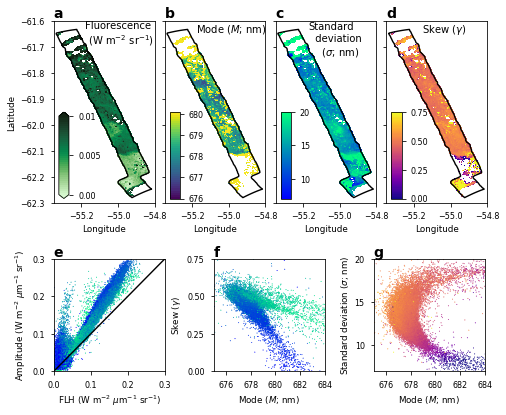


Model


```python
h = 6.626e-34*6.022e23; # J s/mol, from J s/molecule
c = 3e8*1e9; # nm/s, from m/s
sza = 66; # this is reasonable using https://www.esrl.noaa.gov/gmd/grad/solcalc/azel.html
lookangle = 0;
csza = np.cos(sza*np.pi/180)
cla = np.cos(lookangle*np.pi/180)
```


```python
# load solar irradiance data
dat = np.loadtxt(folder+'gcirrad.dat')
dat = np.concatenate((dat[:,0:5],dat[:,5::]),axis=0)
o = np.argsort(dat[:,0])
dat = dat[o]
H0_wl = dat[:,0] # wavelengths of the data
H0 = (dat[:,1]*10) # W/m^2/nm
inds = np.logical_and(H0_wl>=400,H0_wl<=900) # only consider wavelengths from 400 to 900 nm
H0_wl = H0_wl[inds]
H0 = H0[inds]
# correct for Rayleigh transmission and add direct and diffuse components
Tr = np.exp(-((csza+0.15*(93.885-sza)**(-1.253))*(115.6406*H0_wl**4-1.335*H0_wl**2))**(-1));
rho_dsp = 0.0253*np.exp(0.0618*(sza-40));
E0 = H0*csza*(1-rho_dsp)*(Tr+(1-Tr**(0.95))/2)
plt.plot(H0_wl,E0,lw=2); plt.xlabel('Wavelength'); plt.ylabel('Radiation (W/m$^2$/nm)');
plt.plot(H0_wl,H0,lw=2);
```


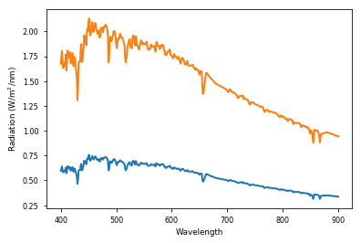


```python
dat = np.loadtxt(folder+'gcirrad.dat')
dat = np.concatenate((dat[:,0:5],dat[:,5::]),axis=0)
o = np.argsort(dat[:,0])
dat = dat[o]
H0_wl = dat[:,0] # wavelengths of the data
H0 = (dat[:,1]*10) # W/m^2/nm
inds = np.logical_and(H0_wl>=400,H0_wl<=900) # only consider wavelengths from 400 to 900 nm
H0_wl = H0_wl[inds]
H0 = H0[inds]
aoz = dat[inds,2] # 1/cm
aw = dat[inds,4] # 1/cm
ao = dat[inds,3] # 1/cm

julianday = 18
MSLP = 99262 # Pa
W = np.sqrt(7.3**2+2.6**2) # m/s
Hoz = 0.0062/2.14*100 # cm, from kg/m^2 divided by kg/m^3
WV = 4.63/1000*100 # cm, from kg/m^2 divided by kg/m^3

F0 = H0*(1+0.0167*np.cos(2*np.pi*(julianday-3)/365))**2 # in W/m^2/nm
M = 1/(csza+0.15*(93.885-sza)**(-1.253)) # unitless
Moz = 1.0035/np.sqrt(csza**2+0.007) # unitless
Mprime = M*MSLP/101325 # unitless
Tr = np.exp(-Mprime/(115.6406*H0_wl**4-1.335*H0_wl**2)) # unitless
Ta = 1 # no aerosols
Tas = 1 # no aerosols
Taa = 1 # no aerosols
Fa = 0 # forward scattering probability -- not really used in any way because (1-Tas) = 0. If aerosols are added, should change this
Toz = np.exp(-aoz*Hoz*Moz) # unitless
To = np.exp(-1.41*ao*Mprime/((1+118.3*ao*M)**(0.45))) # unitless (note that somewhere in here is a unit of cm to cancel ao units)
Tw = np.exp(-0.2385*aw*WV*Mprime/((1+20.07*aw*WV*M)**(0.45))) # unitless
Ir = F0*csza*Toz*To*Tw*Taa*(1-Tr**0.95)/2 # W/m^2/nm
Ia = F0*csza*Toz*To*Tw*Taa*(Tr**1.5)*(1-Tas)*Fa # unitless (and 0)
rho_f = (4.5e-5*1.2e3*(0.49+0.065*W)*1e-3-4e-5)*W**2 # unitless assuming wind speed in m/s
b = -7.14e-4*W+0.0618 # unitless assuming wind speed in m/s
rho_dsp = 0.0253*np.exp(b*(sza-40)) # unitless
rho_ssp = 0.057 # unitless
rho_d = rho_dsp + rho_f # unitless
rho_s = rho_ssp + rho_f # unitless
Edd = F0*csza*Tr*Ta*Toz*To*Tw*(1-rho_d) # W/m^2/nm
Eds = (Ir+Ia)*(1-rho_s) # W/m^2/nm
E0 = Edd + Eds # W/m^2/nm

plt.plot(H0_wl,E0); plt.xlabel('Wavelength'); plt.ylabel('Radiation (W/m$^2$/nm)');
plt.plot(H0_wl,F0)
plt.plot(H0_wl,H0);
```


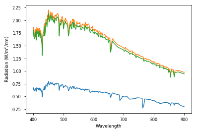


```python
extinction_coeffs = ()
with open(folder+'Optipar_2016c.csv', 'r') as csvfile:
    csvreader = csv.reader(csvfile)
    next(csvreader)
    for row in csvreader:
        extinction_coeffs += (row,)
extinction_coeffs = np.concatenate(extinction_coeffs).reshape(len(extinction_coeffs),-1).astype('float64')
wl_measurements = extinction_coeffs[:,0]
inds = np.logical_and(wl_measurements>=400,wl_measurements<=900)
wl_measurements = wl_measurements[inds]
k_w = extinction_coeffs[inds,5]*100 # in units of 1/m
k_chl = extinction_coeffs[inds,2]/10 # in units of m^2/mg Chl (convert from cm^2/ug Chl)
fl = extinction_coeffs[inds,8] # in arbitrary units

```


```python
fl_norm = fl/(np.trapz(wl_measurements*fl,x=wl_measurements)/(h*c))
```


```python
PAR_inds = np.logical_and(wl_measurements>=400,wl_measurements<=700)
PAR_surf = np.trapz(wl_measurements[PAR_inds]*E0[PAR_inds],x=wl_measurements[PAR_inds])/h/c*1e6;
print('Surface PAR: %.1f uEin/m^2/s'%PAR_surf)
```

    Surface PAR: 860.5 uEin/m^2/s


```python
plt.plot(wl_measurements,fl_norm)
print(np.trapz(wl_measurements*fl_norm,x=wl_measurements)/(h*c));
```

    0.9999999999999999


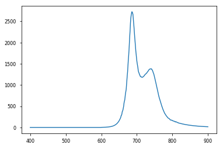


```python
def simple_forward_model(z,chl,wl,compK=False,qI=1):
    chl[chl<=1e-16] = 1e-16; # set up minimum level of chlorophyll possible (needs to be above 0)
    # for each level, calculate fluorescence emission
    dz = np.diff(z);
    z_center = z[0:-1]+dz/2;
    Efl_outgoing = np.empty(shape=(len(dz),len(wl_measurements)));
    for i in range(len(z_center)):
        # amount of light that reaches this depth:
        Ed = E0*np.exp(-(k_w*z_center[i] + k_chl*np.sum(chl[0:i]*dz[0:i]))/csza); # W/m^2/nm
        PAR_inds = np.logical_and(wl_measurements>=400,wl_measurements<=700);
        PAR = np.trapz(wl_measurements[PAR_inds]*Ed[PAR_inds],x=wl_measurements[PAR_inds])/(h*c) # Ein/m^2/s
        Eabs = Ed*(1-np.exp(-k_chl*chl[i]*dz[i]/csza)); # W/m^2/nm
        # amount of fluoescence that is emitted at this depth
        Nabs = np.trapz(wl_measurements*Eabs,x=wl_measurements)/(h*c); # Ein/m^2/s
        Nfl = fluorescence_yield(PAR,qI)*Nabs; # Ein/m^2/s
        Efl = Nfl*fl_norm # W/m^2/nm
        # amount of fluorescence that makes it to the top
        Efl_outgoing[i] = Efl*np.exp(-(k_w*z_center[i] + k_chl*np.sum(chl[0:i]*dz[0:i]))/cla)/(4*np.pi); # W/m^2/nm/sr
    total_Efl_outgoing = np.sum(Efl_outgoing,axis=0)
    if compK: # compute Jacobian matrix K
        K = np.empty(shape=(chl.size,wl.size))
        for i in range(chl.size):
            dc = np.zeros(shape=chl.shape)
            dc[i] = 0.01;
            K[i] = (simple_forward_model(z,chl+dc,wl)-applyInstrument(total_Efl_outgoing,wl_measurements,wl))/dc[i];
        return applyInstrument(total_Efl_outgoing,wl_measurements,wl),K.T
    else:
        return applyInstrument(total_Efl_outgoing,wl_measurements,wl)

def fluorescence_yield(PAR,qI):
    r = 0.04; # fraction of viable PSII centers
    phi_min = 0.03; # minimum fluorescence yield
    phi_max = 0.09; # maximum fluorescence yield
    E_T = 350e-6; # saturating irradiance for NPQ; Ein/m^2/s
    E_K = 55e-6; # saturating irradiance for photosynthesis; Ein/m^2/s
    return (r+(1-r)*qI*np.exp(-PAR/E_T))*(phi_min*np.exp(-PAR/E_K) + phi_max*(1-np.exp(-PAR/E_K)))

def applyInstrument(F,w_meas,w_instr):
    spectral_res_fwhm = 3.5
    spectral_res_sigma = spectral_res_fwhm/2.355
    instru_res = w_instr[1]-w_instr[0]
    meas_res = w_meas[1]-w_meas[0]
    F2 = gaussian_filter1d(F, spectral_res_sigma/meas_res)
    finter = interp1d(w_meas, F2,kind='linear',bounds_error=False)
    return finter(w_instr)
```


```python
dz = .25; # units of m
z = np.arange(0,10+dz/2,dz)
z_center = z[0:-1]+np.diff(z)/2
```


```python
dz_fine = .01;
z_fine = np.arange(0,10+dz_fine/2,dz_fine)
z_center_fine = z_fine[0:-1]+np.diff(z_fine)/2
```


```python
test_chl1 = 6*np.exp(-z_center_fine/3.55) # units of mg/m^3
#test_chl1 = 2*np.ones(shape=z_center_fine.shape)
test_chl2 = 4.04*np.exp(-(z_center_fine-5)**2/2/2**2)
plt.plot(test_chl1,z_center_fine); plt.plot(test_chl2,z_center_fine); plt.ylim([10,0]);
```


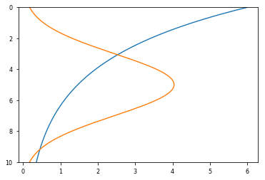


```python
print(np.mean(test_chl1))
print(np.mean(test_chl2))
```

    2.002644670567403
    2.000202269349229


```python
noise = 1e-5 # W/m^2/nm/sr, from about 0.01 W/m^2/um/sr (from Figure 1b,c -- Figure 1b looks like noise if 0.1 W/m^2/um/sr)
invSe = np.zeros((len(wl_sm),len(wl_sm)))
for i in np.arange(0,len(wl_sm),1):
   invSe[i,i]=1./(noise**2) 
Sa = np.zeros((len(z_center),len(z_center)));
sigma_a = 1; # prior uncertainty (mg Chl/m^3)
zdiff_lengthscale = 2; # m; length scale over which one might expect chlorophyll concentrations to change
for i in range(len(z_center)):
    for j in range(len(z_center)):
        Sa[i,j] = sigma_a**2*np.exp(-np.abs(i-j)*dz/zdiff_lengthscale)
plt.figure(figsize=(12,4))
plt.subplot(121); plt.pcolormesh(wl_sm,wl_sm,np.linalg.inv(invSe),cmap='viridis'); plt.colorbar(); plt.xlim(wl_sm[[0,-1]]); plt.ylim(wl_sm[[0,-1]])
plt.xlabel('Wavelength (nm)'); plt.ylabel('Wavelength (nm)'); plt.title('$S_\epsilon$ ($\mu$W/cm$^2$/nm/sr)$^2$')
plt.subplot(122); plt.pcolormesh(z,z,Sa,cmap='viridis'); plt.colorbar(); 
plt.xlabel('Depth (m)'); plt.ylabel('Depth (m)'); plt.title('$S_a$ (mg Chl/m$^3$)$^2$');
plt.tight_layout()
```


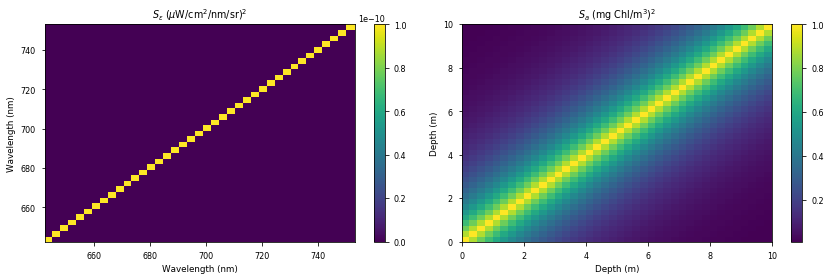


```python
prior = np.mean(test_chl1)*np.ones(shape=z_center.shape)
spectra = simple_forward_model(z_fine,test_chl1,wl_sm);
spectra_prior,Ks = simple_forward_model(z,prior,wl_sm,compK=True);
```


```python
plt.plot(test_chl1,z_center_fine);
plt.plot(prior,z_center)
plt.ylim([10,0])
```


    (10, 0)


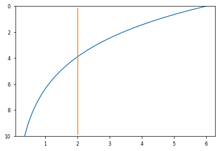


```python
chl_profiles = (test_chl1,test_chl2,); # 0 values cause problems with the K matrix later on
chl_priors = [np.mean(c)*np.ones(shape=z_center.shape) for c in chl_profiles]                

spectra = [[simple_forward_model(z_fine,c,wl_sm)+np.random.randn(len(wl_sm))*noise for abcd in range(100)] for c in chl_profiles]
spectra_priors = [simple_forward_model(z,c,wl_sm) for c in chl_priors]               
Ks = [simple_forward_model(z,c,wl_sm,compK=True)[1] for c in chl_priors]        

chl_iteration1 = [[chl_priors[i]+np.linalg.inv(np.linalg.inv(Sa*chl_priors[i][0]**2)+Ks[i].T.dot(invSe).dot(Ks[i])).dot(Ks[i].T.dot(invSe).dot(spectra[i][j]-spectra_priors[i])) for j in range(100)] for i in range(len(chl_profiles))]
spectra_iteration1 = [[simple_forward_model(z,c[j],wl_sm) for j in range(100)] for c in chl_iteration1]
```


```python
plt.plot(np.array(chl_profiles).T,z_center_fine);
plt.gca().set_prop_cycle(None)
plt.plot(np.array(chl_priors).T,z_center,ls='-.')
plt.gca().set_prop_cycle(None)
for i in range(len(chl_iteration1)):
    plt.fill_betweenx(z_center,np.percentile(np.array(chl_iteration1[i]),5,axis=0),np.percentile(np.array(chl_iteration1[i]),95,axis=0),alpha=0.5,edgecolor=None);
plt.ylim([10,0])
```


    (10, 0)


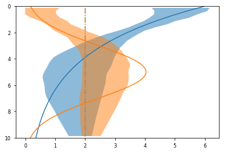


```python
max_iter = 10 # maximum number of iterations -- hopefully will never reach this point
dataset_sm_chl_profile = np.nan*np.empty(shape=(dataset_sm.shape[0],dataset_sm.shape[1],z_center.size))
num_iter = np.nan*np.empty(shape=(dataset_sm[:,:,0].shape))
dataset_sm_rmse = np.nan*np.empty(shape=(dataset_sm[:,:,0].shape))
for i in range(dataset_sm.shape[0]):
    if np.mod(i,10)==0:
        print(i,end='')
    else:
        print('.',end='')
    for j in range(dataset_sm.shape[1]):
        if np.any(np.isnan(dataset_sm[i,j])) or clouds_sm[i,j]>0:
            continue;
        spectrum_sm = dataset_sm[i,j].copy()/100 # units of W/m^2/nm/sr from uW/cm^2/ur
        fit = np.polyfit(wl_sm[fit_inds],spectrum_sm[fit_inds],1)
        spectrum_sm -= np.polyval(fit,wl_sm)
        chl_prior_sm = np.ones(shape=z_center.shape)*chl_sm[i,j]
        chl_iter = chl_prior_sm.copy()
        spectrum_iter,K_sm = simple_forward_model(z,chl_prior_sm,wl_sm,compK=True)
        rmse = np.sqrt(np.mean((spectrum_iter-spectrum_sm)**2))
        for k in range(max_iter):
            chl_new_iter = chl_prior_sm + np.linalg.inv(K_sm.T.dot(invSe).dot(K_sm)+np.linalg.inv(Sa*np.tile(chl_prior_sm**2,[len(z_center),1]))).dot(K_sm.T).dot(invSe).dot(spectrum_sm-spectrum_iter + K_sm.dot(chl_iter-chl_prior_sm))
            spectrum_iter,K_sm = simple_forward_model(z,chl_new_iter,wl_sm,compK=True)
            rmse_new = np.sqrt(np.mean((spectrum_iter-spectrum_sm)**2))
            if rmse<=rmse_new and k>0:
                num_iter[i,j] = k
                break
            else:
                chl_iter = chl_new_iter.copy()  
                rmse = rmse_new.copy()
        dataset_sm_chl_profile[i,j] = chl_iter
        dataset_sm_rmse[i,j] = rmse 
```

    0

    /Library/Frameworks/Python.framework/Versions/3.6/lib/python3.6/site-packages/ipykernel_launcher.py:2: RuntimeWarning: invalid value encountered in less_equal
      


    .........10.........20.........30.........40.........50.........60.........70.........80.........90.........100.........110.........120.........130.........140.........150.........160.........170.........180.........190.........200.........210.........220.........230.........240.........250.........260.........270.........280.........290.........300.........310.........320.........330.........340.........350.........360.........370.........380.........390.........400.........410.........420.........430.........440.........450.........460.........470.........480.........490.........500.........510.........520.........530.........540.........550.........560.........570.........580.........590.........600.........610.........620.........630.........640.........650.........660...


```python
plt.hist(num_iter.ravel()[~np.isnan(num_iter.ravel())],np.arange(-0.5,10.5));
```


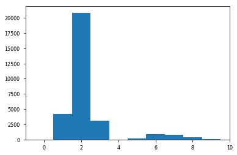


```python
for i in [2,4,6,8]:
    p = np.exp((i-z_center)**2/2)
    fm = simple_forward_model(z,p,wl_sm);
    best_guess = wl_sm[np.argmax(fm)]
    print(i,best_guess,fit_curve(fm,x=wl_sm,allow_skew=True,best_guess = [best_guess,10.6,0.1,0])[0])
    
```

    2 685.0766161 [6.86386561e+02 1.32198926e+01 9.18340143e-03 4.38601485e-02]
    4 687.9135091 [ 6.83004367e+02  2.95889135e+01  1.09794048e-01 -6.18674215e-01]
    6 687.9135091 [ 6.81916309e+02  2.78809448e+01  1.21013020e-01 -6.11494083e-01]
    8 687.9135091 [ 6.81916310e+02  2.78809447e+01  1.21067931e-01 -6.11494070e-01]


```python
for i in [3,4,5,6]:
    p = np.exp(-(i-z_center)**2/2)
    plt.plot(p,z_center)
plt.ylim([10,0])
```


    (10, 0)


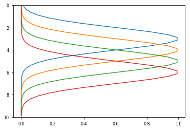


```python
cmap = plt.cm.viridis
for i in [2,4,6,8]:
    p = np.exp(-(i-z_center)**2/2)
    fm = simple_forward_model(z,p,wl_sm);
    plt.plot(wl_sm,fm/np.max(fm),color=cmap((i-2)/6),label='%d m'%i)
    best_guess = wl_sm[np.argmax(fm)]
    print(i,fit_curve(fm,x=wl_sm,allow_skew=True,best_guess = [683,10.6,0.1,0])[0])
plt.legend(loc=(.02,.5),ncol=1,framealpha=0)

```

    2 [ 6.84554454e+02  1.45519874e+01  7.16864552e-04 -1.74614739e-01]
    4 [6.85525818e+02 1.26170527e+01 3.08401607e-04 5.17124394e-02]
    6 [6.85704333e+02 1.20757289e+01 1.27595031e-04 1.86287188e-01]
    8 [6.85690468e+02 1.20247532e+01 5.27950640e-05 2.85082613e-01]


    <matplotlib.legend.Legend at 0x1e21c9cf8>


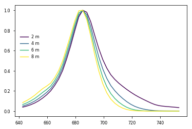


```python
cmap = plt.cm.viridis
fs = 10;

plt.figure(figsize=(7,5))
ax1 = plt.subplot(221);
ax2 = plt.subplot(222);
ax3 = plt.subplot(223);
ax4 = plt.subplot(224);

l1, = ax1.plot(wl_measurements,k_w,color='b');
l2, = ax1.plot(wl_measurements,(k_chl*100),color='g');
ax1b = ax1.twinx();
l3, = ax1b.plot(wl_measurements,fl_norm,color='r');
ax1b.legend([l1,l2,l3],['Water',r'Chl (100 mg m$^{-2}$)','Fluorescence'],loc=(0.48,0.04),labelspacing=0,framealpha=0,edgecolor='none',columnspacing=0)

for i in [2,4,6,8]:
    p = np.exp(-(i-z_center)**2/2)
    fm = simple_forward_model(z,p,wl_sm);
    ax2.plot(wl_sm,fm/np.max(fm),color=cmap((i-2)/6),label='%d m'%i)
    if i==2:
        fits_theoretical1 = fit_curve(fm,x=wl_sm,allow_skew=True,best_guess = [683,10.6,0.1,0])[0]
    elif i==8:
        fits_theoretical2 = fit_curve(fm,x=wl_sm,allow_skew=True,best_guess = [683,10.6,0.1,0])[0]
ax2.legend(loc=(.02,.5),ncol=1,framealpha=0)

ax3.fill_betweenx(z_center,np.percentile(np.array(chl_iteration1[0]),5,axis=0),np.percentile(np.array(chl_iteration1[0]),95,axis=0),alpha=0.5,edgecolor=None,color='C0');
ax3.fill_betweenx(z_center,np.percentile(np.array(chl_iteration1[1]),5,axis=0),np.percentile(np.array(chl_iteration1[1]),95,axis=0),alpha=0.5,edgecolor=None,color='C1');
ax3.plot(dataset_sm_chl_profile[II,JJ],z_center,color='C2',ls='--')[0];
ax3.plot(chl_profiles[0],z_center_fine,color='C0');
ax3.plot(chl_profiles[1],z_center_fine,color='C1');

ax4.plot(wl_sm,spectra[0][0]*1000,color='C0')
ax4.plot(wl_sm,spectra[1][0]*1000,color='C1')
fit = np.polyfit(wl_sm[fit_inds],dataset_sm[II,JJ,fit_inds],1)
ax4.plot(wl_sm,dataset_sm[II,JJ]*10-np.polyval(fit,x=wl_sm)*10,zorder=20,color='C2')
ax4.plot(wl_sm,simple_forward_model(z,dataset_sm_chl_profile[II,JJ],wl_sm)*1000,color='C2',zorder=20,ls='--')
ax4.fill_between(wl_sm,np.percentile(spectra_iteration1[0],5,axis=0)*1000,np.percentile(spectra_iteration1[0],95,axis=0)*1000,alpha=0.5,edgecolor=None,color='C0');
ax4.fill_between(wl_sm,np.percentile(spectra_iteration1[1],5,axis=0)*1000,np.percentile(spectra_iteration1[1],95,axis=0)*1000,alpha=0.5,edgecolor=None,color='C1');

ax1.set_xlim(wl_sm[[0,-1]]); ax1.set_ylim([0,2]); ax1b.set_yticks([]);
ax2.set_xlim(wl_sm[[0,-1]]); ax2.set_ylim([0,1.1]);
ax3.set_xlim([-.1,6]); ax3.set_ylim([10,0]);
ax4.set_xlim(wl_sm[[0,-1]]); ax4.set_ylim([0,.25]);
ax1.set_xlabel('Wavelength (nm)'); ax1.set_ylabel('Attenuation (m$^{-1}$)');
ax2.set_xlabel('Wavelength (nm)'); ax2.set_ylabel('Normalized amplitude');
ax3.set_xlabel('Chl (mg/m$^3$)'); ax3.set_ylabel('Depth (m)');
ax4.set_xlabel('Wavelength (nm)'); ax4.set_ylabel('Radiance (W m$^{-2}$ $\mu$m$^{-1}$ sr$^{-1}$)');

ax2.text(.52,.9,r'z:     2 m $\rightarrow$ 8 m',fontsize=fs,transform=ax2.transAxes)
ax2.text(.52,.8,r'$M$: %.1f $\rightarrow$ %.1f' % (fits_theoretical1[0],fits_theoretical2[0]),fontsize=fs,transform=ax2.transAxes)
ax2.text(.52,.7,r'$\sigma$:    %.1f $\rightarrow$ %.1f' % (fits_theoretical1[1],fits_theoretical2[1]),fontsize=fs,transform=ax2.transAxes)
ax2.text(.52,.6,r'$\gamma$:      %.1f $\rightarrow$ %.1f' % (-fits_theoretical1[3],-fits_theoretical2[3]),fontsize=fs,transform=ax2.transAxes)

ax3.text(0.7,0.25,'Test 1',color='C0',transform=ax3.transAxes,fontsize=fs)
ax3.text(0.7,0.15,'Test 2',color='C1',transform=ax3.transAxes,fontsize=fs)
ax3.text(0.7,0.05,'Data',color='C2',transform=ax3.transAxes,fontsize=fs)

ax4.text(0.6,0.9,'RMSE',color='k',transform=ax4.transAxes,fontsize=fs)
ax4.text(0.6,0.8,'%.3f' % (np.mean(np.sqrt((np.array(spectra[0])-np.array(spectra_iteration1[0]))**2))*1000),color='C0',transform=ax4.transAxes,fontsize=fs)
ax4.text(0.6,0.7,'%.3f' % (np.mean(np.sqrt((np.array(spectra[1])-np.array(spectra_iteration1[1]))**2))*1000),color='C1',transform=ax4.transAxes,fontsize=fs)
ax4.text(0.6,0.6,'%.3f' % (np.mean(np.sqrt((dataset_sm[II,JJ]*10-np.polyval(fit,x=wl_sm)*10-simple_forward_model(z,dataset_sm_chl_profile[II,JJ],wl_sm)*1000)**2))), color='C2',transform=ax4.transAxes,fontsize=fs)

ax1.text(0,1.02,'a',fontsize=fontsize,fontweight='bold',transform=ax1.transAxes)
ax2.text(0,1.02,'b',fontsize=fontsize,fontweight='bold',transform=ax2.transAxes)
ax3.text(0,1.02,'c',fontsize=fontsize,fontweight='bold',transform=ax3.transAxes)
ax4.text(0,1.02,'d',fontsize=fontsize,fontweight='bold',transform=ax4.transAxes)

plt.tight_layout()

plt.savefig('Fig3',dpi=300);
```


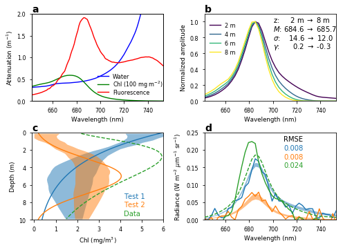


```python
S = np.linalg.inv(Ks[0].T.dot(invSe).dot(Ks[0])+np.linalg.inv(Sa))
Gain = S.dot(Ks[0].T).dot(invSe)
AK = Gain.dot(Ks[0])
AK_max_index = np.argmax(AK,axis=0)
AK_max = np.max(AK,axis=0);
```


```python
.25/AK_max
```


    array([  1.11814136,   1.53784785,   2.03426395,   2.52681264,
             2.9498637 ,   3.28408273,   3.59458878,   3.91078201,
             4.25450108,   4.63768055,   5.05900246,   5.53846636,
             6.0729616 ,   6.66938718,   7.34462198,   8.10028276,
             8.93645967,   9.87696163,  10.93359782,  12.11977047,
            13.43909718,  14.90736036,  16.55269207,  18.39598393,
            20.46064593,  22.77287446,  25.36194631,  28.25112521,
            31.46307578,  35.05549449,  39.07246589,  43.56286299,
            48.58075685,  54.18583168,  60.44379508,  67.42677034,
            75.21365346,  83.89041283,  93.5176128 , 104.18998071])


```python
cmap = plt.cm.viridis
fs = 10;

plt.figure(figsize=(7,5))
ax1 = plt.axes([.1,.45,.2,.5]); 
ax2 = plt.axes([.38,.55,.47,.4]); 
ax3 = plt.axes([.1,.1,.3,.25]); 
ax4 = plt.axes([.55,.1,.3,.25]);
ax4b = ax4.twiny(); 
cax1 = plt.axes([.11,.47,.02,.19]); 
cax2 = plt.axes([.88,.55,.02,.4]);

im1 = ax1.contourf(loc_sm[:,:,0],loc_sm[:,:,1],dataset_sm_rmse*1000,levels=np.arange(0,0.041,.001),extend='max',cmap=plt.cm.nipy_spectral);
ax1.contour(loc_sm[:,:,0],loc_sm[:,:,1],flightpath,[0],colors='k',lw=1)

im2 = ax2.contourf(np.nanmean(loc_sm[:,:,1],axis=1),z_center,np.nanmean(dataset_sm_chl_profile,axis=1).T,levels=np.arange(0,6.01,.1),extend='max',cmap=cmocean.cm.algae);

inds = [np.argmin(np.abs(z_center-zz)) for zz in [0,2.5,5,7.5]]
for i in range(len(inds)):
    ax3.plot(AK[:,inds[i]],z_center,color=cmap(np.linspace(0,1,len(inds))[i]))
ax3.legend(['0.0 m','2.5 m','5.0 m','7.5 m'],loc='lower right',framealpha=0)
ax3.plot([0,0],[0,10],'k:')

l3, = ax4.plot(np.cumsum(np.diag(AK)),z_center,color='k')
l4, = ax4b.plot(.25/AK_max,z_center,color='0.7'); plt.ylim([10,0]); plt.xlim([0,50])
ax4b.legend([l3,l4],['dof','Effective res.'],loc='lower left',framealpha=0)

cbar1 = plt.colorbar(im1,cax=cax1,ticks=np.arange(0,0.041,.01))
cbar2 = plt.colorbar(im2,cax=cax2,label='Averaged retrieved chlorophyll (mg m$^{-3}$)',ticks=np.arange(0,6.1,2));

ax1.set_ylabel('Latitude'); ax1.set_xlabel('Longitude'); ax1.set_xlim([-55.35,-54.8]); ax1.set_ylim([-62.3,-61.6]); ax1.set_xticks(np.arange(-55.2,-54.7,.2))
ax2.set_xlabel('Latitude'); ax2.set_ylabel('Depth (m)'); ax2.set_ylim([10,0]); ax2.set_xlim(np.mean(loc_sm[:,:,1],axis=1)[[0,-1]]);
ax3.set_ylabel('Depth (actual; m)'); ax3.set_xlabel('Weighting function'); ax3.set_ylim([10,0]); 
ax4.set_xlabel('Cumulative degrees of freedom'); ax4.set_ylabel('Depth (retrieved; m)'); ax4.set_ylim([10,0]); ax4.set_xlim([0,1.5]); ax4.set_xticks(np.arange(0,1.6,.5))
ax4b.set_xlabel('Effective resolution (m)',color='0.7'); ax4b.tick_params(color='0.7', labelcolor='0.7'); ax4b.set_xlim([0,60]); ax4b.set_xticks(np.arange(20,61,20))

ax1.text(.33,.78,'RMSE\n(W m$^{-2}$ $\mu$m$^{-1}$\n    sr$^{-1}$)',fontsize=fs,transform=ax1.transAxes)
ax3.text(.63,.66,'  Depth\n(retrieved)',fontsize=fs,transform=ax3.transAxes)

ax1.text(0,1.02,'a',fontsize=fontsize,fontweight='bold',transform=ax1.transAxes)
ax2.text(0,1.02,'b',fontsize=fontsize,fontweight='bold',transform=ax2.transAxes)
ax3.text(0,1.02,'c',fontsize=fontsize,fontweight='bold',transform=ax3.transAxes)
ax4.text(0,1.02,'d',fontsize=fontsize,fontweight='bold',transform=ax4.transAxes)

plt.savefig('Fig4',dpi=300)
```

    /Library/Frameworks/Python.framework/Versions/3.6/lib/python3.6/site-packages/ipykernel_launcher.py:16: RuntimeWarning: Mean of empty slice
      app.launch_new_instance()


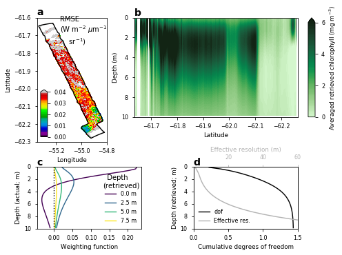

