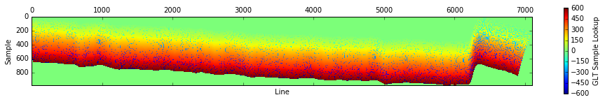
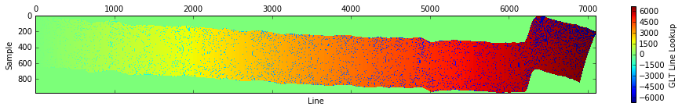
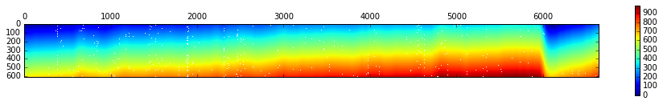
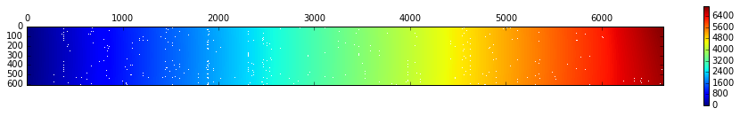

Load in packages we will need.


```python
import spectral.io.envi as envi, numpy as np, matplotlib as mpl, matplotlib.pyplot as plt, scipy, scipy.linalg as LA, cmocean
from scipy.optimize import curve_fit
from scipy.ndimage.filters import gaussian_filter1d
from netCDF4 import Dataset

plt.style.use('classic')
%matplotlib inline
```

## Part I: Load and image data

Look at one line (prm20160118t163646), already downloaded from prism.jpl.nasa.gov. Here I am looking at the radiance data. There are a number of files -- the 'img' file has all of the data, but the 'loc' and 'obs' are also useful -- the former giving location data (latitude, longitude, and altitude, although that last doesn't contain actual data), and the latter giving things like viewing angles. Each dataset is composed of lines, samples, and bands -- lines and samples are roughly like (x,y) in cartesian space, and bands are the different types of data, for example at different wavelengths, or [latitude,longitude], etc.


```python
refl_filename = 'prm20160118t163646_corr_v1k/prm20160118t163646_corr_v1k_img'
refl_file = envi.open(refl_filename+'.hdr', refl_filename)
rdn_filename = 'prm20160118t163646_rdn_v1k/prm20160118t163646_rdn_v1k_img'
rdn_file = envi.open(rdn_filename+'.hdr', rdn_filename)
print('Shape of the ''img'' file:')
print('samples: %s' % refl_file.metadata['samples'])
print('lines: %s' % refl_file.metadata['lines'])
print('bands: %s' % refl_file.metadata['bands'])
```

    Shape of the img file:
    samples: 980
    lines: 7158
    bands: 246


```python
wl = np.asarray(refl_file.metadata['wavelength'],dtype='float64') # download the wavelengths
```

Now look at the location file ('loc'). Note that this has longitude, latitude, and elevation, but the elevation data are only 0's.


```python
loc_filename = 'prm20160118t163646_rdn_v1k/prm20160118t163646_rdn_v1k_loc'
loc_file = envi.open(loc_filename+'.hdr', loc_filename)
loc_names = loc_file.metadata['band names']
print('Shape of the ''loc'' file:')
print('samples: %s' % loc_file.metadata['samples'])
print('lines: %s' % loc_file.metadata['lines'])
print('bands: %s' % loc_file.metadata['bands'])
print('Band names: %s' % loc_names)
loc = loc_file.read_bands(bands=[0,1]) # third band, Elevation, just gives 0's
```

    Shape of the loc file:
    samples: 606
    lines: 6647
    bands: 3
    Band names: ['Longitude (WGS-84)', 'Latitude (WGS-84)', 'Elevation (m)']


The 'glt' file (Geometric Look-up Table) allows us to match up the 'img' data file with the others. Non-zero values designate the line or sample that a given pixel belongs to. If the numbers are negative, it denotes the neighbor pixel that "filled in" for bad data. (In this script, I will only use the positive values.)


```python
glt_filename = 'prm20160118t163646_rdn_v1k/prm20160118t163646_rdn_v1k_glt'
glt_file = envi.open(glt_filename+'.hdr', glt_filename)
glt_names = glt_file.metadata['band names']
print('Shape of the ''glt'' file:')
print('samples: %s' % glt_file.metadata['samples'])
print('lines: %s' % glt_file.metadata['lines'])
print('bands: %s' % glt_file.metadata['bands'])
print('Band names: %s' % glt_names)
glt = glt_file.load()
```

    Shape of the glt file:
    samples: 980
    lines: 7104
    bands: 2
    Band names: ['GLT Sample Lookup', 'GLT Line Lookup']


    /usr/local/lib/python3.6/site-packages/ipykernel_launcher.py:9: DeprecationWarning: tostring() is deprecated. Use tobytes() instead.
      if __name__ == '__main__':


```python
for i in range(glt.shape[2]):
    plt.matshow(glt[:,:,i].squeeze().T);
    plt.xlabel('Line'); plt.ylabel('Sample')
    plt.colorbar(label=glt_names[i]);
```








```python
mapper_sample = np.nan*np.empty(shape=loc[:,:,0].shape)
mapper_line = np.nan*np.empty(shape=loc[:,:,0].shape)
for i in range(glt.shape[0]):
    for j in range(glt.shape[1]):
        if glt[i,j,0]>0:
            mapper_sample[int(glt[i,j,1])-1,int(glt[i,j,0])-1] = j
            mapper_line[int(glt[i,j,1])-1,int(glt[i,j,0])-1] = i
```


```python
plt.matshow(mapper_sample.T); plt.colorbar()
plt.matshow(mapper_line.T); plt.colorbar()
```


    <matplotlib.colorbar.Colorbar at 0x46f149fd0>








```python
mapper_sample = mapper_sample.astype('int')
mapper_line = mapper_line.astype('int')
```

Load in all sensors for radiance measurements and use the mapper to convert into across- and along-flight path values.


```python
rdn_full = np.empty(shape=(loc.shape[0],loc.shape[1],len(wl)))
refl_full = np.empty(shape=(loc.shape[0],loc.shape[1],len(wl)))
for k in range(len(wl)):
    print(int(wl[k]),end=' ')
    rdn_data = rdn_file.read_band(k)
    refl_data = refl_file.read_band(k)
    for i in range(rdn_full.shape[0]):
        for j in range(rdn_full.shape[1]):
            if mapper_sample[i,j]>0:
                rdn_full[i,j,k] = rdn_data[mapper_line[i,j],mapper_sample[i,j]]
                refl_full[i,j,k] = refl_data[mapper_line[i,j],mapper_sample[i,j]]

```

    350 353 356 359 362 364 367 370 373 376 379 381 384 387 390 393 396 398 401 404 407 410 412 415 418 421 424 427 429 432 435 438 441 444 446 449 452 455 458 461 463 466 469 472 475 478 480 483 486 489 492 495 497 500 503 506 509 512 514 517 520 523 526 529 531 534 537 540 543 546 548 551 554 557 560 563 565 568 571 574 577 580 582 585 588 591 594 597 599 602 605 608 611 614 617 619 622 625 628 631 634 636 639 642 645 648 651 653 656 659 662 665 668 670 673 676 679 682 685 687 690 693 696 699 702 704 707 710 713 716 719 721 724 727 730 733 736 738 741 744 747 750 753 756 758 761 764 767 770 773 775 778 781 784 787 790 792 795 798 801 804 807 809 812 815 818 821 824 826 829 832 835 838 841 844 846 849 852 855 858 861 863 866 869 872 875 878 880 883 886 889 892 895 897 900 903 906 909 912 915 917 920 923 926 929 932 934 937 940 943 946 949 951 954 957 960 963 966 969 971 974 977 980 983 986 988 991 994 997 1000 1003 1006 1008 1011 1014 1017 1020 1023 1025 1028 1031 1034 1037 1040 1042 1045 


```python
nc = Dataset('prm20160118t163646.nc','w')
nc.createDimension('latitude',rdn_full.shape[0])
nc.createDimension('longitude',rdn_full.shape[1])
nc.createDimension('wavelength',wl.size)
nc_wl = nc.createVariable('wavelength',np.dtype('float64').char,('wavelength'),fill_value=-999)
nc_rdn = nc.createVariable('radiance',np.dtype('float64').char,('latitude','longitude','wavelength'),fill_value=-999.)
nc_refl = nc.createVariable('reflectance',np.dtype('float64').char,('latitude','longitude','wavelength'),fill_value=-999.)
nc_wl[:] = wl
nc_rdn[:] = rdn_full
nc_refl[:] = refl_full
nc.close()

```
